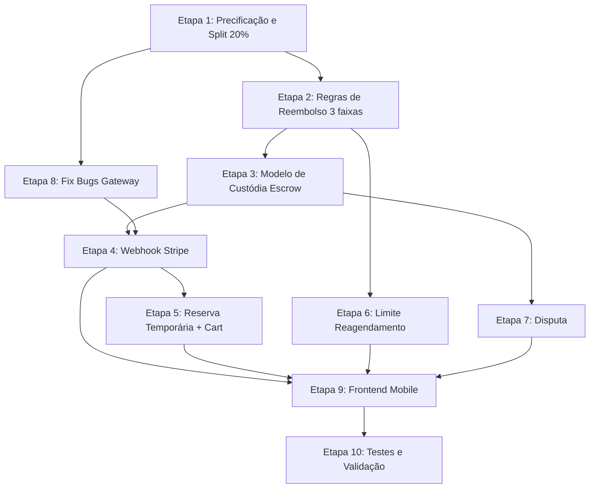

# Plano de Implementação do Sistema de Pagamento - GoDrive

Este documento detalha o planejamento completo, por etapas, para concluir a implementação do sistema de pagamento conforme definido no [PAYMENT_FLOW.md](file:///home/carloshf/udrive/PAYMENT_FLOW.md).

---

## Diagnóstico: Estado Atual vs. Requisitos

### ✅ O que já existe

| Camada | Componente | Status |
|:---|:---|:---|
| Domain | `Payment` entity com status machine | ✅ Funcional |
| Domain | `Transaction` entity com factory methods | ✅ Funcional |
| Domain | `PaymentStatus` enum (6 estados) | ✅ Funcional |
| Domain | `IPaymentGateway` interface (criar PI, reembolso, conta conectada) | ✅ Funcional |
| Domain | `IPaymentRepository` interface (CRUD, listagem por aluno/instrutor) | ✅ Funcional |
| Application | `ProcessPaymentUseCase` (checkout com split) | ✅ Funcional |
| Application | `CalculateSplitUseCase` (cálculo do split) | ✅ Funcional (taxa errada) |
| Application | `ProcessRefundUseCase` (reembolso via Stripe) | ✅ Funcional (regras erradas) |
| Application | `ConnectStripeAccountUseCase` (onboarding Stripe Connect) | ✅ Funcional |
| Application | `GetInstructorEarningsUseCase` (dashboard financeiro) | ✅ Funcional |
| Application | `GetPaymentHistoryUseCase` (histórico) | ✅ Funcional |
| Infrastructure | `StripePaymentGateway` (PI, refund, connected accounts) | ✅ Funcional (bugs menores) |
| Infrastructure | `PaymentModel` / `TransactionModel` (DB) | ✅ Funcional |
| Interface | Routers: `student/payments`, `instructor/earnings`, `shared/payments` | ✅ Funcional |
| Config | `stripe_secret_key` / `stripe_webhook_secret` no settings | ✅ Presente |
| Backend | `stripe>=8.1.0` no requirements | ✅ Instalado |
| Domain | `InstructorProfile.stripe_account_id` | ✅ Presente |

### ❌ Gaps Identificados (O que precisa mudar)

| # | Gap | Prioridade | Detalhes |
|:--|:---|:---|:---|
| 1 | **Taxa da plataforma é 15%, deveria ser 20%** | 🔴 Alta | `calculate_split.py` usa `15.00`, `payment.py` usa `15.00`. PAYMENT_FLOW.md define 20%. |
| 2 | **Modelo de preço não inclui taxas Stripe** | 🔴 Alta | O preço final do aluno deve ser: `preço_instrutor + 20% comissão + taxas_stripe`. O cálculo atual não embute o Stripe fee. |
| 3 | **Regras de reembolso usam 2 faixas, deveria ter 4** | 🔴 Alta | Hoje: `>24h = 100%`, `<24h = 50%`. Deveria ser: `>=48h = 100%`, `24h-48h = 50%`, `<24h = 0%`, `emergência = 100% manual`. |
| 4 | **Webhook do Stripe é stub (TODO)** | 🔴 Alta | Endpoint `/webhook` retorna `{"status":"received"}` sem validação de assinatura nem processamento de eventos. |
| 5 | **Não há Carrinho (Cart) multi-aula** | 🟡 Média | PAYMENT_FLOW.md descreve checkout de múltiplas aulas. Hoje o checkout é por agendamento individual. |
| 6 | **Não há reserva temporária de slots** | 🟡 Média | Ao iniciar checkout, slots deveriam ficar bloqueados ~15min. Não existe essa lógica. |
| 7 | **Não há confirmação automática de conclusão (cron 24h)** | 🔴 Alta | PAYMENT_FLOW.md: se aluno não confirmar em 24h após término, sistema confirma e libera pagamento automaticamente. |
| 8 | **Não há mecanismo de disputa** | 🟡 Média | Se aluno reportar problema (ex: instrutor não apareceu), repasse deve ser bloqueado. Não existe. |
| 9 | **Repasse ao instrutor não é vinculado à conclusão da aula** | 🔴 Alta | Hoje: o `Transfer` é criado junto com o `PaymentIntent`. Deveria: valor ficar em custódia (escrow) e `Transfer` ocorrer somente após confirmação de conclusão. |
| 10 | **Limite de 1 reagendamento por aula não rastreado** | 🟡 Média | Scheduling entity não tem campo `reschedule_count`. |
| 11 | **Trava de reembolso pós-reagendamento não implementada** | 🟡 Média | Aula reagendada na janela <48h mantém "janela original" para cálculo de multa. |
| 12 | **Sem telas de checkout/pagamento no mobile** | 🔴 Alta | Nenhuma feature `payment` existe no mobile. |
| 13 | **`StripePaymentGateway.process_refund` retorna campo errado** | 🟠 Baixa | `RefundResult` espera `amount`, gateway retorna `amount_refunded`. |
| 14 | **`StripePaymentGateway.create_connected_account` retorna campos extras** | 🟠 Baixa | Retorna `type`, `country`, `details_submitted` que não existem no `ConnectedAccountResult`. |
| 15 | **`cancel_scheduling` calcula refund mas não executa refund via Stripe** | 🔴 Alta | Apenas calcula e retorna o percentual, mas não chama `ProcessRefundUseCase`. |

---

## Etapas de Implementação

### Etapa 1 — Correção do Modelo de Precificação e Split

> **Objetivo:** Alinhar o cálculo de split e precificação com o PAYMENT_FLOW.md.

#### 1.1 Atualizar taxa da plataforma para 20%

- **Arquivo:** [calculate_split.py](file:///home/carloshf/udrive/backend/src/application/use_cases/payment/calculate_split.py)
  - Alterar `DEFAULT_PLATFORM_FEE_PERCENTAGE` de `15.00` para `20.00`
- **Arquivo:** [payment.py](file:///home/carloshf/udrive/backend/src/domain/entities/payment.py)
  - Alterar `platform_fee_percentage` default de `15.00` para `20.00`

#### 1.2 Implementar cálculo de preço final all-inclusive (aluno paga tudo)

O modelo de precificação do PAYMENT_FLOW.md é:

```
preço_instrutor = R$ 80,00 (definido pelo instrutor)
comissao_godrive = preço_instrutor × 20% = R$ 16,00
taxas_stripe ≈ 3,99% + R$ 0,39 (cartão BR) ou PIX: 0,5% capped at R$ 5,00
total_aluno = preço_instrutor + comissao + taxas_stripe
```

> [!IMPORTANT]
> A lógica de pricing precisa ser recalibrada. Hoje o `amount` no `Payment` é o preço da aula do scheduling. Deve ser o **valor total (preço base + comissão + fees)**.

- **[NEW] Arquivo:** `backend/src/application/use_cases/payment/calculate_student_price.py`
  - Novo use case `CalculateStudentPriceUseCase`
  - Input: `instructor_hourly_rate` (preço definido pelo instrutor)
  - Output: `StudentPriceDTO` com: `instructor_amount`, `platform_fee`, `stripe_fee_estimate`, `total_student_price`
  - Fórmula reversa para que o instrutor receba exatamente o valor definido

- **Arquivo:** [payment_dtos.py](file:///home/carloshf/udrive/backend/src/application/dtos/payment_dtos.py)
  - Adicionar `StudentPriceDTO` e campo `stripe_fee_amount` ao `SplitCalculationDTO` e `PaymentResponseDTO`

- **Arquivo:** [process_payment.py](file:///home/carloshf/udrive/backend/src/application/use_cases/payment/process_payment.py)
  - Integrar o novo cálculo: `amount` enviado ao Stripe = total_aluno, `transfer_data.amount` = preço_instrutor

#### 1.3 Endpoint de cálculo de preço para exibição no frontend

- **[NEW] Arquivo:** `backend/src/interface/api/routers/shared/pricing.py`
  - `GET /api/v1/shared/pricing/calculate?instructor_rate=80.00`
  - Retorna o breakdown completo (usado pelas telas de busca/agendamento)

---

### Etapa 2 — Correção das Regras de Reembolso e Cancelamento

> **Objetivo:** Implementar as 4 faixas de reembolso (>=48h, 24h-48h, <24h, emergência).

#### 2.1 Atualizar `Scheduling.calculate_refund_percentage()`

- **Arquivo:** [scheduling.py](file:///home/carloshf/udrive/backend/src/domain/entities/scheduling.py#L66-L89)
  - Alterar para 3 faixas automáticas + considerar a "janela original" para aulas reagendadas:
    ```python
    if hours_until >= 48: return 100
    elif hours_until >= 24: return 50
    else: return 0
    ```

#### 2.2 Adicionar campo `original_scheduled_datetime` na entidade e model

- **Arquivo:** [scheduling.py](file:///home/carloshf/udrive/backend/src/domain/entities/scheduling.py)
  - Adicionar campo `original_scheduled_datetime: datetime | None = None`
  - Em `accept_reschedule()`: salvar `scheduled_datetime` original antes de mudar
  - Em `calculate_refund_percentage()`: usar `original_scheduled_datetime` se existir (trava de reembolso pós-reagendamento)

- **Arquivo:** [scheduling_model.py](file:///home/carloshf/udrive/backend/src/infrastructure/db/models/scheduling_model.py)
  - Adicionar coluna `original_scheduled_datetime`

- **Migration Alembic** para adicionar as novas colunas

#### 2.3 Integrar refund efetivo ao cancelamento

- **Arquivo:** [cancel_scheduling.py](file:///home/carloshf/udrive/backend/src/application/use_cases/scheduling/cancel_scheduling.py)
  - Após cancelar, se existe payment COMPLETED ou HELD, chamar `ProcessRefundUseCase` com o percentual calculado.
  - **Reembolso Itemizado:** Em caso de checkout multi-aula (carrinho), o sistema deve solicitar um **reembolso parcial** ao Stripe, calculando apenas o valor proporcional à aula cancelada (valor da aula + comissão proporcional + taxa stripe proporcional se aplicável).
  - Injetar `IPaymentRepository` e `ProcessRefundUseCase` como dependências.

#### 2.4 Adicionar cancelamento de emergência

- **Arquivo:** [payment_dtos.py](file:///home/carloshf/udrive/backend/src/application/dtos/payment_dtos.py)
  - Adicionar `CancelSchedulingDTO.is_emergency: bool = False`
- **Arquivo:** [cancel_scheduling.py](file:///home/carloshf/udrive/backend/src/application/use_cases/scheduling/cancel_scheduling.py)
  - Se `is_emergency=True`, marcar para revisão manual (status `DISPUTE` ou flag `emergency_refund_requested`)

---

### Etapa 3 — Modelo de Custódia (Escrow) e Repasse Pós-Conclusão

> **Objetivo:** O valor fica retido no Stripe e o Transfer para o instrutor só ocorre após confirmação de conclusão.

#### 3.1 Alterar fluxo de pagamento para custódia

- **Arquivo:** [stripe_gateway.py](file:///home/carloshf/udrive/backend/src/infrastructure/external/stripe_gateway.py)
  - Método `create_payment_intent`: remover `transfer_data` do momento de criação
  - O PaymentIntent deve ser criado **sem** destination. O Transfer será feito manualmente depois.
  - Alternativa: usar `transfer_data` com `on_behalf_of` e definir `transfer_group`, mas sem `transfer_data.amount` até confirmação.

> [!IMPORTANT]
> **Decisão arquitetural:** O Stripe suporta duas abordagens para escrow:
> 1. **Separate Charges and Transfers** (ideal): cobrar o aluno na conta da plataforma, depois criar Transfer manual após conclusão.
> 2. **Destination Charges** (atual): cobra e transfere ao mesmo tempo — **não suporta escrow nativo**.
>
> Migrar para **Separate Charges and Transfers** para suportar o modelo escrow.

- **[NEW] Método** `create_transfer` no `IPaymentGateway` e `StripePaymentGateway`:
  ```python
  async def create_transfer(
      self,
      amount: Decimal,
      destination_account_id: str,
      transfer_group: str,
      metadata: dict | None = None,
  ) -> TransferResult
  ```

#### 3.2 Criar use case de repasse pós-conclusão

- **[NEW] Arquivo:** `backend/src/application/use_cases/payment/release_payment.py`
  - `ReleasePaymentUseCase`: chamado quando aula é concluída (confirmação do aluno ou auto-confirmação 24h)
  - Busca `Payment` pelo `scheduling_id`, cria `Transfer` via gateway, registra `Transaction` de tipo `INSTRUCTOR_PAYOUT`
  - Atualiza `Payment.status` para `COMPLETED` e salva `stripe_transfer_id`

#### 3.3 Adicionar status `HELD` ao PaymentStatus

- **Arquivo:** [payment_status.py](file:///home/carloshf/udrive/backend/src/domain/entities/payment_status.py)
  - Adicionar `HELD = "held"` — valor retido em custódia após pagamento confirmado, aguardando conclusão da aula
  - Adicionar `DISPUTED = "disputed"` — pagamento em disputa

- **Arquivo:** [payment.py](file:///home/carloshf/udrive/backend/src/domain/entities/payment.py)
  - Adicionar método `mark_held()` (transição PROCESSING → HELD)
  - Adicionar método `mark_disputed()` (transição HELD → DISPUTED)
  - Ajustar `mark_completed()` para aceitar HELD → COMPLETED

#### 3.4 Integrar repasse ao fluxo de conclusão

- **Arquivo:** [complete_scheduling.py](file:///home/carloshf/udrive/backend/src/application/use_cases/scheduling/complete_scheduling.py)
  - Após `scheduling.complete()`, chamar `ReleasePaymentUseCase` para liberar o pagamento ao instrutor

---

### Etapa 4 — Webhook do Stripe

> **Objetivo:** Processar eventos do Stripe para atualizar status de pagamentos em tempo real.

#### 4.1 Implementar webhook completo

- **Arquivo:** [payments.py (shared)](file:///home/carloshf/udrive/backend/src/interface/api/routers/shared/payments.py#L64-L74)
  - Substituir o stub por implementação completa
  - Validar assinatura do webhook com `stripe.Webhook.construct_event`
  - Processar eventos:
    - `payment_intent.succeeded` → marcar Payment como HELD (custódia)
    - `payment_intent.payment_failed` → marcar Payment como FAILED
    - `charge.refunded` → atualizar status de refund
    - `account.updated` → atualizar status da conta Connect do instrutor

- **[NEW] Arquivo:** `backend/src/application/use_cases/payment/handle_stripe_webhook.py`
  - `HandleStripeWebhookUseCase` com dispatcher de eventos
  - Cada tipo de evento chama handler específico

---

### Etapa 5 — Reserva Temporária de Slots e Carrinho

> **Objetivo:** Evitar conflitos de reserva simultânea e suportar checkout multi-aula.

#### 5.1 Implementar reserva temporária

- **Arquivo:** [scheduling_status.py](file:///home/carloshf/udrive/backend/src/domain/entities/scheduling_status.py)
  - Adicionar status `RESERVED = "reserved"` (slot temporariamente reservado)

- **Arquivo:** [scheduling.py](file:///home/carloshf/udrive/backend/src/domain/entities/scheduling.py)
  - Adicionar campo `reserved_until: datetime | None = None`
  - Método `reserve(duration_minutes=15)` — reserva temporária
  - Método `expire_reservation()` — libera se expirada

- **Migration Alembic** para coluna `reserved_until` e `original_scheduled_datetime`

#### 5.2 Task Celery para expirar reservas

- **[NEW] Arquivo:** `backend/src/infrastructure/tasks/payment_tasks.py`
  - Task `expire_stale_reservations`: roda a cada 1 min, libera reservas expiradas
  - Task `auto_confirm_completed_lessons`: roda a cada 1h, confirma aulas não confirmadas 24h após término e libera pagamento

#### 5.3 Suporte a Carrinho (multi-agendamento no checkout)

- **Arquivo:** [payment_dtos.py](file:///home/carloshf/udrive/backend/src/application/dtos/payment_dtos.py)
  - Alterar `ProcessPaymentDTO.scheduling_id` para aceitar `scheduling_ids: list[UUID]`

- **Arquivo:** [process_payment.py](file:///home/carloshf/udrive/backend/src/application/use_cases/payment/process_payment.py)
  - Ajustar para processar múltiplos agendamentos em um único PaymentIntent.
  - Criar um registro de `Payment` para cada agendamento no banco de dados, todos apontando para o mesmo `stripe_payment_intent_id`.
  - Vincular todos via `transfer_group` para facilitar a conciliação e repasses individuais.

> [!NOTE]
> Ao criar múltiplos `Payment` vinculados a um único `stripe_payment_intent_id`, habilitamos o suporte a reembolsos parciais. Se o aluno cancelar apenas 1 de 5 aulas do carrinho, o sistema saberá exatamente qual valor estornar do pagamento total original.

---

### Etapa 6 — Limite de Reagendamento e Trava de Reembolso

> **Objetivo:** Implementar as regras de reagendamento do PAYMENT_FLOW.md.

#### 6.1 Rastrear contagem de reagendamentos

- **Arquivo:** [scheduling.py](file:///home/carloshf/udrive/backend/src/domain/entities/scheduling.py)
  - Adicionar campo `reschedule_count: int = 0`
  - Em `accept_reschedule()`: incrementar counter e bloquear se `>= 1`

- **Arquivo:** [scheduling_model.py](file:///home/carloshf/udrive/backend/src/infrastructure/db/models/scheduling_model.py)
  - Adicionar coluna `reschedule_count`

#### 6.2 Implementar trava de reembolso pós-reagendamento

- Já descrito na Etapa 2.2 (`original_scheduled_datetime`)

---

### Etapa 7 — Disputa e Bloqueio de Repasse

> **Objetivo:** Permitir que alunos reportem problemas e bloqueiem o repasse.

#### 7.1 Criar fluxo de disputa

- **[NEW] Arquivo:** `backend/src/application/use_cases/payment/create_dispute.py`
  - `CreateDisputeUseCase`: aluno reporta problema antes da auto-confirmação
  - Muda `Payment.status` para `DISPUTED`
  - Bloqueia o Transfer automático

- **Arquivo:** [scheduling_status.py](file:///home/carloshf/udrive/backend/src/domain/entities/scheduling_status.py)
  - Adicionar `DISPUTED = "disputed"`

- **[NEW] Endpoint:** `POST /api/v1/student/lessons/{scheduling_id}/dispute`
  - Razão obrigatória, cria registro para análise manual do suporte

---

### Etapa 8 — Correção de Bugs no StripePaymentGateway

> **Objetivo:** Corrigir inconsistências de interface entre o gateway e os DTOs.

#### 8.1 Fix `process_refund` return

- **Arquivo:** [stripe_gateway.py](file:///home/carloshf/udrive/backend/src/infrastructure/external/stripe_gateway.py#L69-L99)
  - Trocar `amount_refunded` → `amount` no `RefundResult`

#### 8.2 Fix `create_connected_account` return

- **Arquivo:** [stripe_gateway.py](file:///home/carloshf/udrive/backend/src/infrastructure/external/stripe_gateway.py#L101-L126)
  - Remover campos extras (`type`, `country`, `details_submitted`) que não existem no `ConnectedAccountResult`, ou expandir o dataclass

#### 8.3 Fix assinatura `create_connected_account`

- A interface define `instructor_id: UUID`, mas a implementação recebe `str`. Alinhar para `UUID`.

---

### Etapa 9 — Frontend Mobile (Telas de Pagamento)

> **Objetivo:** Criar o módulo de pagamento no app mobile.

#### 9.1 Criar módulo de pagamento no mobile

```
mobile/src/features/shared-features/payment/
├── api/
│   └── paymentApi.ts          # Endpoints: checkout, history, pricing
├── components/
│   ├── CheckoutSummary.tsx    # Resumo com breakdown de preço
│   ├── PaymentMethodSelector.tsx  # Escolha cartão / PIX
│   └── PriceBreakdown.tsx     # Valor instrutor + comissão + taxa
├── hooks/
│   ├── useCheckout.ts         # Mutation de checkout
│   ├── usePaymentHistory.ts   # Query de histórico
│   └── usePricing.ts          # Query de cálculo de preço
├── screens/
│   ├── CheckoutScreen.tsx     # Tela de checkout com Stripe Elements
│   └── PaymentHistoryScreen.tsx  # Histórico financeiro
└── index.ts
```

#### 9.2 Integrar Stripe SDK no mobile

- Instalar `@stripe/stripe-react-native`
- Configurar `StripeProvider` no `App.tsx`
- Usar `useStripe().initPaymentSheet()` com o `client_secret` retornado pelo backend

#### 9.3 Criar telas do instrutor para pagamento

```
mobile/src/features/instructor-app/screens/
├── EarningsScreen.tsx         # Dashboard financeiro
└── StripeOnboardingScreen.tsx # Fluxo de onboarding Stripe
```

#### 9.4 Atualizar tela de busca/agendamento com preço final

- **Arquivo:** Telas de busca de instrutor (student-app)
  - Exibir preço já com comissão + taxas (chamar endpoint de pricing)
  - Ao confirmar booking → navegar para CheckoutScreen

---

### Etapa 10 — Testes e Validação

> **Objetivo:** Garantir cobertura de testes para todos os fluxos de pagamento.

#### 10.1 Testes unitários (Backend)

- **[NEW]** `backend/tests/application/use_cases/payment/`
  - `test_calculate_split.py` — Validar cálculo com 20%, edge cases
  - `test_calculate_student_price.py` — Validar fórmula all-inclusive
  - `test_process_payment.py` — Mock do gateway, validar fluxo completo
  - `test_process_refund.py` — Testar 4 faixas de reembolso
  - `test_release_payment.py` — Validar repasse pós-conclusão
  - `test_handle_webhook.py` — Processar cada tipo de evento

- **Comando:**
  ```bash
  cd backend && python -m pytest tests/ -v --cov=src/application/use_cases/payment
  ```

#### 10.2 Testes de domínio

- **[NEW]** `backend/tests/domain/test_payment.py`
  - Testar state machine (PENDING → PROCESSING → HELD → COMPLETED)
  - Testar `process_refund` com diferentes percentuais

- **[NEW]** `backend/tests/domain/test_scheduling_refund.py`
  - Testar `calculate_refund_percentage` com as 3 faixas
  - Testar trava de janela original pós-reagendamento

#### 10.3 Verificação manual

> [!NOTE]
> Estes passos requerem o Stripe CLI configurado em modo teste.

1. **Teste de Stripe Connect Onboarding:**
   - Criar conta Connect via `POST /instructor/stripe/connect`
   - Verificar URL de onboarding retornada

2. **Teste de Checkout:**
   - Criar agendamento → iniciar checkout → verificar PaymentIntent criado no dashboard Stripe

3. **Teste de Webhook:**
   - `stripe listen --forward-to localhost:8000/api/v1/shared/payments/webhook`
   - Confirmar pagamento e verificar status atualizado no DB

4. **Teste de Refund:**
   - Cancelar agendamento com diferentes antecedências
   - Verificar valor reembolsado no Stripe Dashboard

---

## Ordem de Execução Recomendada



| Etapa | Prioridade | Esforço Estimado | Dependências |
|:---|:---|:---|:---|
| 1. Precificação e Split | 🔴 Crítica | ~4h | Nenhuma |
| 2. Regras de Reembolso | 🔴 Crítica | ~4h | Migration Alembic |
| 3. Custódia (Escrow) | 🔴 Crítica | ~6h | Etapas 1 e 2 |
| 4. Webhook Stripe | 🔴 Crítica | ~4h | Etapa 3 |
| 5. Reserva + Carrinho | 🟡 Média | ~6h | Etapa 4, Migration |
| 6. Limite Reagendamento | 🟡 Média | ~2h | Migration |
| 7. Disputa | 🟡 Média | ~3h | Etapas 3 e 4 |
| 8. Fix Bugs Gateway | 🟠 Rápida | ~1h | Nenhuma |
| 9. Frontend Mobile | 🔴 Crítica | ~12h | Etapas 1-8 |
| 10. Testes | 🔴 Crítica | ~6h | Pós cada etapa |

---

## Migrations Alembic Necessárias

Uma única migration consolidando todas as mudanças de schema:

```sql
-- Novos campos em schedulings
ALTER TABLE schedulings ADD COLUMN reserved_until TIMESTAMPTZ;
ALTER TABLE schedulings ADD COLUMN reschedule_count INTEGER DEFAULT 0 NOT NULL;
ALTER TABLE schedulings ADD COLUMN original_scheduled_datetime TIMESTAMPTZ;

-- Novos status em scheduling_status_enum
ALTER TYPE scheduling_status_enum ADD VALUE 'reserved';
ALTER TYPE scheduling_status_enum ADD VALUE 'disputed';

-- Novos campos em payments
-- stripe_fee_amount e total_student_amount
ALTER TABLE payments ADD COLUMN stripe_fee_amount NUMERIC(10,2);
ALTER TABLE payments ADD COLUMN total_student_amount NUMERIC(10,2);

-- Novos status de payment
-- (Enum update para incluir 'held' e 'disputed')
```

> [!CAUTION]
> Enums do PostgreSQL não suportam remoção de valores. Testar a migration em staging antes de aplicar em produção.
