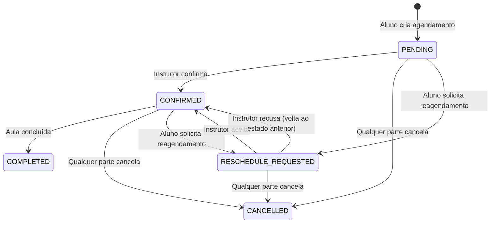
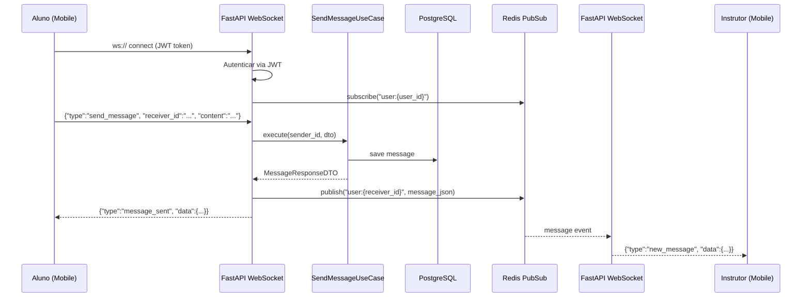

# WEBSOCKETS_PLAN.md — Planejamento de Comunicação em Tempo Real

## 1. Diagnóstico do Estado Atual

### O que já existe — Chat

| Camada | Componente | Arquivo | Estado |
|--------|-----------|---------|--------|
| **Domain** | `Message` entity | `domain/entities/message.py` | ✅ Completa — `sender_id`, `receiver_id`, `content`, `timestamp`, `is_read` |
| **Domain** | `IMessageRepository` | `domain/interfaces/message_repository.py` | ✅ Completa — `create`, `list_by_conversation`, `mark_as_read`, `count_unread` |
| **Application** | `SendMessageUseCase` | `application/use_cases/chat/send_message_use_case.py` | ✅ Completa — validação de agendamento ativo + filtro de conteúdo |
| **Application** | Chat DTOs | `application/dtos/chat_dtos.py` | ✅ Completa |
| **Infrastructure** | `MessageRepositoryImpl` | `infrastructure/repositories/message_repository_impl.py` | ✅ Completa |
| **Infrastructure** | `RedisCacheService` | `infrastructure/external/redis_cache.py` | ⚠️ Somente cache GET/SET — sem PubSub |
| **Interface** | REST Chat Router | `interface/api/routers/shared/chat.py` | ✅ Completa — endpoints REST |
| **Interface** | WebSockets dir | `interface/websockets/__init__.py` | ❌ Vazio — apenas docstring |
| **Mobile** | `ChatRoomScreen` | `shared-features/chat/screens/ChatRoomScreen.tsx` | ✅ Funcional via polling |
| **Mobile** | `useMessages` hook | `shared-features/chat/hooks/useMessages.ts` | ⚠️ **Polling 5s** via `refetchInterval` |
| **Mobile** | `useConversations` hook | `shared-features/chat/hooks/useConversations.ts` | ⚠️ **Polling 30s** |
| **Mobile** | `useUnreadCount` hook | `shared-features/chat/hooks/useUnreadCount.ts` | ⚠️ **Polling 30s** |

### O que já existe — Agendamentos (Scheduling)

| Camada | Componente | Arquivo | Estado |
|--------|-----------|---------|--------|
| **Domain** | `Scheduling` entity | `domain/entities/scheduling.py` | ✅ Completa — 5 status, transições validadas, regra de reembolso |
| **Domain** | `SchedulingStatus` enum | `domain/entities/scheduling_status.py` | ✅ `PENDING → CONFIRMED → COMPLETED`, `CANCELLED`, `RESCHEDULE_REQUESTED` |
| **Domain** | `ISchedulingRepository` | `domain/interfaces/scheduling_repository.py` | ✅ CRUD + `check_conflict`, `list_by_student`, `list_by_instructor` |
| **Application** | `CreateSchedulingUseCase` | `use_cases/scheduling/create_scheduling.py` | ✅ Valida aluno, instrutor, disponibilidade, conflito |
| **Application** | `ConfirmSchedulingUseCase` | `use_cases/scheduling/confirm_scheduling.py` | ✅ Instrutor confirma → CONFIRMED |
| **Application** | `CancelSchedulingUseCase` | `use_cases/scheduling/cancel_scheduling.py` | ✅ Ambos cancelam → CANCELLED + cálculo reembolso |
| **Application** | `StartSchedulingUseCase` | `use_cases/scheduling/start_scheduling.py` | ✅ Registra `started_at` |
| **Application** | `CompleteSchedulingUseCase` | `use_cases/scheduling/complete_scheduling.py` | ✅ Aluno ou instrutor → COMPLETED |
| **Application** | `RequestRescheduleUseCase` | `use_cases/scheduling/request_reschedule_use_case.py` | ✅ Aluno solicita → RESCHEDULE_REQUESTED |
| **Application** | `RespondRescheduleUseCase` | `use_cases/scheduling/respond_reschedule_use_case.py` | ✅ Instrutor aceita/recusa |
| **Application** | Scheduling DTOs | `application/dtos/scheduling_dtos.py` | ✅ Input + Output DTOs completos |
| **Interface** | REST Student Lessons | `api/routers/student/lessons.py` | ✅ `POST /lessons`, `cancel`, `start`, `complete`, `request-reschedule` |
| **Interface** | REST Instructor Schedule | `api/routers/instructor/schedule.py` | ✅ `confirm`, `cancel`, `complete`, `respond-reschedule`, `start` |
| **Mobile** | `useInstructorSchedule` | `instructor-app/hooks/useInstructorSchedule.ts` | ⚠️ `staleTime: 0` mas **sem polling** — dados só atualizam ao reabrir tela |
| **Mobile** | `useStudentSchedulings` | `shared-features/scheduling/hooks/useStudentSchedulings.ts` | ⚠️ **Sem polling** — dados só atualizam ao reabrir tela |
| **Mobile** | `schedulingApi.ts` | `shared-features/scheduling/api/schedulingApi.ts` | ✅ REST completo |
| **Mobile** | `scheduleApi.ts` (instrutor) | `instructor-app/api/scheduleApi.ts` | ✅ REST completo |

### Máquina de Estados dos Agendamentos



### Problemas no fluxo atual de Agendamentos

1. **Instrutor não sabe em tempo real** quando recebe um novo agendamento (PENDING)
2. **Aluno não sabe instantaneamente** quando o instrutor confirma, cancela ou inicia a aula
3. **Reagendamentos ficam invisíveis** — o instrutor precisa atualizar a tela para ver solicitações
4. **Nenhum dos 7 use cases emite eventos** — todas as transições são silenciosas

### Problemas com a abordagem atual (HTTP Polling)

1. **Latência alta** — mensagens levam até 5s para aparecer no chat
2. **Desperdício de recursos** — requisições HTTP desnecessárias quando não há mensagens novas
3. **Contagem de não-lidas desatualizada** — atualiza apenas a cada 30 segundos
4. **Não escalável** — cada usuário gera ~12 requisições/minuto estando no chat

### Infraestrutura disponível

- **Redis** já roda no Docker (`redis:7-alpine`, porta 6379) — pronto para PubSub
- **FastAPI** tem suporte nativo a WebSockets via Starlette (já está em `requirements.txt` por padrão)
- **`redis[asyncio]`** (biblioteca `redis>=5.0.1`) já inclui suporte a PubSub assíncrono
- **Diretório** `interface/websockets/` já está preparado na estrutura

---

## 2. Arquitetura Proposta

### Diagrama de Fluxo



### Topologia de Canais Redis PubSub

```
user:{user_id}           → Canal pessoal (mensagens, notificações de agendamento)
chat:{user_a}:{user_b}   → Canal de conversa específica (indicadores de digitação)
```

### Protocolo de Mensagens WebSocket (JSON)

#### Client → Server
```json
{"type": "send_message", "receiver_id": "uuid", "content": "texto"}
{"type": "mark_as_read", "message_ids": ["uuid1", "uuid2"]}
{"type": "typing", "receiver_id": "uuid"}
{"type": "ping"}
```

#### Server → Client — Chat
```json
{"type": "new_message", "data": {"id": "...", "sender_id": "...", ...}}
{"type": "message_sent", "data": {"id": "...", ...}}
{"type": "messages_read", "data": {"message_ids": ["..."]}}
{"type": "typing_indicator", "data": {"user_id": "..."}}
{"type": "unread_count", "data": {"count": 5}}
{"type": "pong"}
{"type": "error", "data": {"code": "...", "message": "..."}}
```

#### Server → Client — Agendamentos
```json
{"type": "scheduling_created", "data": {"id": "...", "student_name": "...", "scheduled_datetime": "...", ...}}
{"type": "scheduling_confirmed", "data": {"id": "...", "instructor_name": "...", ...}}
{"type": "scheduling_cancelled", "data": {"id": "...", "cancelled_by": "...", "refund_percentage": 100, ...}}
{"type": "scheduling_started", "data": {"id": "...", "started_at": "...", ...}}
{"type": "scheduling_completed", "data": {"id": "...", "completed_at": "...", ...}}
{"type": "reschedule_requested", "data": {"id": "...", "student_name": "...", "rescheduled_datetime": "...", ...}}
{"type": "reschedule_responded", "data": {"id": "...", "accepted": true, "scheduled_datetime": "...", ...}}
```

> [!IMPORTANT]
> Os eventos de agendamento são **server-push only** — o mobile NÃO envia ações de agendamento via WS.
> As ações continuam sendo feitas via REST (com validação completa), e o backend emite o evento
> para o outro usuário como notificação em tempo real.

---

## 3. Etapas de Implementação

### ETAPA 1 — Backend: Connection Manager + Autenticação WebSocket

**Objetivo:** Criar a infraestrutura base para aceitar e gerenciar conexões WebSocket autenticadas.

#### Arquivos a criar/modificar

| Ação | Arquivo | Descrição |
|------|---------|-----------|
| **NOVO** | `interface/websockets/connection_manager.py` | Classe `ConnectionManager` — gerencia conexões ativas, `connect()`, `disconnect()`, `send_personal_message()` |
| **NOVO** | `interface/websockets/auth.py` | Função `authenticate_websocket(token)` — valida JWT extraído da query string |
| **NOVO** | `interface/websockets/chat_handler.py` | Handler WebSocket para chat — rota `/ws/chat?token={jwt}` |
| **MODIFICAR** | `interface/websockets/__init__.py` | Exportar módulos |
| **MODIFICAR** | `interface/api/main.py` | Registrar WebSocket routes no `app` |

#### Detalhes técnicos

**`ConnectionManager`:**
```python
class ConnectionManager:
    """Gerencia conexões WebSocket ativas em memória."""

    def __init__(self) -> None:
        # Mapeia user_id → lista de WebSockets (um user pode ter múltiplas abas/devices)
        self.active_connections: dict[UUID, list[WebSocket]] = {}

    async def connect(self, user_id: UUID, websocket: WebSocket) -> None
    async def disconnect(self, user_id: UUID, websocket: WebSocket) -> None
    async def send_to_user(self, user_id: UUID, data: dict) -> None
    def is_online(self, user_id: UUID) -> bool
```

**Autenticação WebSocket:**
- JWT é passado via query string: `ws://host/ws/chat?token=eyJ...`
- Não é possível usar headers de Authorization em WebSockets do browser/React Native
- Reutilizar a mesma lógica de validação JWT que já existe em `dependencies.py`

---

### ETAPA 2 — Backend: Redis PubSub para Multi-instância

**Objetivo:** Permitir que mensagens sejam entregues mesmo quando sender e receiver estão conectados a instâncias diferentes do backend (preparação para scaling horizontal).

#### Arquivos a criar/modificar

| Ação | Arquivo | Descrição |
|------|---------|-----------|
| **NOVO** | `infrastructure/external/redis_pubsub.py` | Classe `RedisPubSubService` — `publish()`, `subscribe()`, `unsubscribe()` |
| **MODIFICAR** | `interface/websockets/connection_manager.py` | Integrar PubSub no envio de mensagens |
| **MODIFICAR** | `interface/websockets/chat_handler.py` | Subscrever no canal do user ao conectar |

#### Detalhes técnicos

**`RedisPubSubService`:**
```python
class RedisPubSubService:
    """Serviço de PubSub Redis para comunicação entre instâncias."""

    async def publish(self, channel: str, message: dict) -> None
    async def subscribe(self, channel: str, callback: Callable) -> None
    async def unsubscribe(self, channel: str) -> None
```

**Fluxo:**
1. User conecta → `subscribe("user:{user_id}")`
2. Mensagem enviada → salva no DB → `publish("user:{receiver_id}", message_data)`
3. Todas as instâncias que têm o receiver conectado recebem e encaminham via WebSocket
4. User desconecta → `unsubscribe("user:{user_id}")`

---

### ETAPA 3 — Backend: Handlers de Mensagem (send, read, typing)

**Objetivo:** Implementar o processamento de mensagens WebSocket no servidor.

#### Arquivos a criar/modificar

| Ação | Arquivo | Descrição |
|------|---------|-----------|
| **MODIFICAR** | `interface/websockets/chat_handler.py` | Implementar handlers para `send_message`, `mark_as_read`, `typing` |
| **NOVO** | `interface/websockets/message_types.py` | Constantes e schemas dos tipos de mensagem |
| **MODIFICAR** | `application/use_cases/chat/send_message_use_case.py` | Retornar DTO sem alterar lógica (já é compatível) |

#### Detalhes técnicos

**Processamento de mensagens recebidas:**
```python
async def handle_message(websocket, user_id, data):
    match data["type"]:
        case "send_message":
            # 1. Executar SendMessageUseCase (validação + persistência)
            # 2. Publicar no Redis PubSub para o receiver
            # 3. Enviar confirmação ao sender
        case "mark_as_read":
            # 1. Chamar message_repository.mark_as_read()
            # 2. Notificar o sender original que suas mensagens foram lidas
        case "typing":
            # 1. Publicar indicador de digitação para o receiver (sem persistir)
        case "ping":
            # Responder com pong (keepalive)
```

**Gerenciamento de sessão DB:**
- Cada mensagem WebSocket que precisa de DB deve criar uma nova sessão via `async_session_maker`
- Usar context manager para garantir commit/rollback adequado

---

### ETAPA 3.5 — Backend: Event Dispatcher para Agendamentos

**Objetivo:** Criar um sistema de dispatching de eventos que, após cada transição de estado de agendamento, notifica a outra parte em tempo real via Redis PubSub → WebSocket.

#### Estratégia: Decorator/Wrapper nos Routers (sem alterar Use Cases)

Para manter a Clean Architecture intacta, os use cases **NÃO serão modificados**. Em vez disso, a camada `interface/` (routers) será responsável por emitir eventos **após** a execução bem-sucedida do use case.

Isso mantém o princípio de que use cases não conhecem detalhes de infraestrutura (WebSockets, Redis).

#### Arquivos a criar/modificar

| Ação | Arquivo | Descrição |
|------|---------|-----------|
| **NOVO** | `interface/websockets/event_dispatcher.py` | Classe `SchedulingEventDispatcher` — recebe resultado do use case e publica via Redis PubSub |
| **NOVO** | `interface/websockets/scheduling_handler.py` | Subscrição de eventos de agendamento no handler WS |
| **MODIFICAR** | `interface/websockets/message_types.py` | Adicionar constantes dos 7 tipos de evento de agendamento |
| **MODIFICAR** | `interface/api/routers/student/lessons.py` | Após cada use case, chamar `event_dispatcher.emit()` |
| **MODIFICAR** | `interface/api/routers/instructor/schedule.py` | Após cada use case, chamar `event_dispatcher.emit()` |

#### Detalhes técnicos

**`SchedulingEventDispatcher`:**
```python
class SchedulingEventDispatcher:
    """Emite eventos de agendamento via Redis PubSub para o outro participante."""

    def __init__(self, pubsub_service: RedisPubSubService) -> None:
        self._pubsub = pubsub_service

    async def emit_scheduling_created(self, dto: SchedulingResponseDTO) -> None:
        """Notifica o INSTRUTOR que recebeu novo agendamento."""
        await self._pubsub.publish(
            f"user:{dto.instructor_id}",
            {"type": "scheduling_created", "data": self._serialize(dto)}
        )

    async def emit_scheduling_confirmed(self, dto: SchedulingResponseDTO) -> None:
        """Notifica o ALUNO que o agendamento foi confirmado."""
        await self._pubsub.publish(
            f"user:{dto.student_id}",
            {"type": "scheduling_confirmed", "data": self._serialize(dto)}
        )

    async def emit_scheduling_cancelled(self, dto, cancelled_by: UUID) -> None:
        """Notifica a OUTRA PARTE que o agendamento foi cancelado."""
        target_id = dto.student_id if cancelled_by == dto.instructor_id else dto.instructor_id
        await self._pubsub.publish(
            f"user:{target_id}",
            {"type": "scheduling_cancelled", "data": self._serialize(dto)}
        )

    async def emit_scheduling_started(self, dto: SchedulingResponseDTO, started_by: UUID) -> None:
        """Notifica a OUTRA PARTE que a aula começou."""
        target_id = dto.student_id if started_by != dto.student_id else dto.instructor_id
        await self._pubsub.publish(
            f"user:{target_id}",
            {"type": "scheduling_started", "data": self._serialize(dto)}
        )

    async def emit_scheduling_completed(self, dto: SchedulingResponseDTO) -> None:
        """Notifica AMBAS as partes que a aula foi concluída."""
        data = {"type": "scheduling_completed", "data": self._serialize(dto)}
        await self._pubsub.publish(f"user:{dto.student_id}", data)
        await self._pubsub.publish(f"user:{dto.instructor_id}", data)

    async def emit_reschedule_requested(self, dto: SchedulingResponseDTO) -> None:
        """Notifica o INSTRUTOR que recebeu solicitação de reagendamento."""
        await self._pubsub.publish(
            f"user:{dto.instructor_id}",
            {"type": "reschedule_requested", "data": self._serialize(dto)}
        )

    async def emit_reschedule_responded(self, dto: SchedulingResponseDTO, accepted: bool) -> None:
        """Notifica o ALUNO sobre a resposta do reagendamento."""
        await self._pubsub.publish(
            f"user:{dto.student_id}",
            {"type": "reschedule_responded", "data": {**self._serialize(dto), "accepted": accepted}}
        )
```

#### Tabela de eventos por ação

| Ação no REST | Use Case | Evento WS | Destinatário |
|-------------|----------|-----------|-------------|
| `POST /student/lessons` | `CreateScheduling` | `scheduling_created` | **Instrutor** |
| `POST /instructor/schedule/{id}/confirm` | `ConfirmScheduling` | `scheduling_confirmed` | **Aluno** |
| `POST /{id}/cancel` (ambos routers) | `CancelScheduling` | `scheduling_cancelled` | **A outra parte** |
| `POST /{id}/start` (ambos routers) | `StartScheduling` | `scheduling_started` | **A outra parte** |
| `POST /{id}/complete` (ambos routers) | `CompleteScheduling` | `scheduling_completed` | **Ambas as partes** |
| `POST /student/lessons/{id}/request-reschedule` | `RequestReschedule` | `reschedule_requested` | **Instrutor** |
| `POST /instructor/schedule/{id}/respond-reschedule` | `RespondReschedule` | `reschedule_responded` | **Aluno** |

#### Exemplo de uso no Router (padrão para todos os endpoints)
```python
# interface/api/routers/student/lessons.py
@router.post("", status_code=status.HTTP_201_CREATED)
async def create_scheduling(
    request: CreateSchedulingRequest,
    current_user: CurrentStudent,
    ...,
    event_dispatcher: Annotated[SchedulingEventDispatcher, Depends(get_event_dispatcher)],
) -> SchedulingResponse:
    result = await use_case.execute(dto)
    
    # Emitir evento em tempo real para o instrutor
    await event_dispatcher.emit_scheduling_created(result)
    
    return SchedulingResponse.model_validate(result)
```

> [!NOTE]
> O `event_dispatcher.emit()` é chamado **após** o commit do banco (via middleware de auto-commit do FastAPI).
> Se o emit falhar (ex: Redis offline), o agendamento já está salvo — o evento será entregue quando o
> destinatário recarregar a tela (fallback REST).

### ETAPA 4 — Mobile: WebSocket Service + Hook

**Objetivo:** Criar a camada de comunicação WebSocket no mobile que se integra com a arquitetura existente (React Query + Zustand).

#### Arquivos a criar/modificar

| Ação | Arquivo | Descrição |
|------|---------|-----------|
| **NOVO** | `mobile/src/lib/websocket.ts` | Classe `WebSocketService` — singleton, connect, disconnect, send, onMessage, auto-reconnect |
| **NOVO** | `mobile/src/shared/hooks/useWebSocket.ts` | Hook React que inicializa WebSocket na autenticação e integra com React Query |
| **NOVO** | `mobile/src/shared/stores/websocketStore.ts` | Store Zustand para o estado de conexão (`connected`, `reconnecting`, `disconnected`) |

#### Detalhes técnicos

**`WebSocketService`:**
```typescript
class WebSocketService {
    private ws: WebSocket | null = null;
    private reconnectAttempts: number = 0;
    private maxReconnectAttempts: number = 10;
    private reconnectDelay: number = 1000; // Início com 1s, backoff exponencial

    connect(token: string): void
    disconnect(): void
    send(data: object): void
    onMessage(callback: (data: WSMessage) => void): void
    
    // Reconexão automática com backoff exponencial
    private attemptReconnect(): void
}
```

**Integração com React Query:**
- Quando `new_message` chega via WS → `queryClient.setQueryData(['chat-messages', senderId], ...)` (atualização otimista)
- Quando `unread_count` chega via WS → `queryClient.setQueryData(['chat-unread-count'], ...)`
- Quando `messages_read` chega → invalida queries relevantes

**URL do WebSocket:**  
```typescript
const WS_BASE_URL = API_BASE_URL.replace('http', 'ws');
const wsUrl = `${WS_BASE_URL}/ws/chat?token=${accessToken}`;
```

---

### ETAPA 5 — Mobile: Integrar WebSocket no Chat

**Objetivo:** Substituir o polling HTTP por WebSocket na tela de chat e nas listas de conversas.

#### Arquivos a modificar

| Ação | Arquivo | Descrição |
|------|---------|-----------|
| **MODIFICAR** | `hooks/useMessages.ts` | Remover `refetchInterval`, receber mensagens via WS, enviar via WS em vez de REST |
| **MODIFICAR** | `hooks/useConversations.ts` | Remover `refetchInterval`, atualizar em tempo real via eventos WS |
| **MODIFICAR** | `hooks/useUnreadCount.ts` | Remover `refetchInterval`, atualizar via evento `unread_count` do WS |
| **MODIFICAR** | `hooks/useStudentConversations.ts` | Mesma lógica do `useConversations` |
| **MODIFICAR** | `screens/ChatRoomScreen.tsx` | Enviar mensagem via WS, indicadores de typing, status de "online" |
| **MODIFICAR** | `screens/InstructorChatListScreen.tsx` | Atualização em tempo real dos cards de conversa |

#### Detalhes técnicos

**`useMessages` atualizado:**
```typescript
export function useMessages(otherUserId: string) {
    const queryClient = useQueryClient();
    const { send } = useWebSocket();

    // Query inicial para carregar histórico (sem polling)
    const query = useQuery({
        queryKey: ['chat-messages', otherUserId],
        queryFn: () => getMessages(otherUserId),
        enabled: !!otherUserId,
        // SEM refetchInterval — WebSocket cuida da atualização
    });

    // Enviar via WebSocket em vez de REST
    const sendMessage = useCallback((content: string) => {
        send({ type: 'send_message', receiver_id: otherUserId, content });
    }, [otherUserId, send]);

    return { ...query, messages: query.data || [], sendMessage };
}
```

**Fallback Strategy:**  
Se o WebSocket desconectar e não conseguir reconectar, ativar polling como fallback:
```typescript
refetchInterval: isWsConnected ? false : 5000
```

---

### ETAPA 5.5 — Mobile: Integrar WebSocket nos Agendamentos

**Objetivo:** Atualizar as telas de agendamento para reagir em tempo real a eventos de scheduling recebidos via WebSocket.

#### Arquivos a modificar

| Ação | Arquivo | Descrição |
|------|---------|-----------|
| **MODIFICAR** | `shared/hooks/useWebSocket.ts` | Adicionar handlers para os 7 tipos de evento de scheduling |
| **MODIFICAR** | `instructor-app/hooks/useInstructorSchedule.ts` | Invalidar cache ao receber eventos de agendamento |
| **MODIFICAR** | `shared-features/scheduling/hooks/useStudentSchedulings.ts` | Invalidar cache ao receber eventos |
| **NOVO** | `shared/hooks/useSchedulingNotifications.ts` | Hook que exibe alertas/toasts ao receber eventos de agendamento |
| **MODIFICAR** | `instructor-app/screens/InstructorScheduleScreen.tsx` | Mostrar notificação visual ao receber novo agendamento |

#### Detalhes técnicos

**Integração com React Query — invalidação de cache:**
```typescript
// Em useWebSocket.ts — handlers para eventos de agendamento
function handleSchedulingEvent(event: WSMessage) {
    switch (event.type) {
        case 'scheduling_created':       // Instrutor recebeu novo agendamento
        case 'scheduling_confirmed':     // Aluno: agendamento confirmado
        case 'scheduling_cancelled':     // Outra parte cancelou
        case 'scheduling_started':       // Outra parte iniciou a aula
        case 'scheduling_completed':     // Aula concluída
        case 'reschedule_requested':     // Instrutor: aluno pediu reagendamento
        case 'reschedule_responded':     // Aluno: instrutor respondeu reagendamento
            // Invalidar todas as queries de agendamento para forçar refetch
            queryClient.invalidateQueries({ queryKey: ['instructor', 'schedule'] });
            queryClient.invalidateQueries({ queryKey: ['student-schedulings'] });
            break;
    }
}
```

**Notificações visuais (Alertas no app):**
```typescript
// useSchedulingNotifications.ts
export function useSchedulingNotifications() {
    const { onEvent } = useWebSocket();

    useEffect(() => {
        const unsubscribe = onEvent((event) => {
            switch (event.type) {
                case 'scheduling_created':
                    Alert.alert('Novo Agendamento!', 
                        `${event.data.student_name} solicitou uma aula`);
                    break;
                case 'scheduling_confirmed':
                    Alert.alert('Aula Confirmada!', 
                        `${event.data.instructor_name} confirmou sua aula`);
                    break;
                case 'scheduling_cancelled':
                    Alert.alert('Agendamento Cancelado', 
                        'Um agendamento foi cancelado');
                    break;
                case 'reschedule_requested':
                    Alert.alert('Reagendamento Solicitado', 
                        `${event.data.student_name} pediu para reagendar`);
                    break;
                case 'reschedule_responded':
                    const msg = event.data.accepted 
                        ? 'Reagendamento aceito!' 
                        : 'Reagendamento recusado';
                    Alert.alert('Resposta ao Reagendamento', msg);
                    break;
            }
        });
        return unsubscribe;
    }, [onEvent]);
}
```

**Onde ativar o hook:**
- `InstructorTabNavigator` — para instrutores receberem notificações globalmente
- `StudentTabNavigator` — para alunos receberem notificações globalmente
- Garante que notificações apareçam **independente da tela ativa**

**Fallback Strategy:**
Assim como no chat, se o WebSocket desconectar, ativar polling temporário:
```typescript
// useInstructorSchedule.ts
const { isConnected } = useWebSocketStore();

return useQuery({
    ...,
    refetchInterval: isConnected ? false : 30000, // Polling de 30s como fallback
});
```

### ETAPA 6 — Backend: Notificações Complementares (Push + Offline)

**Objetivo:** Garantir que mensagens cheguem ao destinatário mesmo quando o app está em segundo plano ou offline.

#### Arquivos a criar/modificar

| Ação | Arquivo | Descrição |
|------|---------|-----------|
| **NOVO** | `infrastructure/external/push_notification_service.py` | Serviço para enviar push notifications (Expo Push API) |
| **NOVO** | `application/use_cases/chat/notify_offline_user_use_case.py` | Verifica se o user está online, se não envia push |
| **MODIFICAR** | `interface/websockets/chat_handler.py` | Após enviar via PubSub, se user offline → disparar push |
| **MODIFICAR** | `domain/entities/user.py` (ou equivalente) | Adicionar campo `expo_push_token` |
| **NOVA MIGRATION** | `alembic/versions/...` | Adicionar coluna `expo_push_token` na tabela users |

#### Fluxo

```
Mensagem enviada
  ├── User online? → entrega via WebSocket (Redis PubSub)
  └── User offline? → envia Push Notification (Expo Push API)
        → Quando user abrir o app → carrega mensagens perdidas via REST
```

> [!NOTE]  
> Esta etapa pode ser implementada como melhoria posterior. O chat funciona sem ela, 
> porém o destinatário só verá mensagens ao abrir o app.

---

### ETAPA 7 — Testes e Verificação

**Objetivo:** Validar a implementação de WebSockets end-to-end (chat + agendamentos).

#### Testes Unitários (Backend)

| Teste | Descrição |
|-------|-----------|
| `test_connection_manager.py` | Testar `connect`, `disconnect`, `send_to_user`, `is_online` |
| `test_websocket_auth.py` | Testar autenticação via JWT na query string (token válido, expirado, inválido) |
| `test_redis_pubsub.py` | Testar `publish` e `subscribe` do serviço Redis PubSub |
| `test_message_types.py` | Testar parsing e validação dos tipos de mensagem do protocolo (chat + scheduling) |
| `test_event_dispatcher.py` | Testar que cada método do `SchedulingEventDispatcher` publica no canal correto |

#### Testes de Integração (Backend)

| Teste | Descrição |
|-------|-----------|
| `test_ws_chat_flow.py` | Testar fluxo completo: conectar → enviar mensagem → receber no outro lado |
| `test_ws_reconnection.py` | Testar que mensagens em fila são entregues após reconexão |
| `test_ws_scheduling_events.py` | Testar: criar agendamento via REST → instrutor recebe `scheduling_created` via WS |
| `test_ws_scheduling_cancel.py` | Testar: cancelar agendamento → a outra parte recebe `scheduling_cancelled` via WS |

#### Verificação Manual

**Chat:**
1. Abrir dois dispositivos/emuladores com contas diferentes
2. Enviar mensagem de A → B e verificar que B recebe instantaneamente
3. Verificar que o indicador de "não lidas" atualiza em tempo real
4. Desconectar e reconectar — verificar que a reconexão é automática

**Agendamentos:**
5. Aluno cria um agendamento → Verificar que o instrutor recebe um alerta imediatamente
6. Instrutor confirma → Verificar que a tela do aluno atualiza o status sem recarregar
7. Aluno solicita reagendamento → Verificar que o instrutor vê a solicitação em tempo real
8. Instrutor aceita/recusa → Verificar que o aluno recebe a resposta imediatamente
9. Qualquer parte cancela → Verificar que a outra parte é notificada em tempo real
10. Instrutor inicia a aula → Verificar que o aluno vê a mudança de status
11. Aula é concluída → Verificar que ambos são notificados
12. Testar fallback: desligar Redis → verificar que as telas recarregam via polling REST

---

## 4. Ordem de Execução Recomendada

```mermaid
gantt
    title Implementação WebSockets — GoDrive
    dateFormat  X
    axisFormat %s

    section Backend Core
    Etapa 1 - Connection Manager     :a1, 0, 1
    Etapa 2 - Redis PubSub           :a2, after a1, 1
    Etapa 3 - Chat Handlers          :a3, after a2, 1
    Etapa 3.5 - Scheduling Events    :a4, after a3, 1

    section Mobile
    Etapa 4 - WS Service + Hook      :b1, after a1, 1
    Etapa 5 - Integrar Chat          :b2, after a3, 1
    Etapa 5.5 - Integrar Scheduling  :b3, after a4, 1

    section Complementar
    Etapa 6 - Push Notifications     :c1, after b3, 1
    Etapa 7 - Testes                :c2, after b3, 1
```



**Dependências:**
- Etapas 1 → 2 → 3 → 3.5 são sequenciais (backend)
- Etapa 4 pode começar em paralelo à Etapa 2 (mobile service)
- Etapa 5 depende das Etapas 3 + 4
- Etapa 3.5 depende da Etapa 3 (reutiliza `RedisPubSubService` e `ConnectionManager`)
- Etapa 5.5 depende das Etapas 3.5 + 4
- Etapas 6 e 7 dependem da Etapa 5.5 (testa o sistema completo)

---

## 5. Dependências a Instalar

### Backend
Nenhuma dependência nova necessária:
- `fastapi` já inclui suporte a WebSocket (via Starlette)
- `redis>=5.0.1` já inclui `redis.asyncio` com PubSub
- `uvicorn[standard]` já suporta WebSockets via `websockets` ou `wsproto`

### Mobile
```bash
npx expo install expo-crypto  # Para gerar IDs únicos de mensagens (opcional)
```

> [!TIP]  
> O React Native já inclui a API `WebSocket` nativa — não precisamos de bibliotecas adicionais.

---

## 6. Configurações de Ambiente

### Docker Compose
Nenhuma mudança necessária — Redis já está configurado e acessível.

### Backend (`config.py`)
Adicionar configurações opcionais:
```python
# WebSocket
ws_heartbeat_interval: int = 30      # Intervalo de ping/pong em segundos
ws_max_connections_per_user: int = 5  # Conexões simultâneas por usuário
```

### Mobile (`.env`)
A URL base do WebSocket será derivada automaticamente da `EXPO_PUBLIC_API_URL`:
```
http://192.168.x.x:8000  →  ws://192.168.x.x:8000
```

---

## 7. Considerações de Segurança

| Aspecto | Implementação |
|---------|---------------|
| **Autenticação** | JWT validado na conexão WebSocket; desconectar se token expirar |
| **Rate Limiting** | Limitar envio a 30 msgs/minuto por conexão WebSocket |
| **Tamanho da mensagem** | Max 2000 caracteres (já validado no `SendMessageDTO`) |
| **Filtro de conteúdo** | Reutilizar `_filter_content()` do `SendMessageUseCase` |
| **Reconexão** | Backoff exponencial: 1s, 2s, 4s, 8s... até 30s máximo |
| **Token refresh** | Ao detectar token expirado, fechar WS e reconectar com novo token |

---

## 8. Impacto nos Endpoints REST Existentes

> [!IMPORTANT]  
> Os endpoints REST **NÃO serão removidos**. Eles continuam como fallback e para 
> carregamento inicial. O WebSocket complementa o REST, não o substitui.

### Chat

| Endpoint | Mantido? | Papel com WebSocket |
|----------|----------|---------------------|
| `POST /chat/messages` | ✅ Sim | Fallback se WS desconectar |
| `GET /chat/messages/{id}` | ✅ Sim | Carregamento inicial do histórico |
| `GET /chat/conversations` | ✅ Sim | Carregamento inicial da lista |
| `GET /chat/unread-count` | ✅ Sim | Fallback e carregamento inicial |
| `POST /chat/mark-as-read` | ✅ Sim | Fallback se WS desconectar |

### Agendamentos

| Endpoint | Mantido? | Papel com WebSocket |
|----------|----------|---------------------|
| `POST /student/lessons` | ✅ Sim | **Ação principal** (cria agendamento). WS apenas notifica o instrutor |
| `POST /instructor/schedule/{id}/confirm` | ✅ Sim | **Ação principal**. WS notifica o aluno |
| `POST /{id}/cancel` | ✅ Sim | **Ação principal**. WS notifica a outra parte |
| `POST /{id}/start` | ✅ Sim | **Ação principal**. WS notifica a outra parte |
| `POST /{id}/complete` | ✅ Sim | **Ação principal**. WS notifica ambos |
| `POST /{id}/request-reschedule` | ✅ Sim | **Ação principal**. WS notifica o instrutor |
| `POST /{id}/respond-reschedule` | ✅ Sim | **Ação principal**. WS notifica o aluno |
| `GET /student/lessons` | ✅ Sim | Carregamento inicial + fallback de polling |
| `GET /instructor/schedule` | ✅ Sim | Carregamento inicial + fallback de polling |

> [!CAUTION]
> As **ações de agendamento** (criar, confirmar, cancelar etc.) devem **sempre** ser feitas via REST,
> nunca via WebSocket. Isso garante validação completa, transações ACID, e resposta de erro adequada.
> O WebSocket é usado **apenas** para notificação do outro participante.

---

## 9. Compatibilidade com Clean Architecture

A implementação segue rigorosamente o `PROJECT_GUIDELINES.md`:

```
domain/          → Entidades e interfaces (sem mudanças)
application/     → Use Cases existentes reutilizados (ZERO alterações)
infrastructure/  → Novo: RedisPubSubService
interface/
  ├── api/       → REST mantido + chamada ao EventDispatcher nos routers
  └── websockets/→ NOVO: ConnectionManager, Auth, ChatHandler, EventDispatcher
```

### Princípios respeitados

- **SRP**: `ConnectionManager` gerencia conexões, `EventDispatcher` emite eventos, `ChatHandler` processa mensagens — cada classe com responsabilidade única
- **DIP**: O `ChatHandler` depende de interfaces (`IMessageRepository`), não de implementações. O `EventDispatcher` depende de `RedisPubSubService` (interface de infra), não de WebSocket diretamente
- **OCP**: Os 7 use cases de scheduling não foram modificados — o comportamento de tempo real foi adicionado **sem alterar** código existente
- **O WebSocket handler é apenas um novo ponto de entrada** — reutiliza a mesma lógica de negócio
- **O EventDispatcher vive na camada Interface** — é ele quem "sabe" sobre WebSockets, não os use cases
