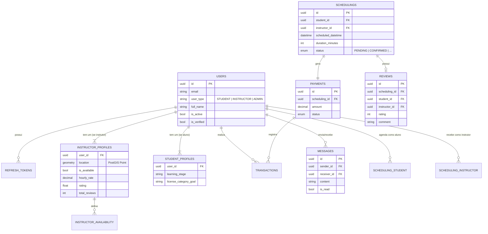

# Visão do Banco de Dados - Projeto GoDrive

Este documento serve como um guia técnico completo sobre a estrutura, modelagem e configuração do banco de dados do projeto GoDrive. Ele foi desenhado para facilitar o onboarding de novos desenvolvedores e garantir o entendimento correto das decisões arquiteturais.

## 1. Visão Geral da Arquitetura

O projeto utiliza uma stack moderna e robusta focada em performance e geolocalização.

- **SGBD**: PostgreSQL 15
- **Extensão Geoespacial**: PostGIS 3.3 (para armazenamento e queries de localização)
- **Driver**: `asyncpg` (driver assíncrono de alta performance)
- **ORM**: SQLAlchemy 2.0+ (com suporte nativo a `asyncio`)
- **Gerenciamento de Migrations**: Alembic

### Infraestrutura (Docker)
O banco roda em um container Docker (`godrive_postgres`), exposto na porta `5432`.
- **Volume persistente**: `postgres_data` mapeado para `/var/lib/postgresql/data`.
- **Healthcheck**: Configurado via `pg_isready`.

---

## 2. Diagrama Entidade-Relacionamento (ER)

O diagrama abaixo ilustra as relações entre as principais entidades do sistema.



---

## 3. Catálogo de Tabelas

### 3.1. Core e Autenticação

#### `users`
Tabela central que armazena as credenciais e dados básicos de todos os usuários (Alunos, Instrutores e Admins).
*   **PK**: `id` (UUIDv4)
*   **Campos Chave**:
    *   `email` (Unique Index): Login do usuário.
    *   `user_type`: Discriminador (`student`, `instructor`, `admin`).
    *   `hashed_password`: Hash seguro da senha.
    *   `full_name`, `cpf`, `phone`, `biological_sex`, `birth_date`: Dados pessoais.
    *   `is_active`, `is_verified`: Flags de controle de acesso.
*   **Relacionamentos**: Pai de `instructor_profiles`, `student_profiles`, envia/recebe `messages` e participa nas `transactions`.

#### `refresh_tokens`
Gerencia a persistência de sessões para renovação de JWTs.
*   **PK**: `id` (UUIDv4)
*   **FK**: `user_id` -> `users.id` (Cascade Delete)
*   **Campos Chave**: `token_hash`, `expires_at`, `is_revoked`.

#### `messages`
Armazena as mensagens trocadas no chat interno entre alunos e instrutores.
*   **PK**: `id` (UUIDv4)
*   **FKs**: `sender_id` -> `users.id`, `receiver_id` -> `users.id` (Cascade Delete)
*   **Campos Chave**: `content` (Conteúdo da mensagem), `is_read` (Status de leitura), `timestamp`.

### 3.2. Perfis de Usuário

#### `instructor_profiles`
Armazena dados específicos de instrutores, incluindo dados espaciais.
*   **PK**: `id` (UUIDv4)
*   **FK**: `user_id` -> `users.id` (One-to-One, Unique, Cascade Delete)
*   **Geolocalização**:
    *   campo `location`: Tipo `Geometry(Point, 4326)`. Armazena a posição geográfica do instrutor (WGS84).
    *   Índice Espacial: `GIST` na coluna `location` para queries de proximidade (`ST_DWithin`).
*   **Campos Chave**: `bio`, `vehicle_type`, `license_category`, `hourly_rate`, `is_available`, `rating`, `total_reviews`, `city`, `stripe_account_id`.
*   **Integração Mercado Pago**: `mp_access_token`, `mp_refresh_token`, `mp_token_expiry`, `mp_user_id`.

#### `student_profiles`
Armazena dados de aprendizado dos alunos.
*   **PK**: `id` (UUIDv4)
*   **FK**: `user_id` -> `users.id` (One-to-One, Unique, Cascade Delete)
*   **Campos Chave**: `learning_stage` (Iniciante, Intermediário...), `license_category_goal`, `preferred_schedule`, `notes`, `total_lessons`.

### 3.3. Agendamento e Disponibilidade

#### `schedulings`
Registra as aulas agendadas.
*   **PK**: `id` (UUIDv4)
*   **FKs** (Cascade Delete):
    *   `student_id` -> `users.id`
    *   `instructor_id` -> `users.id`
*   **Campos Chave**:
    *   `scheduled_datetime`: Data e hora da aula.
    *   `duration_minutes`: Tempo em minutos (padrão 50).
    *   `status`: Enum (`PENDING`, `CONFIRMED`, `COMPLETED`, `CANCELLED`).
    *   `price`: Valor congelado no momento do agendamento.
    *   `cancellation_reason`, `cancelled_by`, `rescheduled_datetime`: Controle do ciclo de vida da aula.
*   **Índices**: Compostos para buscas rápidas por aluno/data e instrutor/data.

#### `reviews`
Armazena as avaliações de feedback.
*   **PK**: `id` (UUIDv4)
*   **FKs** (Cascade Delete):
    *   `scheduling_id` -> `schedulings.id` (One-to-One, Unique)
    *   `student_id` -> `users.id`
    *   `instructor_id` -> `users.id`
*   **Campos Chave**: `rating` (Nota recebida) e `comment` (Comentário do aluno).

#### `instructor_availability`
Define a "grade horária" recorrente do instrutor.
*   **PK**: `id` (UUIDv4)
*   **FK**: `instructor_id` -> `users.id` (Cascade Delete)
*   **Campos Chave**:
    *   `day_of_week` (int 0-6).
    *   `start_time`, `end_time`.
*   **Constraint**: Unique constraint combinando `instructor_id` + `day_of_week` + `start_time` para evitar sobreposições.

### 3.4. Financeiro

#### `payments`
Gerencia o ciclo de vida do pagamento de uma aula.
*   **PK**: `id` (UUIDv4)
*   **FK**: `scheduling_id` -> `schedulings.id` (One-to-One, Unique)
*   **Campos Chave**:
    *   `amount`: Valor total.
    *   `platform_fee_percentage`, `platform_fee_amount`: Parte e percentual da plataforma.
    *   `instructor_amount`: Parte do instrutor (split).
    *   `gateway_payment_id`, `gateway_preference_id`, `gateway_provider`: Dados do gateway (ex: Mercado Pago).
    *   `refund_amount`, `refunded_at`: Informações sobre estorno.
    *   `status`: (`PENDING`, `PAID`, `REFUNDED`, `FAILED`).

#### `transactions`
Log imutável de movimentações financeiras para auditoria.

> [!WARNING]
> Atualmente, a exclusão de um agendamento/pagamento causa a exclusão em cascata das transações associadas (`cascade="all, delete-orphan"`). Para um ambiente de produção rigoroso, considere alterar `payment_id` para opcional (`nullable=True`) com `ondelete="SET NULL"` e remover o cascade, garantindo que o histórico financeiro seja preservado integralmente para auditoria.

*   **PK**: `id` (UUIDv4)
*   **FKs**: `payment_id` -> `payments.id`, `user_id` -> `users.id`
*   **Campos Chave**: `type` (Enum do tipo de transação), `amount`, `description`, `gateway_reference_id`.

---

## 4. Detalhes Técnicos Importantes

### 4.1. Conexão Assíncrona
A aplicação conecta ao banco exclusivamente de forma assíncrona.
- **Engine**: `create_async_engine` com `postgresql+asyncpg://`.
- **Pool de Conexões**: Configurado para alta concorrência (`pool_size=20`, `max_overflow=10`).
- **Session**: O uso de `AsyncSession` exige que todas as chamadas de banco sejam `await`ed. Lembre-se de usar `await session.commit()` e `await session.refresh()`.

### 4.2. Migrations (Alembic)

### Regras
- **Uma migration por feature branch.**
- **Naming convention:** `{YYYY_MM_DD}_{descricao_snake_case}` (ex: `2024_01_15_criar_tabela_agendamentos`).
- **Nunca editar migrations já mergeadas na main.**
- **Sempre testar rollback:** `alembic downgrade -1` antes de merge.
- **Migrations manuais:** Não usar `--autogenerate` para evitar código verbose e desnecessário.
- **Executar dentro do docker.**

### Comandos Padrão
```bash
# Criar nova migration (manual - sem autogenerate)
docker compose exec backend alembic revision -m "descricao_da_mudanca"

# Aplicar migrations
docker compose exec backend alembic upgrade head

# Rollback
docker compose exec backend alembic downgrade -1

# Verificar status atual
docker compose exec backend alembic current

# Histórico de migrations
docker compose exec backend alembic history
```

### 4.3. PostGIS e GeoAlchemy2
O uso de dados espaciais requer atenção especial:
- Os modelos usam `geoalchemy2.Geometry`.
- Ao inserir dados, converta coordenadas para WKT (Well-Known Text) ou WKB.
- Queries de "Instrutores Próximos" utilizam funções nativas do banco, o que é extremamente performático comparado a calcular distância em Python.

## 5. Boas Práticas Estabelecidas

1.  **Chaves Estrangeiras**: Sempre defina `ondelete` (ex: `CASCADE` ou `SET NULL`) para manter integridade referencial.
2.  **Índices**: Campos usados em filtros (`WHERE`) ou ordenação frequente possuem índices explícitos.
3.  **Tipos**: Uso estrito de tipos (ex: `Decimal` para dinheiro, não `Float`).
4.  **Imutabilidade e Auditoria**: Tabelas financeiras (`transactions`) devem ser tratadas como *append-only* (nunca alterar registros passados). Ao escalar para produção, priorize estratégias de "Soft Delete" ou exclusões lógicas para não perder histórico financeiro.
