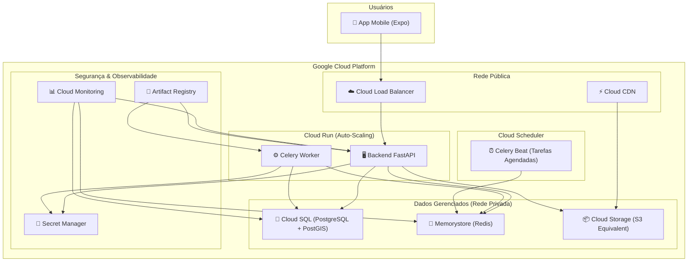

# 🚀 GoDrive — Guia de Deploy e Infraestrutura (Google Cloud Platform)

Este documento descreve **como hospedar, configurar e escalar** o aplicativo GoDrive usando os serviços da Google Cloud Platform (GCP). Ele mapeia cada serviço do `docker-compose.yml` local para o equivalente gerenciado na nuvem.

---

## 📐 Visão Geral da Arquitetura



### Mapeamento Docker Compose → GCP

| Serviço Local (`docker-compose.yml`) | Serviço GCP                    | Tipo de Escala        |
| :----------------------------------- | :----------------------------- | :-------------------- |
| `postgres` (PostGIS 15)              | **Cloud SQL for PostgreSQL**   | Vertical + Réplicas   |
| `redis` (Redis 7)                    | **Memorystore for Redis**      | Vertical              |
| `backend` (FastAPI + Uvicorn)        | **Cloud Run**                  | Horizontal Automático |
| `celery-worker`                      | **Cloud Run**                  | Horizontal Automático |
| `celery-beat`                        | **Cloud Scheduler + Cloud Run Jobs** | Instância Única |
| Volumes Docker                       | **Cloud Storage**              | Infinito              |
| Arquivo `.env`                       | **Secret Manager**             | N/A                   |

---

## 🔧 Pré-Requisitos

1.  **Conta Google Cloud** com faturamento ativo.
2.  **`gcloud` CLI** instalada e autenticada.
3.  **Docker** instalado localmente.
4.  **Projeto GCP** criado.

```bash
# Instalar gcloud CLI (se ainda não tiver)
curl https://sdk.cloud.google.com | bash
exec -l $SHELL
gcloud init

# Criar um projeto (substitua pelo seu nome)
gcloud projects create godrive-prod --name="GoDrive Production"
gcloud config set project godrive-prod

# Ativar as APIs necessárias
gcloud services enable \
  run.googleapis.com \
  sqladmin.googleapis.com \
  redis.googleapis.com \
  artifactregistry.googleapis.com \
  secretmanager.googleapis.com \
  cloudscheduler.googleapis.com \
  monitoring.googleapis.com \
  compute.googleapis.com \
  vpcaccess.googleapis.com
```

---

## 1. 🐘 Cloud SQL — Banco de Dados PostgreSQL + PostGIS

Substitui o container `postgres` do Docker Compose.

### 1.1 Criar a Instância

```bash
# Definir variáveis
export REGION="southamerica-east1"   # São Paulo
export DB_INSTANCE="godrive-db"
export DB_NAME="godrive_db"
export DB_USER="godrive"
export DB_PASSWORD="<SENHA_FORTE_AQUI>"

# Criar instância Cloud SQL
gcloud sql instances create $DB_INSTANCE \
  --database-version=POSTGRES_15 \
  --tier=db-f1-micro \
  --region=$REGION \
  --storage-type=SSD \
  --storage-size=10GB \
  --storage-auto-increase \
  --backup-start-time=03:00 \
  --availability-type=zonal \
  --maintenance-window-day=SUN \
  --maintenance-window-hour=04

# Criar o banco de dados
gcloud sql databases create $DB_NAME --instance=$DB_INSTANCE

# Criar o usuário
gcloud sql users create $DB_USER \
  --instance=$DB_INSTANCE \
  --password=$DB_PASSWORD
```

### 1.2 Ativar PostGIS

```bash
# Conectar ao banco via Cloud SQL Proxy ou pelo console
gcloud sql connect $DB_INSTANCE --user=$DB_USER --database=$DB_NAME

# Dentro do psql, ativar a extensão
CREATE EXTENSION IF NOT EXISTS postgis;
CREATE EXTENSION IF NOT EXISTS postgis_topology;
```

### 1.3 Escalabilidade do Banco

| Cenário                      | Ação                                                                            |
| :--------------------------- | :------------------------------------------------------------------------------ |
| Banco ficando lento           | Aumentar o `tier` (ex: `db-f1-micro` → `db-custom-2-7680`)                     |
| Muitas consultas de leitura   | Criar **Read Replicas** para distribuir `SELECT`s                               |
| Precisa de escala massiva     | Migrar para **Cloud Spanner** ou **AlloyDB** (Postgres com escala horizontal)   |

```bash
# Criar uma Read Replica (quando necessário)
gcloud sql instances create godrive-db-replica \
  --master-instance-name=$DB_INSTANCE \
  --region=$REGION \
  --tier=db-f1-micro
```

> [!TIP]
> Comece com `db-f1-micro` (compartilhado) para desenvolvimento/testes. Em produção real, use pelo menos `db-custom-1-3840` (1 vCPU, 3.75 GB RAM).

---

## 2. 🔴 Memorystore — Redis (Cache e Filas do Celery)

Substitui o container `redis` do Docker Compose.

### 2.1 Criar a Instância

```bash
# Criar instância Redis
gcloud redis instances create godrive-redis \
  --size=1 \
  --region=$REGION \
  --redis-version=redis_7_0 \
  --tier=basic

# Obter o IP interno (será usado nas variáveis de ambiente)
gcloud redis instances describe godrive-redis \
  --region=$REGION \
  --format="value(host)"
```

> [!NOTE]
> O Memorystore só é acessível via rede interna (VPC). O Cloud Run se conecta a ele através de um **VPC Connector**.

### 2.2 Criar o VPC Connector

O VPC Connector permite que o Cloud Run (rede pública) acesse o Memorystore (rede privada).

```bash
# Criar o conector VPC
gcloud compute networks vpc-access connectors create godrive-connector \
  --region=$REGION \
  --range="10.8.0.0/28" \
  --min-instances=2 \
  --max-instances=3
```

---

## 3. 🐳 Artifact Registry — Repositório de Imagens Docker

Substitui o Docker Hub. Suas imagens ficam dentro da sua conta GCP, de forma privada.

```bash
# Criar repositório
gcloud artifacts repositories create godrive-repo \
  --repository-format=docker \
  --location=$REGION \
  --description="GoDrive Docker Images"

# Configurar o Docker para autenticar no Artifact Registry
gcloud auth configure-docker ${REGION}-docker.pkg.dev

# Build e Push da imagem (a partir da raiz do projeto)
docker build -t ${REGION}-docker.pkg.dev/godrive-prod/godrive-repo/backend:latest ./backend

docker push ${REGION}-docker.pkg.dev/godrive-prod/godrive-repo/backend:latest
```

---

## 4. 🔐 Secret Manager — Variáveis de Ambiente Seguras

Substitui o arquivo `.env`. Cada variável sensível vira um "segredo" gerenciado.

### 4.1 Criar os Segredos

```bash
# Criar cada segredo individualmente
echo -n "<SENHA_DO_BANCO>" | gcloud secrets create DB_PASSWORD --data-file=-
echo -n "<SEU_JWT_SECRET>" | gcloud secrets create JWT_SECRET_KEY --data-file=-
echo -n "<SEU_MP_ACCESS_TOKEN>" | gcloud secrets create MP_ACCESS_TOKEN --data-file=-
echo -n "<SEU_MP_PUBLIC_KEY>" | gcloud secrets create MP_PUBLIC_KEY --data-file=-
echo -n "<SEU_MP_CLIENT_ID>" | gcloud secrets create MP_CLIENT_ID --data-file=-
echo -n "<SEU_MP_CLIENT_SECRET>" | gcloud secrets create MP_CLIENT_SECRET --data-file=-
echo -n "<SEU_MP_WEBHOOK_SECRET>" | gcloud secrets create MP_WEBHOOK_SECRET --data-file=-
echo -n "<SUA_ENCRYPTION_KEY>" | gcloud secrets create ENCRYPTION_KEY --data-file=-
```

### 4.2 Conceder Acesso ao Cloud Run

```bash
# Obter o número do projeto
PROJECT_NUMBER=$(gcloud projects describe godrive-prod --format="value(projectNumber)")

# Dar permissão à service account do Cloud Run
gcloud secrets add-iam-policy-binding DB_PASSWORD \
  --member="serviceAccount:${PROJECT_NUMBER}-compute@developer.gserviceaccount.com" \
  --role="roles/secretmanager.secretAccessor"

# Repetir para cada segredo ou usar um loop:
for SECRET in JWT_SECRET_KEY MP_ACCESS_TOKEN MP_PUBLIC_KEY MP_CLIENT_ID MP_CLIENT_SECRET MP_WEBHOOK_SECRET ENCRYPTION_KEY; do
  gcloud secrets add-iam-policy-binding $SECRET \
    --member="serviceAccount:${PROJECT_NUMBER}-compute@developer.gserviceaccount.com" \
    --role="roles/secretmanager.secretAccessor"
done
```

---

## 5. 🖥️ Cloud Run — Backend FastAPI (API Principal)

Substitui o container `backend` do Docker Compose. Este é o **coração da escalabilidade**.

### 5.1 Deploy

```bash
# Obter a CONNECTION_NAME do Cloud SQL
CONNECTION_NAME=$(gcloud sql instances describe $DB_INSTANCE --format="value(connectionName)")

# Obter o IP do Redis
REDIS_HOST=$(gcloud redis instances describe godrive-redis --region=$REGION --format="value(host)")

# Deploy do serviço
gcloud run deploy godrive-api \
  --image=${REGION}-docker.pkg.dev/godrive-prod/godrive-repo/backend:latest \
  --region=$REGION \
  --platform=managed \
  --port=8000 \
  --allow-unauthenticated \
  --vpc-connector=godrive-connector \
  --add-cloudsql-instances=$CONNECTION_NAME \
  --set-env-vars="ENVIRONMENT=production,DEBUG=false,PLATFORM_FEE_PERCENTAGE=20.0,MERCADOPAGO_FEE_PERCENTAGE=4.98" \
  --set-env-vars="DATABASE_URL=postgresql+asyncpg://${DB_USER}:${DB_PASSWORD}@/${DB_NAME}?host=/cloudsql/${CONNECTION_NAME}" \
  --set-env-vars="REDIS_URL=redis://${REDIS_HOST}:6379/0" \
  --set-secrets="JWT_SECRET_KEY=JWT_SECRET_KEY:latest,MP_ACCESS_TOKEN=MP_ACCESS_TOKEN:latest,MP_PUBLIC_KEY=MP_PUBLIC_KEY:latest,MP_CLIENT_ID=MP_CLIENT_ID:latest,MP_CLIENT_SECRET=MP_CLIENT_SECRET:latest,MP_WEBHOOK_SECRET=MP_WEBHOOK_SECRET:latest,ENCRYPTION_KEY=ENCRYPTION_KEY:latest" \
  --min-instances=1 \
  --max-instances=100 \
  --cpu=1 \
  --memory=512Mi \
  --concurrency=80 \
  --timeout=300 \
  --command="uvicorn","src.interface.api.main:app","--host","0.0.0.0","--port","8000"
```

### 5.2 Configuração de Auto-Scaling

O Cloud Run escala automaticamente com base no tráfego. As configurações-chave:

| Parâmetro          | Valor Recomendado | Descrição                                                         |
| :----------------- | :---------------- | :---------------------------------------------------------------- |
| `--min-instances`  | `1`               | Mínimo de 1 instância para evitar cold starts.                    |
| `--max-instances`  | `100`             | Limite superior. Aumente conforme necessário.                     |
| `--concurrency`    | `80`              | Requisições simultâneas por instância antes de escalar.            |
| `--cpu`            | `1`               | 1 vCPU por instância. Aumente para `2` se o processamento for pesado. |
| `--memory`         | `512Mi`           | RAM por instância. Aumente se necessário (`1Gi`, `2Gi`).          |

> [!IMPORTANT]
> **Scale to Zero:** Se quiser economizar nos primeiros meses, use `--min-instances=0`. O Cloud Run desligará todas as instâncias quando não houver tráfego (custo zero), mas a primeira requisição após um período de inatividade terá um delay de ~2-5 segundos (cold start).

---

## 6. ⚙️ Cloud Run — Celery Worker (Tarefas em Background)

Substitui o container `celery-worker`. Processa pagamentos, envio de notificações e outras tarefas assíncronas.

```bash
gcloud run deploy godrive-worker \
  --image=${REGION}-docker.pkg.dev/godrive-prod/godrive-repo/backend:latest \
  --region=$REGION \
  --platform=managed \
  --no-allow-unauthenticated \
  --vpc-connector=godrive-connector \
  --add-cloudsql-instances=$CONNECTION_NAME \
  --set-env-vars="ENVIRONMENT=production,DEBUG=false" \
  --set-env-vars="DATABASE_URL=postgresql+asyncpg://${DB_USER}:${DB_PASSWORD}@/${DB_NAME}?host=/cloudsql/${CONNECTION_NAME}" \
  --set-env-vars="REDIS_URL=redis://${REDIS_HOST}:6379/0" \
  --set-secrets="MP_ACCESS_TOKEN=MP_ACCESS_TOKEN:latest,MP_CLIENT_SECRET=MP_CLIENT_SECRET:latest,ENCRYPTION_KEY=ENCRYPTION_KEY:latest" \
  --min-instances=1 \
  --max-instances=20 \
  --cpu=1 \
  --memory=1Gi \
  --no-cpu-throttling \
  --timeout=3600 \
  --command="celery","-A","src.infrastructure.tasks.celery_app","worker","--loglevel=info"
```

> [!NOTE]
> O flag `--no-cpu-throttling` é essencial para o worker. Sem ele, o Cloud Run só aloca CPU quando há uma requisição HTTP. O worker precisa rodar continuamente para consumir a fila do Celery.

---

## 7. ⏰ Cloud Scheduler + Cloud Run Jobs — Celery Beat (Tarefas Agendadas)

Substitui o container `celery-beat`. O approach recomendado no GCP é usar o **Cloud Scheduler** para disparar tarefas em intervalos, em vez de manter um processo `celery-beat` rodando 24/7.

### Opção A: Cloud Run Jobs (Recomendado)

```bash
# Criar um Cloud Run Job para executar tarefas periódicas
gcloud run jobs create godrive-beat \
  --image=${REGION}-docker.pkg.dev/godrive-prod/godrive-repo/backend:latest \
  --region=$REGION \
  --vpc-connector=godrive-connector \
  --add-cloudsql-instances=$CONNECTION_NAME \
  --set-env-vars="ENVIRONMENT=production,DATABASE_URL=postgresql+asyncpg://${DB_USER}:${DB_PASSWORD}@/${DB_NAME}?host=/cloudsql/${CONNECTION_NAME},REDIS_URL=redis://${REDIS_HOST}:6379/0" \
  --cpu=1 \
  --memory=512Mi \
  --max-retries=3 \
  --task-timeout=600 \
  --command="celery","-A","src.infrastructure.tasks.celery_app","beat","--loglevel=info"

# Agendar a execução a cada minuto com Cloud Scheduler
gcloud scheduler jobs create http godrive-beat-trigger \
  --schedule="* * * * *" \
  --uri="https://${REGION}-run.googleapis.com/apis/run.googleapis.com/v1/namespaces/godrive-prod/jobs/godrive-beat:run" \
  --http-method=POST \
  --oauth-service-account-email="${PROJECT_NUMBER}-compute@developer.gserviceaccount.com" \
  --location=$REGION
```

### Opção B: Cloud Run Service (Alternativa Simples)

Se preferir manter a mesma abordagem do Docker Compose:

```bash
gcloud run deploy godrive-beat \
  --image=${REGION}-docker.pkg.dev/godrive-prod/godrive-repo/backend:latest \
  --region=$REGION \
  --platform=managed \
  --no-allow-unauthenticated \
  --vpc-connector=godrive-connector \
  --add-cloudsql-instances=$CONNECTION_NAME \
  --set-env-vars="ENVIRONMENT=production,DATABASE_URL=postgresql+asyncpg://${DB_USER}:${DB_PASSWORD}@/${DB_NAME}?host=/cloudsql/${CONNECTION_NAME},REDIS_URL=redis://${REDIS_HOST}:6379/0" \
  --min-instances=1 \
  --max-instances=1 \
  --cpu=0.5 \
  --memory=256Mi \
  --no-cpu-throttling \
  --timeout=3600 \
  --command="celery","-A","src.infrastructure.tasks.celery_app","beat","--loglevel=info"
```

---

## 8. 📦 Cloud Storage — Armazenamento de Arquivos

Para fotos de perfil, comprovantes de pagamento e outros uploads.

```bash
# Criar bucket
gsutil mb -l $REGION gs://godrive-prod-uploads

# Configurar CORS para permitir uploads do app
cat > /tmp/cors.json << 'EOF'
[
  {
    "origin": ["*"],
    "method": ["GET", "PUT", "POST"],
    "responseHeader": ["Content-Type", "Authorization"],
    "maxAgeSeconds": 3600
  }
]
EOF
gsutil cors set /tmp/cors.json gs://godrive-prod-uploads

# Tornar objetos públicos (se necessário para imagens de perfil)
gsutil iam ch allUsers:objectViewer gs://godrive-prod-uploads
```

---

## 9. 🔄 CI/CD — GitHub Actions (Deploy Automático)

Crie o arquivo `.github/workflows/deploy.yml` no repositório:

```yaml
name: Deploy GoDrive to GCP

on:
  push:
    branches: [main]

env:
  PROJECT_ID: godrive-prod
  REGION: southamerica-east1
  REPOSITORY: godrive-repo
  IMAGE_NAME: backend

jobs:
  test:
    runs-on: ubuntu-latest
    steps:
      - uses: actions/checkout@v4
      - name: Run Tests (Docker)
        run: |
          docker compose up -d postgres redis
          docker compose run --rm backend pytest tests/ -v
          docker compose down

  deploy:
    needs: test
    runs-on: ubuntu-latest
    permissions:
      contents: read
      id-token: write

    steps:
      - uses: actions/checkout@v4

      # Autenticar no GCP via Workload Identity Federation
      - id: auth
        uses: google-github-actions/auth@v2
        with:
          workload_identity_provider: ${{ secrets.WIF_PROVIDER }}
          service_account: ${{ secrets.WIF_SERVICE_ACCOUNT }}

      # Configurar Docker para Artifact Registry
      - name: Configure Docker
        run: gcloud auth configure-docker ${{ env.REGION }}-docker.pkg.dev

      # Build e Push da Imagem
      - name: Build and Push
        run: |
          IMAGE="${{ env.REGION }}-docker.pkg.dev/${{ env.PROJECT_ID }}/${{ env.REPOSITORY }}/${{ env.IMAGE_NAME }}"
          docker build -t ${IMAGE}:${{ github.sha }} -t ${IMAGE}:latest ./backend
          docker push ${IMAGE}:${{ github.sha }}
          docker push ${IMAGE}:latest

      # Deploy API
      - name: Deploy API
        run: |
          gcloud run deploy godrive-api \
            --image=${{ env.REGION }}-docker.pkg.dev/${{ env.PROJECT_ID }}/${{ env.REPOSITORY }}/${{ env.IMAGE_NAME }}:${{ github.sha }} \
            --region=${{ env.REGION }}

      # Deploy Worker
      - name: Deploy Worker
        run: |
          gcloud run deploy godrive-worker \
            --image=${{ env.REGION }}-docker.pkg.dev/${{ env.PROJECT_ID }}/${{ env.REPOSITORY }}/${{ env.IMAGE_NAME }}:${{ github.sha }} \
            --region=${{ env.REGION }}
```

> [!IMPORTANT]
> **Workload Identity Federation** é a forma recomendada de autenticar o GitHub no GCP (sem usar chaves JSON). Siga a [documentação oficial](https://cloud.google.com/iam/docs/workload-identity-federation-with-deployment-pipelines#github-actions) para configurar.

---

## 10. 📊 Monitoramento — Cloud Monitoring e Alertas

### 10.1 Alertas Essenciais

```bash
# Alerta: Latência da API acima de 2 segundos
gcloud monitoring policies create \
  --display-name="GoDrive API - Alta Latência" \
  --condition-display-name="Latência > 2s" \
  --condition-filter='resource.type="cloud_run_revision" AND metric.type="run.googleapis.com/request_latencies"' \
  --condition-threshold-value=2000 \
  --condition-threshold-duration=300s \
  --notification-channels="<CHANNEL_ID>"

# Alerta: Erros 5xx acima de 5% das requisições
gcloud monitoring policies create \
  --display-name="GoDrive API - Erros 5xx" \
  --condition-display-name="Erros > 5%" \
  --condition-filter='resource.type="cloud_run_revision" AND metric.type="run.googleapis.com/request_count" AND metric.labels.response_code_class="5xx"' \
  --condition-threshold-value=5 \
  --condition-threshold-duration=60s \
  --notification-channels="<CHANNEL_ID>"
```

### 10.2 Dashboards

O Cloud Run já vem com dashboards integrados no console do GCP mostrando:
- Quantidade de requisições por segundo
- Latência (P50, P95, P99)
- Quantidade de instâncias ativas (auto-scaling em ação)
- Uso de CPU e memória por instância
- Erros por código HTTP

---

## 11. 💰 Estimativa de Custos Mensais

Baseado em um cenário de **MVP com tráfego baixo a moderado** (~1.000 usuários ativos/dia).

| Serviço                    | Tier/Configuração              | Custo Estimado (USD/mês) |
| :------------------------- | :----------------------------- | :----------------------- |
| **Cloud SQL** (Postgres)   | `db-f1-micro` (compartilhado) | ~$10                     |
| **Memorystore** (Redis)    | Basic, 1 GB                   | ~$35                     |
| **Cloud Run** (API)        | 1 vCPU, 512Mi, min=1          | ~$15–40                  |
| **Cloud Run** (Worker)     | 1 vCPU, 1Gi, min=1            | ~$20–50                  |
| **Cloud Storage**          | 10 GB padrão                  | ~$0.50                   |
| **Secret Manager**         | 10 segredos                   | ~$0.10                   |
| **Artifact Registry**      | 5 GB de imagens               | ~$0.50                   |
| **VPC Connector**          | 2 instâncias mínimas          | ~$15                     |
| **Cloud Scheduler**        | 3 jobs                        | Gratuito (até 3 jobs)    |
| **Total Estimado**         |                                | **~$95–150/mês**         |

> [!TIP]
> O Google oferece **$300 de créditos gratuitos** para novas contas. Isso cobre aproximadamente 2–3 meses de operação no cenário acima.

---

## 12. 📋 Checklist de Deploy

Use esta lista para acompanhar o progresso da migração:

- [ ] Criar projeto no GCP e ativar APIs
- [ ] Configurar Cloud SQL (PostgreSQL + PostGIS)
- [ ] Configurar Memorystore (Redis)
- [ ] Criar VPC Connector
- [ ] Criar repositório no Artifact Registry
- [ ] Subir segredos no Secret Manager
- [ ] Build e push da imagem Docker
- [ ] Deploy do Backend (Cloud Run)
- [ ] Deploy do Celery Worker (Cloud Run)
- [ ] Configurar Celery Beat (Cloud Scheduler / Cloud Run Jobs)
- [ ] Criar bucket no Cloud Storage
- [ ] Rodar migrations do Alembic no banco de produção
- [ ] Configurar domínio customizado no Cloud Run
- [ ] Configurar CI/CD (GitHub Actions)
- [ ] Configurar alertas de monitoramento
- [ ] Testar fluxo completo end-to-end

---

## 13. 🔑 Comandos Rápidos de Referência

```bash
# Ver logs da API em tempo real
gcloud run services logs read godrive-api --region=$REGION --tail=100

# Ver logs do Worker
gcloud run services logs read godrive-worker --region=$REGION --tail=100

# Conectar ao banco de dados (via Cloud SQL Proxy)
gcloud sql connect godrive-db --user=godrive --database=godrive_db

# Atualizar a imagem de um serviço (deploy manual)
gcloud run deploy godrive-api \
  --image=${REGION}-docker.pkg.dev/godrive-prod/godrive-repo/backend:latest \
  --region=$REGION

# Rodar migrations do Alembic no Cloud Run
gcloud run jobs execute godrive-migrate --region=$REGION

# Escalar manualmente (ex: durante um evento promocional)
gcloud run services update godrive-api --min-instances=5 --max-instances=200 --region=$REGION
```
