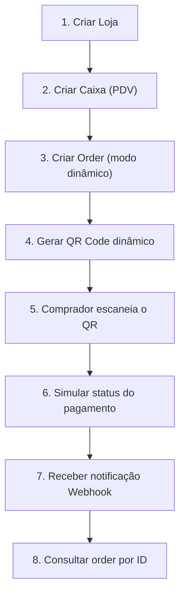

# 🧪 MP_TESTING — Guia de Testes: QR Code Dinâmico com Orders API

> **Fonte oficial**: Toda a informação deste guia é baseada na [documentação oficial do Mercado Pago](https://www.mercadopago.com/developers/pt/docs/qr-code/overview) para integração QR Code com a API de Orders (MLB — Brasil).

---

## 1. Controle de Testes da Integração

### 1.1 Credenciais — Teste vs. Produção

| Etapa do Fluxo | Tipo de Credencial | Onde obter |
|---|---|---|
| Criar loja (`POST /users/{user_id}/stores`) | **Access Token de teste** | Suas integrações > Detalhes da aplicação > Testes > Credenciais de teste |
| Criar caixa (`POST /pos`) | **Access Token de teste** | Mesma origem acima |
| Criar order (`POST /v1/orders`) | **Access Token de teste** | Mesma origem acima |
| Simular status (`POST /v1/orders/{id}/events`) | **Access Token de teste** | Mesma origem acima |
| Consultar order (`GET /v1/orders/{id}`) | **Access Token de teste** | Mesma origem acima |
| **Produção (após homologação)** | **Access Token de produção** | Suas integrações > Credenciais de produção |

> [!IMPORTANT]
> Durante **todo o processo de integração e teste**, utilize exclusivamente o **Access Token de teste**. Ao concluir a integração, substitua-o pelo **Access Token de produção** (integração própria) ou pelo **Access Token obtido via OAuth** (integrações para terceiros).

### 1.2 Requisitos Prévios

1. **Aplicação criada** em [Suas integrações](https://www.mercadopago.com.br/developers/panel/app)
2. **App do Mercado Pago** instalado no celular ([Android](https://play.google.com/store/apps/details?id=com.mercadopago.wallet&hl=pt_419) | [iOS](https://apps.apple.com/br/app/mercado-pago/id925436649))
3. **Conta Mercado Pago** do vendedor
4. **Webhooks configurados** antes de iniciar os testes (tópico `order`)

---

## 2. Usuários de Teste Criados

Ambos os usuários foram criados via MCP (`create_test_user`) para o site **MLB (Brasil)**, com saldo inicial de **R$ 5.000,00**.

### 2.1 Vendedor — `testes orders`

| Campo | Valor |
|---|---|
| **User ID** | `3209222310` |
| **Nickname** | `TESTUSER9010978536074485288` |
| **Perfil** | Seller |
| **Site** | MLB |
| **Status** | Active |
| **Saldo** | R$ 5.000,00 |
| **Credenciais** | [Ver no painel](https://www.mercadopago.com.br/developers/panel/app/1579574652382256/test-users) |

### 2.2 Comprador — `comprador orders`

| Campo | Valor |
|---|---|
| **User ID** | `3209222312` |
| **Nickname** | `TESTUSER1116871565177296333` |
| **Perfil** | Buyer |
| **Site** | MLB |
| **Status** | Active |
| **Saldo** | R$ 5.000,00 |
| **Credenciais** | [Ver no painel](https://www.mercadopago.com.br/developers/panel/app/1579574652382256/test-users) |

> [!NOTE]
> As senhas e códigos de verificação (6 dígitos) estão disponíveis exclusivamente no painel **Suas integrações > Contas de teste**. Comprador e Vendedor precisam ser do mesmo país.

---

## 3. Simulação Passo a Passo do Fluxo de Pagamento

### Fluxo Geral (Diagrama)



---

### Passo 1 — Criar Loja

Cria o estabelecimento físico vinculado à conta do vendedor de teste.

```bash
curl -X POST \
  'https://api.mercadopago.com/users/3209222310/stores' \
  -H 'Content-Type: application/json' \
  -H 'Authorization: Bearer ACCESS_TOKEN_TESTE' \
  -d '{
    "name": "Loja Teste Orders",
    "business_hours": {
      "monday": [{"open": "08:00", "close": "18:00"}],
      "tuesday": [{"open": "08:00", "close": "18:00"}],
      "wednesday": [{"open": "08:00", "close": "18:00"}],
      "thursday": [{"open": "08:00", "close": "18:00"}],
      "friday": [{"open": "08:00", "close": "18:00"}]
    },
    "external_id": "LOJ_ORDERS_001",
    "location": {
      "street_number": "1000",
      "street_name": "Av. Paulista",
      "city_name": "São Paulo",
      "state_name": "São Paulo",
      "latitude": -23.561414,
      "longitude": -46.655881,
      "reference": "Próximo ao MASP"
    }
  }'
```

**Resposta esperada**: Retorna o `id` da loja (ex: `1234567`). Guarde este valor.

| Campo | Obrigatório | Descrição |
|---|---|---|
| `user_id` (path) | ✅ | User ID do vendedor de teste (`3209222310`) |
| `name` | ✅ | Nome da loja |
| `external_id` | ✅ | ID externo único (até 60 caracteres) |
| `location` | ✅ | Dados de localização com `latitude` e `longitude` |

**Justificativa**: A loja é o primeiro nível da hierarquia. Sem ela, não é possível criar caixas.

---

### Passo 2 — Criar Caixa (PDV)

Vincula um ponto de venda à loja. É aqui que o QR Code estático é gerado automaticamente.

```bash
curl -X POST \
  'https://api.mercadopago.com/pos' \
  -H 'Content-Type: application/json' \
  -H 'Authorization: Bearer ACCESS_TOKEN_TESTE' \
  -d '{
    "name": "Caixa 01 Orders",
    "fixed_amount": true,
    "store_id": STORE_ID,
    "external_store_id": "LOJ_ORDERS_001",
    "external_id": "LOJ001_CAIXA001"
  }'
```

**Resposta esperada**: Retorna o `id` do caixa, além de um objeto `qr` com `image`, `template_document` e `template_image`.

| Campo | Obrigatório | Descrição |
|---|---|---|
| `name` | ✅ | Nome do caixa |
| `fixed_amount` | ✅ | `true` para modelos integrados |
| `store_id` | ✅ | `id` retornado no Passo 1 |
| `external_store_id` | ✅ | `external_id` definido na loja |
| `external_id` | ✅ | ID externo único do caixa (até 40 caracteres) |

**Justificativa**: Cada loja precisa de pelo menos um caixa. O caixa recebe automaticamente um QR estático para uso no modo estático/híbrido.

---

### Passo 3 — Criar Order (Modo Dinâmico)

No modo **dinâmico**, cada transação gera um QR Code único. Envie uma order com `type: "dynamic"`.

```bash
curl -X POST \
  'https://api.mercadopago.com/v1/orders' \
  -H 'Content-Type: application/json' \
  -H 'Authorization: Bearer ACCESS_TOKEN_TESTE' \
  -d '{
    "type": "qr",
    "type_detail": "dynamic",
    "external_reference": "ORDER_TEST_001",
    "title": "Compra Teste - Aula de Direção",
    "description": "Pagamento de teste via QR Code dinâmico",
    "notification_url": "https://seu-webhook.example.com/mp/notifications",
    "total_amount": "150.00",
    "transactions": {
      "payments": [
        {
          "amount": "150.00"
        }
      ]
    }
  }'
```

**Resposta esperada**: Retorna o `id` da order (ex: `ORD01...`), o `status` (`created`) e os dados do QR Code para exibição.

| Campo | Obrigatório | Descrição |
|---|---|---|
| `type` | ✅ | `"qr"` para pagamentos via QR Code |
| `type_detail` | ✅ | `"dynamic"` para QR dinâmico |
| `external_reference` | Recomendado | Referência externa para conciliação |
| `total_amount` | ✅ | Valor total da order |
| `notification_url` | Recomendado | URL para receber notificações webhook |

**Justificativa**: Este é o coração do fluxo. O modo dinâmico gera um QR exclusivo para cada transação, impedindo reutilização acidental.

---

### Passo 4 — Gerar e Exibir o QR Code

O QR Code é retornado na resposta da criação da order. A resposta inclui:
- **`qr_data`**: String para gerar a imagem do QR Code programaticamente
- **`qr_code_base64`**: Imagem do QR Code em Base64 (quando disponível)

No seu sistema (PDV), exiba o QR Code para o comprador escanear.

**Justificativa**: O QR Code é o meio pelo qual o comprador paga. Sem exibi-lo, não há como o comprador completar a transação.

---

### Passo 5 — Comprador Escaneia e Paga

Em **ambiente de teste**, o comprador (conta `comprador orders`) escanearia o QR com o app do Mercado Pago. Como estamos em sandbox, utilizamos a **simulação de status** (Passo 6).

---

### Passo 6 — Simular Status do Pagamento

Use a API de simulação para alterar o status da order. A mudança pode levar até **10 segundos** (ou até 40s para `action_required`).

#### 6.1 Pagamento Aprovado (`processed`)

```bash
curl -X POST \
  'https://api.mercadopago.com/v1/orders/{order_id}/events' \
  -H 'Content-Type: application/json' \
  -H 'Authorization: Bearer ACCESS_TOKEN_TESTE' \
  -d '{
    "status": "processed",
    "payment_method_type": "credit_card",
    "installments": 1,
    "payment_method_id": "visa",
    "status_detail": "accredited"
  }'
```

#### 6.2 Pagamento com Falha (`failed`)

```bash
curl -X POST \
  'https://api.mercadopago.com/v1/orders/{order_id}/events' \
  -H 'Content-Type: application/json' \
  -H 'Authorization: Bearer ACCESS_TOKEN_TESTE' \
  -d '{
    "status": "failed",
    "payment_method_type": "credit_card",
    "installments": 1,
    "payment_method_id": "visa",
    "status_detail": "insufficient_amount"
  }'
```

#### 6.3 Reembolso (`refunded`) — Requer order previamente `processed`

```bash
curl -X POST \
  'https://api.mercadopago.com/v1/orders/{order_id}/events' \
  -H 'Content-Type: application/json' \
  -H 'Authorization: Bearer ACCESS_TOKEN_TESTE' \
  -d '{
    "status": "refunded"
  }'
```

#### 6.4 Cancelamento (`canceled`)

```bash
curl -X POST \
  'https://api.mercadopago.com/v1/orders/{order_id}/events' \
  -H 'Content-Type: application/json' \
  -H 'Authorization: Bearer ACCESS_TOKEN_TESTE' \
  -d '{
    "status": "canceled"
  }'
```

#### 6.5 Expiração (`expired`)

```bash
curl -X POST \
  'https://api.mercadopago.com/v1/orders/{order_id}/events' \
  -H 'Content-Type: application/json' \
  -H 'Authorization: Bearer ACCESS_TOKEN_TESTE' \
  -d '{
    "status": "expired"
  }'
```

#### 6.6 Ação Requerida (`action_required`) — até 40s para processar

```bash
curl -X POST \
  'https://api.mercadopago.com/v1/orders/{order_id}/events' \
  -H 'Content-Type: application/json' \
  -H 'Authorization: Bearer ACCESS_TOKEN_TESTE' \
  -d '{
    "status": "action_required"
  }'
```

#### Parâmetros da Simulação

| Parâmetro | Tipo | Valores Possíveis (MLB) | Obrigatoriedade |
|---|---|---|---|
| `status` | String | `processed`, `failed`, `refunded`, `canceled`, `expired`, `action_required` | ✅ |
| `payment_method_type` | String | `debit_card`, `credit_card`, `qr`, `voucher_card` | Opcional |
| `installments` | Integer | `1` | Condicional (apenas se `credit_card`) |
| `payment_method_id` | String | `amex`, `master`, `visa`, `debmaster`, `debvisa`, `elo`, `diners`, `hipercard` | Condicional (se `debit_card` ou `credit_card`) |
| `status_detail` | String | Ver tabela abaixo | Opcional |

#### Status Detail para falhas (`failed`)

| `status_detail` | Descrição |
|---|---|
| `bad_filled_card_data` | Dados do cartão incorretos |
| `required_call_for_authorize` | Requer ligação para autorizar |
| `card_disabled` | Cartão desabilitado |
| `high_risk` | Alto risco |
| `insufficient_amount` | Quantia insuficiente |
| `invalid_installments` | Parcelas inválidas |
| `max_attempts_exceeded` | Tentativas excedidas |
| `rejected_other_reason` | Rejeitado por outro motivo |
| `processing_error` | Erro de processamento |

---

### Passo 7 — Receber Notificação Webhook

Após a simulação, o Mercado Pago envia uma notificação **Webhook** com o campo `action` correspondente:

| Status Simulado | `action` no Webhook | `type` |
|---|---|---|
| `processed` | `order.processed` | `order` |
| `failed` | `order.failed` | `order` |
| `refunded` | `order.refunded` | `order` |
| `canceled` | `order.canceled` | `order` |
| `expired` | `order.expired` | `order` |
| `action_required` | `order.action_required` | `order` |

**Exemplo de payload (pagamento aprovado)**:

```json
{
  "action": "order.processed",
  "api_version": "v1",
  "application_id": "SUA_APP_ID",
  "data": {
    "external_reference": "ORDER_TEST_001",
    "id": "ORD01...",
    "status": "processed",
    "status_detail": "accredited",
    "total_paid_amount": "150.00",
    "transactions": {
      "payments": [
        {
          "amount": "150.00",
          "id": "PAY01...",
          "paid_amount": "150.00",
          "payment_method": {
            "id": "visa",
            "installments": 1,
            "type": "credit_card"
          },
          "reference": { "id": "123456789" },
          "status": "processed",
          "status_detail": "accredited"
        }
      ]
    },
    "type": "point",
    "version": 3
  },
  "date_created": "2026-02-17T00:30:00.000Z",
  "live_mode": false,
  "type": "order",
  "user_id": "3209222310"
}
```

---

### Passo 8 — Consultar Order por ID

Verifique o status atual da order a qualquer momento:

```bash
curl -X GET \
  'https://api.mercadopago.com/v1/orders/{order_id}' \
  -H 'Authorization: Bearer ACCESS_TOKEN_TESTE'
```

---

## 4. Cartões de Teste — MLB (Brasil)

| Tipo | Bandeira | Número | CVV | Validade |
|---|---|---|---|---|
| Crédito | Mastercard | `5031 4332 1540 6351` | `123` | `11/30` |
| Crédito | Visa | `4235 6477 2802 5682` | `123` | `11/30` |
| Crédito | American Express | `3753 651535 56885` | `1234` | `11/30` |
| Débito | Elo | `5067 7667 8388 8311` | `123` | `11/30` |

### Nomes do Titular para Simular Cenários

| Nome do Titular | Status do Pagamento | Documento (CPF) |
|---|---|---|
| `APRO` | ✅ Pagamento aprovado | `12345678909` |
| `OTHE` | ❌ Recusado por erro geral | `12345678909` |
| `CONT` | ⏳ Pagamento pendente | — |
| `CALL` | 📞 Validação para autorizar | — |
| `FUND` | 💰 Quantia insuficiente | — |
| `SECU` | 🔒 Código de segurança inválido | — |
| `EXPI` | 📅 Problema com validade | — |
| `FORM` | 📝 Erro no formulário | — |
| `CARD` | 🚫 Falta card_number | — |
| `INST` | 📊 Parcelas inválidas | — |
| `DUPL` | 🔁 Pagamento duplicado | — |
| `LOCK` | 🔐 Cartão desabilitado | — |

---

## 5. Status de Orders e Transações

### Status da Order

| Status | Descrição |
|---|---|
| `created` | Order criada, aguardando pagamento |
| `processing` | Pagamento em processamento |
| `processed` | ✅ Pagamento aprovado com sucesso |
| `failed` | ❌ Pagamento falhou |
| `canceled` | 🚫 Order cancelada |
| `expired` | ⏰ Order expirada |
| `refunded` | 💸 Pagamento reembolsado |
| `action_required` | ⚠️ Ação adicional necessária no terminal |

---

## 6. Referências da Documentação Oficial

| Tópico | Link |
|---|---|
| Visão geral QR Code | [/docs/qr-code/overview](https://www.mercadopago.com/developers/pt/docs/qr-code/overview) |
| Criar aplicação | [/docs/qr-code/create-application](https://www.mercadopago.com/developers/pt/docs/qr-code/create-application) |
| Criar loja e caixa | [/docs/qr-code/create-store-and-pos](https://www.mercadopago.com/developers/pt/docs/qr-code/create-store-and-pos) |
| Processamento de pagamentos | [/docs/qr-code/payment-processing](https://www.mercadopago.com/developers/pt/docs/qr-code/payment-processing) |
| Testar a integração | [/docs/qr-code/test-integration](https://www.mercadopago.com/developers/pt/docs/qr-code/test-integration) |
| Contas de teste | [/docs/your-integrations/test/accounts](https://www.mercadopago.com/developers/pt/docs/checkout-api-payments/additional-content/your-integrations/test/accounts) |
| Cartões de teste | [/docs/your-integrations/test/cards](https://www.mercadopago.com/developers/pt/docs/checkout-api-payments/additional-content/your-integrations/test/cards) |
| Referência API - Criar loja | [/reference/stores/_users_user_id_stores/post](https://www.mercadopago.com/developers/pt/reference/stores/_users_user_id_stores/post) |
| Referência API - Criar caixa | [/reference/pos/_pos/post](https://www.mercadopago.com/developers/pt/reference/pos/_pos/post) |
