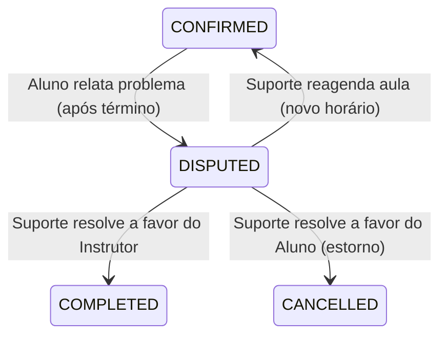

# Fluxo de Disputas (Relatar Problema) - GoDrive

Este documento detalha o funcionamento técnico e de negócio do fluxo de disputa, permitindo que o aluno relate problemas em aulas e que o suporte medie a resolução.

## 1. Visão Geral
O objetivo da disputa é proteger o aluno em caso de não prestação do serviço pelo instrutor e impedir o pagamento automático (auto-complete) de aulas com problemas, garantindo a integridade financeira da plataforma.

## 2. Ciclo de Vida do Agendamento
O status `DISPUTED` é um estado de exceção no ciclo de vida de um agendamento.

## 3. Abertura da Disputa (Aluno)
### Condições para Abertura:
*   O agendamento deve estar no status `CONFIRMED`.
*   A hora de término da aula deve ter passado (`lesson_end_datetime < now`).
*   O aluno clica no botão **"Relatar Problema"** na tela de detalhes da aula.

### Fluxo no Mobile:
1.  **Botão de Ação:** Exibido apenas em aulas confirmadas que já passaram.
2.  **Motivos Pré-definidos:**
    *   Instrutor não compareceu.
    *   Problemas mecânicos no veículo.
    *   Local de encontro não localizado.
    *   Outro (Campo de texto livre).
3.  **Transição:** O agendamento passa para `status = 'disputed'`.

## 4. Mediação e Suporte (Admin)
Uma vez que a aula está em disputa:
*   **Bloqueio de Auto-complete:** O job de conclusão automática ignora agendamentos em disputa.
*   **Chat:** O canal de comunicação entre aluno e instrutor permanece aberto para tentativa de resolução direta.
*   **Painel Administrativo:** O suporte visualiza a descrição do problema, o histórico do chat e a telemetria (início da aula/localização).

## 5. Resoluções Possíveis

### A. Favorável ao Instrutor (`COMPLETED`)
Decidido se o serviço foi prestado ou o aluno faltou sem justificativa.
*   **Ação:** O status muda para `COMPLETED`.
*   **Financeiro:** O saldo é liberado para o instrutor via split do Mercado Pago.

### B. Favorável ao Aluno (`CANCELLED`)
Decidido se o instrutor faltou ou houve falha grave no serviço.
*   **Ação:** O status muda para `CANCELLED`.
*   **Financeiro:** Um reembolso (total ou parcial) é disparado para o aluno via gateway.

### C. Reagendamento Mediado (`CONFIRMED`)
Decidido em comum acordo para realizar a aula em outro momento.
*   **Ação:** O suporte define uma nova `scheduled_datetime` e o status volta para `CONFIRMED`.
*   **Financeiro:** O pagamento permanece retido na plataforma.

## 6. Implementação Técnica

### Backend
*   **Entidade `Scheduling`:** Já possui o status `DISPUTED` e o método `open_dispute()`.
*   **Novo Job/UseCase:** `ResolveDisputeUseCase` para lidar com as transições finais.
*   **Tabela `disputes` (Opcional - Futuro):** Para armazenar notas de auditoria e logs de decisão.

### Frontend
*   **LessonDetailsScreen:** Lógica condicional para exibir o botão de disputa.
*   **Visualização de Status:** Badge específico para `DISPUTED` indicando que o suporte está analisando.
