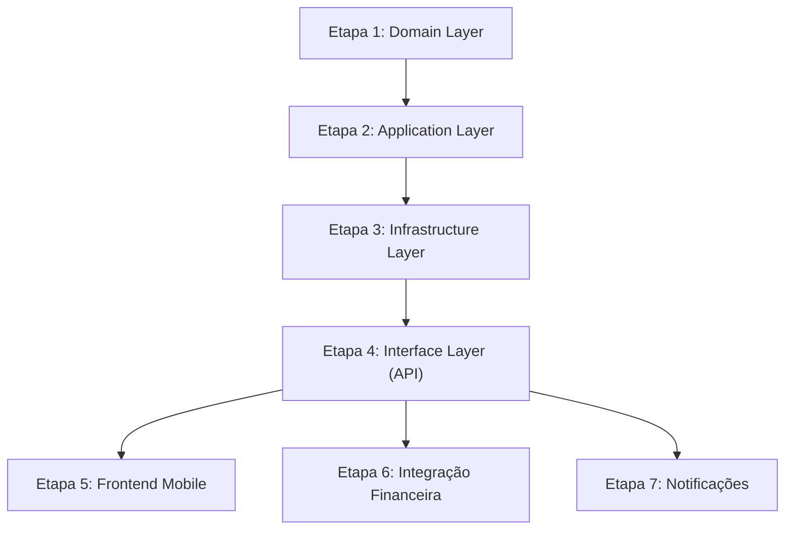

# DISPUTE_PLAN.md — Plano de Implementação do Sistema de Disputas

> Referências: [DISPUTE_FLOW.md](./DISPUTE_FLOW.md) · [PROJECT_GUIDELINES.md](../architeture/PROJECT_GUIDELINES.md)

---

## Diagnóstico: O Que Já Existe

| Componente | Estado Atual |
|---|---|
| `SchedulingStatus.DISPUTED` | ✅ Enum já definido |
| `Scheduling.open_dispute()` | ✅ Método na entidade (valida status CONFIRMED + aula terminada) |
| `Scheduling.is_disputed` | ✅ Property na entidade |
| Endpoint `POST /student/lessons/{id}/dispute` | ✅ Implementado (mas sem campos de motivo/descrição) |
| Auto-complete ignora `DISPUTED` | ✅ `AutoCompleteLessonsUseCase` já filtra |
| Entidade `Dispute` | ❌ Não existe |
| Tabela `disputes` no banco | ❌ Não existe |
| `OpenDisputeUseCase` (camada Application) | ❌ Lógica está direto no router |
| `ResolveDisputeUseCase` | ❌ Não existe |
| Repositório `IDisputeRepository` | ❌ Não existe |
| DTOs de Dispute | ❌ Não existem |
| Endpoints Admin (resolução) | ❌ Não existem |
| Tela mobile "Relatar Problema" | ❌ Não existe |
| Badge DISPUTED no mobile | ❌ Não existe |

---

## Etapa 1 — Domain Layer (Entidades e Interfaces)

> **Princípio:** Começar pela camada mais interna (Clean Architecture). Nenhuma dependência externa.

### 1.1 · [NEW] Entidade `Dispute`

**Arquivo:** `backend/src/domain/entities/dispute.py`

```python
@dataclass
class Dispute:
    scheduling_id: UUID
    opened_by: UUID           # student_id
    reason: DisputeReason     # enum (NO_SHOW, VEHICLE_PROBLEM, OTHER)
    description: str          # texto livre do aluno
    contact_phone: str
    contact_email: str
    status: DisputeStatus     # OPEN, UNDER_REVIEW, RESOLVED
    resolution: DisputeResolution | None  # FAVOR_INSTRUCTOR, FAVOR_STUDENT, RESCHEDULED
    resolution_notes: str | None
    resolved_by: UUID | None  # admin_id
    resolved_at: datetime | None
    refund_type: str | None   # "full", "partial", None
    id: UUID
    created_at: datetime
    updated_at: datetime | None
```

### 1.2 · [NEW] Enums `DisputeReason`, `DisputeStatus`, `DisputeResolution`

**Arquivo:** `backend/src/domain/entities/dispute_enums.py`

```python
class DisputeReason(str, Enum):
    NO_SHOW = "no_show"                # Instrutor não compareceu
    VEHICLE_PROBLEM = "vehicle_problem" # Problemas mecânicos
    OTHER = "other"                     # Outro

class DisputeStatus(str, Enum):
    OPEN = "open"
    UNDER_REVIEW = "under_review"
    RESOLVED = "resolved"

class DisputeResolution(str, Enum):
    FAVOR_INSTRUCTOR = "favor_instructor"  # scheduling → COMPLETED
    FAVOR_STUDENT = "favor_student"        # scheduling → CANCELLED + reembolso
    RESCHEDULED = "rescheduled"            # scheduling → CONFIRMED (nova data)
```

### 1.3 · [NEW] Interface `IDisputeRepository`

**Arquivo:** `backend/src/domain/interfaces/dispute_repository.py`

Métodos essenciais:
- `create(dispute: Dispute) -> Dispute`
- `get_by_id(dispute_id: UUID) -> Dispute | None`
- `get_by_scheduling_id(scheduling_id: UUID) -> Dispute | None`
- `list_open() -> list[Dispute]` (para admin)
- `update(dispute: Dispute) -> Dispute`

### 1.4 · [MODIFY] Entidade `Scheduling`

**Arquivo:** `backend/src/domain/entities/scheduling.py`

- Atualizar `open_dispute()` para aceitar parâmetros (motivo, descrição, contatos) — ou manter simples e delegar à `Dispute`.
- Adicionar métodos de transição para resolução:
  - `resolve_dispute_favor_instructor()` → status = COMPLETED
  - `resolve_dispute_favor_student()` → status = CANCELLED
  - `resolve_dispute_reschedule(new_datetime)` → status = CONFIRMED

---

## Etapa 2 — Application Layer (Use Cases e DTOs)

> **Princípio:** Regras de negócio ficam aqui. Não dependem de FastAPI/SQLAlchemy.

### 2.1 · [NEW] DTOs de Disputa

**Arquivo:** `backend/src/application/dtos/dispute_dtos.py`

```python
@dataclass
class OpenDisputeDTO:
    scheduling_id: UUID
    student_id: UUID
    reason: str          # valor do DisputeReason
    description: str
    contact_phone: str
    contact_email: str

@dataclass
class ResolveDisputeDTO:
    dispute_id: UUID
    admin_id: UUID
    resolution: str      # valor do DisputeResolution
    resolution_notes: str
    refund_type: str | None = None       # "full" | "partial" | None
    new_datetime: datetime | None = None  # para reagendamento

@dataclass
class DisputeResponseDTO:
    # campos para serialização de resposta
    ...
```

### 2.2 · [NEW] `OpenDisputeUseCase`

**Arquivo:** `backend/src/application/use_cases/scheduling/open_dispute.py`

**Responsabilidades:**
1. Validar que o scheduling existe e pertence ao aluno.
2. Chamar `scheduling.open_dispute()` (valida status + horário).
3. Criar entidade `Dispute` com motivo, descrição e contatos.
4. Persistir ambos (`scheduling_repo.update` + `dispute_repo.create`).
5. Retornar DTO de resposta.

> **Nota:** O endpoint atual faz a lógica inline no router. Devemos **migrar** essa lógica para o UseCase e atualizar o router para chamá-lo.

### 2.3 · [NEW] `ResolveDisputeUseCase`

**Arquivo:** `backend/src/application/use_cases/scheduling/resolve_dispute.py`

**Responsabilidades:**
1. Buscar a disputa e o scheduling associado.
2. Validar que o scheduling está com status `DISPUTED`.
3. Conforme a resolução:
   - **FAVOR_INSTRUCTOR:** `scheduling.resolve_dispute_favor_instructor()` + liberar pagamento (via gateway).
   - **FAVOR_STUDENT:** `scheduling.resolve_dispute_favor_student()` + disparar reembolso (task Celery).
   - **RESCHEDULED:** `scheduling.resolve_dispute_reschedule(new_datetime)`.
4. Atualizar `Dispute` (status=RESOLVED, resolution_notes, resolved_by, etc).
5. Persistir tudo.

### 2.4 · [NEW] `ListOpenDisputesUseCase`

**Arquivo:** `backend/src/application/use_cases/scheduling/list_disputes.py`

Para o admin visualizar disputas abertas/sob revisão com paginação.

---

## Etapa 3 — Infrastructure Layer (Banco, Repositórios)

### 3.1 · [NEW] Migration — Tabela `disputes`

**Arquivo:** `backend/src/infrastructure/db/migrations/versions/YYYY_MM_DD_criar_tabela_disputes.py`

```sql
CREATE TABLE disputes (
    id              UUID PRIMARY KEY DEFAULT gen_random_uuid(),
    scheduling_id   UUID NOT NULL REFERENCES schedulings(id),
    opened_by       UUID NOT NULL REFERENCES users(id),
    reason          VARCHAR(50) NOT NULL,     -- 'no_show', 'vehicle_problem', 'other'
    description     TEXT NOT NULL,
    contact_phone   VARCHAR(20) NOT NULL,
    contact_email   VARCHAR(255) NOT NULL,
    status          VARCHAR(20) NOT NULL DEFAULT 'open',  -- 'open', 'under_review', 'resolved'
    resolution      VARCHAR(30),              -- 'favor_instructor', 'favor_student', 'rescheduled'
    resolution_notes TEXT,
    refund_type     VARCHAR(10),              -- 'full', 'partial', NULL
    resolved_by     UUID REFERENCES users(id),
    resolved_at     TIMESTAMPTZ,
    created_at      TIMESTAMPTZ NOT NULL DEFAULT NOW(),
    updated_at      TIMESTAMPTZ
);

CREATE INDEX ix_disputes_scheduling_id ON disputes(scheduling_id);
CREATE INDEX ix_disputes_status ON disputes(status);
```

> ⚠️ A migration deve rodar **dentro do Docker**: `docker compose exec backend alembic upgrade head`

### 3.2 · [NEW] SQLAlchemy Model `DisputeModel`

**Arquivo:** `backend/src/infrastructure/db/models/dispute_model.py`

Mapeia a tabela `disputes` para o SQLAlchemy. Inclui `to_entity()` e `from_entity()` para converter entre Model e Domain Entity.

### 3.3 · [NEW] Repositório `DisputeRepository`

**Arquivo:** `backend/src/infrastructure/repositories/dispute_repository.py`

Implementação concreta de `IDisputeRepository` usando SQLAlchemy async.

---

## Etapa 4 — Interface Layer (API)

### 4.1 · [MODIFY] Router do Aluno — Atualizar endpoint de abertura

**Arquivo:** `backend/src/interface/api/routers/student/lessons.py`

- Alterar `POST /{scheduling_id}/dispute` para:
  - Receber body com `reason`, `description`, `contact_phone`, `contact_email`.
  - Delegar ao `OpenDisputeUseCase` em vez de lógica inline.
  - Retornar resposta com dados da disputa criada.

### 4.2 · [NEW] Router Admin — Endpoints de resolução

**Arquivo:** `backend/src/interface/api/routers/admin/disputes.py`

| Método | Endpoint | Descrição |
|---|---|---|
| `GET` | `/api/v1/admin/disputes` | Listar disputas (filtro por status, paginação) |
| `GET` | `/api/v1/admin/disputes/{dispute_id}` | Detalhes da disputa (inclui dados do scheduling, chat, telemetria) |
| `POST` | `/api/v1/admin/disputes/{dispute_id}/resolve` | Resolver disputa (body: resolution, notes, refund_type, new_datetime) |
| `PATCH` | `/api/v1/admin/disputes/{dispute_id}/status` | Alterar status (ex: OPEN → UNDER_REVIEW) |

> **Nota:** Endpoints admin precisam de guard `require_admin` (dependency semelhante a `require_student`/`require_instructor` das Guidelines).

### 4.3 · [NEW] Schemas Pydantic

**Arquivo:** `backend/src/interface/api/schemas/dispute_schemas.py`

- `OpenDisputeRequest` (reason, description, contact_phone, contact_email)
- `ResolveDisputeRequest` (resolution, resolution_notes, refund_type, new_datetime)
- `DisputeResponse` (todos os campos da disputa para serialização)
- `DisputeListResponse` (lista + paginação)

### 4.4 · [MODIFY] Dependencies

**Arquivo:** `backend/src/interface/api/dependencies.py`

- Registrar `DisputeRepo` (Annotated dependency para injeção do repositório).
- Adicionar `require_admin` (se ainda não existir).

### 4.5 · [MODIFY] Main (registro de routers)

**Arquivo:** `backend/src/interface/api/main.py`

- Incluir router admin: `app.include_router(admin_disputes_router, prefix="/api/v1/admin")`.

---

## Etapa 5 — Frontend Mobile (React Native)

> **Princípio:** Feature-Based Architecture. Disputas são específicas do aluno (`student-app`), mas a visualização pode ser compartilhada.

### 5.1 · [NEW] API Functions

**Arquivo:** `mobile/src/features/student-app/scheduling/api/disputes.ts`

```typescript
// Funções de fetch para React Query
export const openDispute = (schedulingId: string, data: OpenDisputeData) => ...
export const getDisputeByScheduling = (schedulingId: string) => ...
```

### 5.2 · [NEW] Hook `useOpenDispute`

**Arquivo:** `mobile/src/features/student-app/scheduling/hooks/useOpenDispute.ts`

- Mutation via TanStack Query (React Query).
- Invalidar cache de scheduling após sucesso.

### 5.3 · [NEW] Tela `ReportProblemScreen`

**Arquivo:** `mobile/src/features/student-app/scheduling/screens/ReportProblemScreen.tsx`

**Conteúdo:**
1. **Seleção de Motivo:** Picker/RadioGroup com motivos pré-definidos (Instrutor não compareceu, Problemas mecânicos, Outro).
2. **Campo de Descrição:** TextInput multiline para descrever o ocorrido.
3. **Campos de Contato:** TextInput para telefone e e-mail (pré-preenchidos do perfil).
4. **Botão Confirmar:** Chama `useOpenDispute` mutation.
5. **Estilização:** NativeWind, seguindo o design system existente.

### 5.4 · [MODIFY] `LessonDetailsScreen`

**Arquivo:** `mobile/src/features/student-app/scheduling/screens/LessonDetailsScreen.tsx`

- Adicionar botão **"Relatar Problema"** condicional:
  - Visível apenas quando `status === 'confirmed'` **E** `lesson_end_datetime < now`.
  - Navega para `ReportProblemScreen`.
- Adicionar **Badge "Em Disputa"** quando `status === 'disputed'`:
  - Exibir mensagem: "O suporte está analisando seu problema."

### 5.5 · [MODIFY] Navegação

**Arquivo:** `mobile/src/features/student-app/scheduling/navigation/SchedulingStackNavigator.tsx`

- Registrar rota para `ReportProblemScreen`.

### 5.6 · [MODIFY] Types / Interfaces

**Arquivo:** `mobile/src/shared/types/scheduling.ts` (ou equivalente)

- Adicionar tipos para `Dispute` e `OpenDisputeData` seguindo interfaces TypeScript (conforme Guidelines).

---

## Etapa 6 — Integração Financeira (Reembolso via Disputa)

### 6.1 · Resolução Favor Aluno → Reembolso

Reaproveitar a infra existente:
- `ResolveDisputeUseCase` deve chamar `process_refund_task.delay()` (Celery) quando a resolução for `FAVOR_STUDENT`.
- Usar `PaymentRepository.get_by_scheduling_id()` já existente.
- `refund_type` determina se é reembolso total ou parcial.

### 6.2 · Resolução Favor Instrutor → Liberar Pagamento

- Chamar o fluxo de split/liberação que já existe no `handle_payment_webhook.py`.
- O scheduling muda para `COMPLETED` e o pagamento segue o fluxo normal.

### 6.3 · Reagendamento Mediado

- Atualizar `scheduled_datetime` no scheduling.
- Manter pagamento retido (sem ação no gateway).
- Considerar a trava de multa (preservar `original_scheduled_datetime`).

---

## Etapa 7 — Notificações

### 7.1 · Push Notifications

Utilizar o padrão decorator existente (`scheduling_notification_decorators.py`):

| Evento | Destinatário | Mensagem |
|---|---|---|
| Disputa aberta | Instrutor | "O aluno {nome} relatou um problema na aula de {data}." |
| Disputa resolvida | Aluno + Instrutor | "Sua disputa foi resolvida: {resolução}." |

### 7.2 · WebSocket Events

Emitir eventos via `EventDispatcher` para atualização em tempo real:
- `dispute_opened`
- `dispute_resolved`

---

## Resumo Visual: Ordem de Implementação



A implementação segue a ordem **Domain → Application → Infrastructure → Interface** conforme as Guidelines (Seção 11 — Fluxo do Agente).

---

## Checklist Geral

- [ ] **Etapa 1:** Entidade `Dispute`, enums, interface `IDisputeRepository`, métodos de resolução em `Scheduling`
- [ ] **Etapa 2:** DTOs, `OpenDisputeUseCase`, `ResolveDisputeUseCase`, `ListOpenDisputesUseCase`
- [ ] **Etapa 3:** Migration `disputes`, SQLAlchemy Model, `DisputeRepository`
- [ ] **Etapa 4:** Atualizar endpoint aluno, router admin, schemas, dependencies
- [ ] **Etapa 5:** API functions, hook, `ReportProblemScreen`, badge DISPUTED, navegação
- [ ] **Etapa 6:** Reembolso via Celery, liberação de pagamento, reagendamento mediado
- [ ] **Etapa 7:** Push notifications (decorators), WebSocket events
