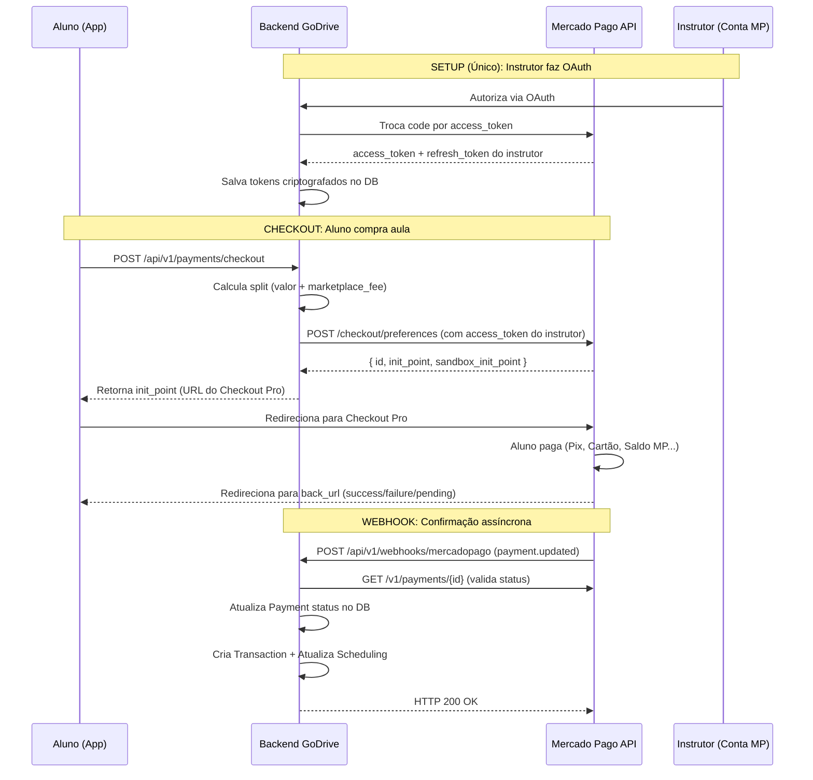

# Planejamento de Integração — Mercado Pago Checkout Pro (GoDrive)

Este documento detalha o plano de integração do **Checkout Pro** do Mercado Pago no backend do GoDrive, substituindo o Stripe como gateway de pagamento. Ele foi construído a partir de:
-   Análise do [PAYMENT_FLOW.md](./PAYMENT_FLOW.md) (fluxo de negócio atual).
-   Análise do [MERCADOPAGO_ANALYSIS.md](./MERCADOPAGO_ANALYSIS.MD) (estudo de migração).
-   Estado atual do backend (Clean Architecture: `domain` → `application` → `infrastructure` → `interface`).
-   [Documentação oficial do Mercado Pago](https://www.mercadopago.com/developers/pt/docs/checkout-pro/overview) — Checkout Pro, Split de Pagamentos, OAuth e Webhooks.

---

## 1. Visão Geral da Arquitetura Atual

O backend do GoDrive segue **Clean Architecture** e possui a seguinte estrutura relevante para pagamentos:

```
backend/src/
├── domain/
│   ├── entities/
│   │   ├── payment.py           # Entidade Payment (com stripe_payment_intent_id, stripe_transfer_id)
│   │   ├── payment_status.py    # Enum: PENDING, PROCESSING, COMPLETED, FAILED, REFUNDED...
│   │   └── transaction.py       # Entidade Transaction (com stripe_reference_id)
│   └── interfaces/
│       └── payment_gateway.py   # Interface IPaymentGateway (PaymentIntentResult, RefundResult...)
│
├── application/
│   └── use_cases/payment/
│       ├── process_payment.py
│       └── get_payment_history.py
│
├── infrastructure/
│   ├── config.py                # Settings (stripe_secret_key, stripe_webhook_secret)
│   └── external/
│       └── stripe_gateway.py    # StripePaymentGateway (implementa IPaymentGateway)
│
└── interface/api/routers/       # Endpoints REST
```

### Pontos-chave do Estado Atual

| Item | Detalhe |
| :--- | :--- |
| **Gateway** | `StripePaymentGateway` implementa `IPaymentGateway` |
| **Split** | Usa `transfer_data` do Stripe Connect (Destination Charges) |
| **Onboarding Instrutor** | Via Stripe Express Account + Account Link |
| **Entidade Payment** | Campos `stripe_payment_intent_id` e `stripe_transfer_id` |
| **Entidade Transaction** | Campo `stripe_reference_id` |
| **Config** | `stripe_secret_key`, `stripe_webhook_secret` |
| **Dependência** | `stripe>=8.1.0` no `requirements.txt` |
| **Taxa Plataforma** | `platform_fee_percentage: 13.0%` (config.py) — **diverge dos 20% documentados no PAYMENT_FLOW.md** |

> [!WARNING]
> **Divergência de Taxa:** O `config.py` define `platform_fee_percentage: 13.0`, enquanto o `PAYMENT_FLOW.md` documenta 20%. Isso precisa ser alinhado durante a migração.

---

## 2. Modelo de Integração: Checkout Pro + Marketplace (Split)

O GoDrive opera como um **Marketplace** — conecta alunos (compradores) a instrutores (vendedores). O modelo escolhido para integração no Mercado Pago é:

### Fluxo Completo



### Conceitos-chave da Integração

| Conceito GoDrive | Stripe (Atual) | Mercado Pago (Novo) |
| :--- | :--- | :--- |
| Pagamento | PaymentIntent | Preferência → Payment |
| Split de Valor | `transfer_data` (Destination Charge) | `marketplace_fee` na Preferência |
| Conta do Instrutor | Stripe Express Account | Vendedor Autorizado (OAuth) |
| Onboarding Instrutor | Account Link (formulário Stripe) | Fluxo OAuth (autorização da conta MP) |
| Chave do Instrutor | `stripe_account_id` | `mp_access_token` + `mp_refresh_token` |
| Confirmação | Webhook `payment_intent.succeeded` | Webhook `payment` (topic) |
| Reembolso | `stripe.Refund.create()` | `POST /v1/payments/{id}/refunds` |

---

## 3. Planejamento de Mudanças por Camada

### 3.1. Camada de Domínio (`domain/`)

#### `domain/entities/payment.py`

Renomear campos específicos do Stripe para campos genéricos ou do Mercado Pago:

| Campo Atual | Novo Campo | Motivo |
| :--- | :--- | :--- |
| `stripe_payment_intent_id` | `gateway_payment_id` | ID do pagamento no MP (ou em qualquer gateway) |
| `stripe_transfer_id` | `gateway_preference_id` | ID da preferência do Checkout Pro |

Novos campos a considerar:
-   `gateway_provider: str` → Indica qual gateway processou (`"mercadopago"` / `"stripe"`).
-   `payer_email: str | None` → Email do pagador retornado pelo webhook.

Ajustar `platform_fee_percentage` padrão para `Decimal("20.00")` (conforme PAYMENT_FLOW.md).

#### `domain/entities/transaction.py`

Renomear `stripe_reference_id` → `gateway_reference_id`.

#### `domain/entities/instructor_profile.py`

Adicionar campos para armazenar credenciais OAuth do instrutor:

```python
# Campos novos
mp_access_token: str | None = None       # Access token OAuth do instrutor
mp_refresh_token: str | None = None      # Refresh token para renovação
mp_token_expiry: datetime | None = None  # Data de expiração do access_token
mp_user_id: str | None = None            # ID do usuário no Mercado Pago
```

> [!IMPORTANT]
> Os tokens devem ser **criptografados** antes de persistir no banco de dados.

#### `domain/interfaces/payment_gateway.py`

Refatorar a interface `IPaymentGateway` para ser agnóstica ao gateway:

```python
@dataclass
class CheckoutResult:
    """Resultado da criação de um checkout."""
    preference_id: str        # ID da preferência/sessão
    checkout_url: str         # URL para redirecionar o usuário
    sandbox_url: str | None   # URL sandbox (apenas dev)

@dataclass
class PaymentStatusResult:
    """Resultado da consulta de status de pagamento."""
    payment_id: str
    status: str               # approved, pending, rejected, etc.
    status_detail: str
    payer_email: str | None

class IPaymentGateway(ABC):

    @abstractmethod
    async def create_checkout(
        self,
        items: list[dict],
        marketplace_fee: Decimal,
        seller_access_token: str,
        back_urls: dict,
        metadata: dict | None = None,
        binary_mode: bool = True,
    ) -> CheckoutResult: ...

    @abstractmethod
    async def get_payment_status(
        self, payment_id: str, access_token: str,
    ) -> PaymentStatusResult: ...

    @abstractmethod
    async def process_refund(
        self, payment_id: str, amount: Decimal | None, access_token: str,
    ) -> RefundResult: ...

    @abstractmethod
    async def authorize_seller(
        self, authorization_code: str,
    ) -> OAuthResult: ...

    @abstractmethod
    async def refresh_seller_token(
        self, refresh_token: str,
    ) -> OAuthResult: ...
```

---

### 3.2. Camada de Aplicação (`application/`)

#### Novos Use Cases

| Use Case | Descrição |
| :--- | :--- |
| `create_checkout.py` | Cria preferência de pagamento no MP e retorna `init_point` |
| `handle_payment_webhook.py` | Processa notificação webhook do MP e atualiza estado |
| `oauth_authorize_instructor.py` | Gera URL de autorização OAuth para o instrutor |
| `oauth_callback.py` | Recebe callback OAuth, troca code por tokens, salva no perfil |
| `refresh_instructor_token.py` | Renova `access_token` expirado via `refresh_token` |

#### Use Case Modificado

-   `process_payment.py` → Será refatorado para usar `create_checkout` internamente ou será substituído por ele.

---

### 3.3. Camada de Infraestrutura (`infrastructure/`)

#### `infrastructure/config.py` — Novas Variáveis de Ambiente

```python
# Mercado Pago
mp_access_token: str | None = None       # Access Token da aplicação (marketplace)
mp_public_key: str | None = None         # Public Key da aplicação
mp_client_id: str | None = None          # Client ID para OAuth
mp_client_secret: str | None = None      # Client Secret para OAuth
mp_webhook_secret: str | None = None     # Assinatura para validar webhooks (x-signature)
mp_redirect_uri: str = "https://godrive.com/api/v1/oauth/mercadopago/callback"
```

#### `infrastructure/external/mercadopago_gateway.py` — **NOVO**

Implementação do `IPaymentGateway` para Mercado Pago usando `httpx`:

```python
class MercadoPagoGateway(IPaymentGateway):
    """Implementação do gateway Mercado Pago via Checkout Pro."""

    BASE_URL = "https://api.mercadopago.com"

    async def create_checkout(self, ...):
        """
        POST /checkout/preferences
        Usa access_token do INSTRUTOR (vendedor) para criar a preferência.
        O marketplace_fee define a comissão do GoDrive.
        """
        ...

    async def get_payment_status(self, payment_id, access_token):
        """
        GET /v1/payments/{id}
        Consulta status do pagamento após notificação webhook.
        """
        ...

    async def process_refund(self, payment_id, amount, access_token):
        """
        POST /v1/payments/{id}/refunds
        Reembolso total ou parcial.
        """
        ...

    async def authorize_seller(self, authorization_code):
        """
        POST /oauth/token (grant_type=authorization_code)
        Troca o code recebido no callback por access_token do instrutor.
        """
        ...

    async def refresh_seller_token(self, refresh_token):
        """
        POST /oauth/token (grant_type=refresh_token)
        Renova o access_token do instrutor (validade: 180 dias).
        """
        ...
```

> [!NOTE]
> Utilizaremos `httpx` (já presente no `requirements.txt`) em vez do SDK oficial Python do MP, para manter controle total sobre as chamadas e evitar dependências pesadas.

---

### 3.4. Camada de Interface (`interface/`)

#### Novos Endpoints

| Método | Rota | Descrição |
| :--- | :--- | :--- |
| `POST` | `/api/v1/payments/checkout` | Cria preferência e retorna `init_point` |
| `POST` | `/api/v1/webhooks/mercadopago` | Recebe notificações do MP |
| `GET` | `/api/v1/oauth/mercadopago/authorize` | Gera URL OAuth para instrutor vincular conta |
| `GET` | `/api/v1/oauth/mercadopago/callback` | Callback do OAuth (recebe `code`) |
| `GET` | `/api/v1/payments/status/{payment_id}` | Consulta status de pagamento |

#### Endpoints existentes mantidos (adaptação)

-   `/api/v1/payments/history` → Continua igual, apenas muda a referência de IDs internos.

---

### 3.5. Banco de Dados (Alembic Migration)

Nova migration para:

1.  **Tabela `payments`**: Renomear `stripe_payment_intent_id` → `gateway_payment_id`, `stripe_transfer_id` → `gateway_preference_id`, adicionar `gateway_provider`.
2.  **Tabela `transactions`**: Renomear `stripe_reference_id` → `gateway_reference_id`.
3.  **Tabela `instructor_profiles`**: Adicionar colunas `mp_access_token`, `mp_refresh_token`, `mp_token_expiry`, `mp_user_id`.
4.  Remover colunas antigas do Stripe se não houver dados em produção (ou manter com deprecation se já houver).

---

### 3.6. Dependências (`requirements.txt`)

```diff
# Financial
-stripe>=8.1.0
+# mercadopago interage via httpx (já incluído)
+# httpx>=0.26.0 (já presente)
+cryptography>=42.0.0  # Para criptografar tokens OAuth dos instrutores
```

---

## 4. Detalhamento Técnico das Integrações

### 4.1. Fluxo OAuth do Instrutor

O instrutor precisa **vincular sua conta Mercado Pago** ao GoDrive para receber pagamentos.

**Etapa 1 — Redirecionar para autorização:**
```
GET https://auth.mercadopago.com/authorization
  ?client_id={MP_CLIENT_ID}
  &response_type=code
  &platform_id=mp
  &redirect_uri={REDIRECT_URI}
  &state={INSTRUCTOR_ID_ENCRYPTED}
```

**Etapa 2 — Callback com `code`:**
```
GET /api/v1/oauth/mercadopago/callback?code=TG-XXXX&state={INSTRUCTOR_ID}
```

**Etapa 3 — Trocar `code` por tokens:**
```json
POST https://api.mercadopago.com/oauth/token
{
  "client_id": "{MP_CLIENT_ID}",
  "client_secret": "{MP_CLIENT_SECRET}",
  "grant_type": "authorization_code",
  "code": "TG-XXXX",
  "redirect_uri": "{REDIRECT_URI}"
}
// Resposta:
{
  "access_token": "APP_USR-xxx",
  "token_type": "Bearer",
  "expires_in": 15552000,  // ~180 dias
  "scope": "read write offline_access",
  "user_id": 123456,
  "refresh_token": "TG-XXXX"
}
```

**Etapa 4 — Renovação automática:**
-   O `refresh_token` tem validade de **6 meses**.
-   Implementar job/task que renova tokens que expiram nos próximos 30 dias.

---

### 4.2. Criação de Preferência (Checkout)

```json
POST https://api.mercadopago.com/checkout/preferences
Authorization: Bearer {INSTRUCTOR_ACCESS_TOKEN}

{
  "items": [
    {
      "id": "AULA-{scheduling_id}",
      "title": "Aula de Direção - {instrutor_nome}",
      "description": "Aula de 1h em {data} às {hora}",
      "quantity": 1,
      "currency_id": "BRL",
      "unit_price": 100.00
    }
  ],
  "marketplace_fee": 20.00,
  "payer": {
    "email": "aluno@email.com"
  },
  "back_urls": {
    "success": "godrive://payment/success?scheduling_id={id}",
    "failure": "godrive://payment/failure?scheduling_id={id}",
    "pending": "godrive://payment/pending?scheduling_id={id}"
  },
  "auto_return": "approved",
  "binary_mode": true,
  "notification_url": "https://api.godrive.com/api/v1/webhooks/mercadopago",
  "external_reference": "{scheduling_id}",
  "metadata": {
    "scheduling_id": "{scheduling_id}",
    "student_id": "{student_id}",
    "instructor_id": "{instructor_id}"
  }
}
```

**Campos importantes:**
-   `marketplace_fee`: Comissão do GoDrive (Comissão 20% + possível taxa de transação embutida).
-   `binary_mode: true`: Aceita ou recusa imediatamente, sem pagamentos pendentes.
-   `external_reference`: Usado para rastrear o `scheduling_id` nos webhooks.
-   `notification_url`: URL do webhook do backend.

---

### 4.3. Webhook de Notificação

O Mercado Pago envia notificações via **Webhooks** quando o status de um pagamento muda.

**Request recebida:**
```json
POST /api/v1/webhooks/mercadopago
{
  "id": 12345,
  "live_mode": true,
  "type": "payment",
  "date_created": "2024-01-01T00:00:00.000-03:00",
  "action": "payment.updated",
  "data": {
    "id": "987654321"
  }
}
```

**Processamento no backend:**
1.  Validar assinatura do webhook (header `x-signature`).
2.  `GET /v1/payments/{data.id}` com o `access_token` do vendedor para obter detalhes.
3.  Verificar `external_reference` para mapear ao `scheduling_id`.
4.  Atualizar `Payment.status` conforme `payment.status`:

| Status MP | PaymentStatus GoDrive | Ação |
| :--- | :--- | :--- |
| `approved` | `COMPLETED` | Confirma aula, desbloqueia chat |
| `rejected` | `FAILED` | Libera horário, notifica aluno |
| `pending` | `PROCESSING` | Aguarda (não deve ocorrer com binary_mode) |
| `refunded` | `REFUNDED` | Registra reembolso |

5.  Criar `Transaction` correspondente.
6.  Retornar HTTP 200 ao MP.

---

### 4.4. Reembolso

```json
POST https://api.mercadopago.com/v1/payments/{payment_id}/refunds
Authorization: Bearer {INSTRUCTOR_ACCESS_TOKEN}

{
  "amount": 50.00  // Parcial. Omitir para total.
}
```

> [!IMPORTANT]
> No modelo de marketplace, o reembolso é **proporcional**: o MP subtrai do vendedor e do marketplace de forma proporcional ao split original. Se o vendedor não tiver saldo suficiente, o marketplace deve cobrir a diferença.

---

## 5. Cálculo de Preços (Modelo de Precificação)

Seguindo o `PAYMENT_FLOW.md`, o aluno paga tudo:

```
Valor Base (Instrutor): R$ 80,00
Comissão GoDrive (20%): R$ 16,00
Taxas MP (~4,98% cartão): R$ 4,78  (sobre o total de R$ 96,00)
────────────────────────────────────
Valor Final (Aluno paga): ~ R$ 100,78
Valor Instrutor recebe:   R$ 80,00
Valor GoDrive recebe:     R$ 16,00
Valor MP retém:           R$ 4,78
```

**Fórmula para incluir taxas na precificação (cartão de crédito à vista):**

```
preço_total = (valor_instrutor + comissão_godrive) / (1 - taxa_mp)
preço_total = (80 + 16) / (1 - 0.0498)
preço_total ≈ R$ 100,78
```

> [!TIP]
> Para **Pix** (taxa 0,99%), o preço final cai significativamente. Podemos exibir preços diferenciados por meio de pagamento ou usar a taxa mais alta (cartão) como padrão para evitar complexidade.

---

## 6. Considerações de Segurança

1.  **Tokens OAuth criptografados**: Os `access_token` e `refresh_token` dos instrutores devem ser armazenados com criptografia simétrica (AES-256) no banco.
2.  **Validação de Webhook**: Validar o header `x-signature` com HMAC usando o `mp_webhook_secret`.
3.  **Rate Limiting**: O endpoint de webhook deve ter rate limiting diferenciado para IPs do Mercado Pago.
4.  **Idempotência**: O handler de webhook deve ser idempotente — processar o mesmo `payment_id` múltiplas vezes sem efeitos colaterais.

---

## 7. Plano de Execução (Fases)

### Fase 1: Fundação (Domínio + Infraestrutura)
- [ ] Refatorar `IPaymentGateway` para interface agnóstica
- [ ] Refatorar entidades `Payment` e `Transaction` (campos genéricos)
- [ ] Adicionar campos MP ao `InstructorProfile`
- [ ] Criar migration Alembic
- [ ] Adicionar variáveis de configuração MP ao `config.py`
- [ ] Implementar `MercadoPagoGateway`

### Fase 2: OAuth + Onboarding do Instrutor
- [ ] Implementar endpoint `GET /oauth/mercadopago/authorize`
- [ ] Implementar endpoint `GET /oauth/mercadopago/callback`
- [ ] Implementar use cases `oauth_authorize_instructor` e `oauth_callback`
- [ ] Implementar renovação automática de tokens
- [ ] Tela no mobile para instrutor vincular conta MP

### Fase 3: Checkout + Webhooks
- [ ] Implementar use case `create_checkout`
- [ ] Implementar endpoint `POST /payments/checkout`
- [ ] Implementar endpoint `POST /webhooks/mercadopago`
- [ ] Implementar use case `handle_payment_webhook`
- [ ] Integrar com fluxo de Scheduling (confirmar aula, desbloquear chat)

### Fase 4: Reembolsos + Fluxo Completo
- [ ] Implementar reembolso via API do MP
- [ ] Adaptar regras de cancelamento (>48h=100%, 24-48h=50%, <24h=0%)
- [ ] Implementar confirmação automática (24h trigger)
- [ ] Testes E2E com usuários de teste (Sandbox)

### Fase 5: Testes e Produção
- [ ] Criar usuários de teste (buyer/seller) via MCP
- [ ] Ciclo completo de testes em Sandbox
- [ ] Configurar webhooks de produção
- [ ] Remover dependência do Stripe
- [ ] Deploy em produção

---

## 8. Referências

-   [Checkout Pro — Visão Geral](https://www.mercadopago.com/developers/pt/docs/checkout-pro/overview)
-   [Split de Pagamentos (Marketplace)](https://www.mercadopago.com/developers/pt/docs/split-payments/landing)
-   [Integrar Checkout em Marketplace](https://www.mercadopago.com/developers/pt/docs/split-payments/integration-configuration/integrate-marketplace)
-   [OAuth — Introdução](https://www.mercadopago.com/developers/pt/docs/security/oauth)
-   [Obter Access Token (OAuth)](https://www.mercadopago.com/developers/pt/docs/security/oauth/creation)
-   [Renovar Access Token](https://www.mercadopago.com/developers/pt/docs/security/oauth/renewal)
-   [Webhooks e Notificações](https://www.mercadopago.com/developers/pt/docs/checkout-pro/additional-content/your-integrations/notifications)
-   [API de Pagamentos](https://www.mercadopago.com/developers/pt/reference/payments/_payments/post)
-   [API de Reembolsos](https://www.mercadopago.com/developers/pt/reference/chargebacks/_payments_id_refunds/post)
-   [Tabela de Taxas Brasil](https://www.mercadopago.com.br/ajuda/33399)
