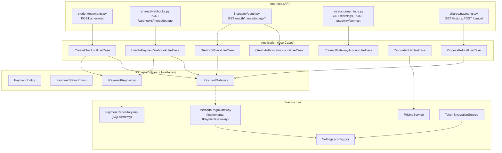
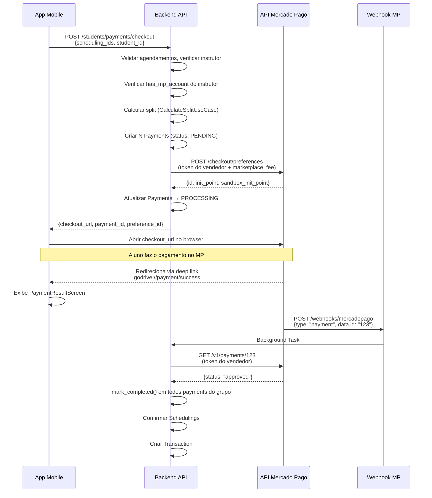
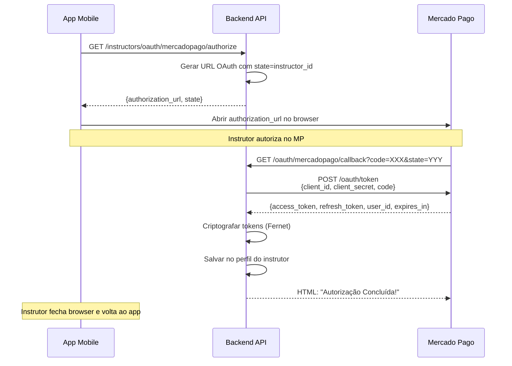
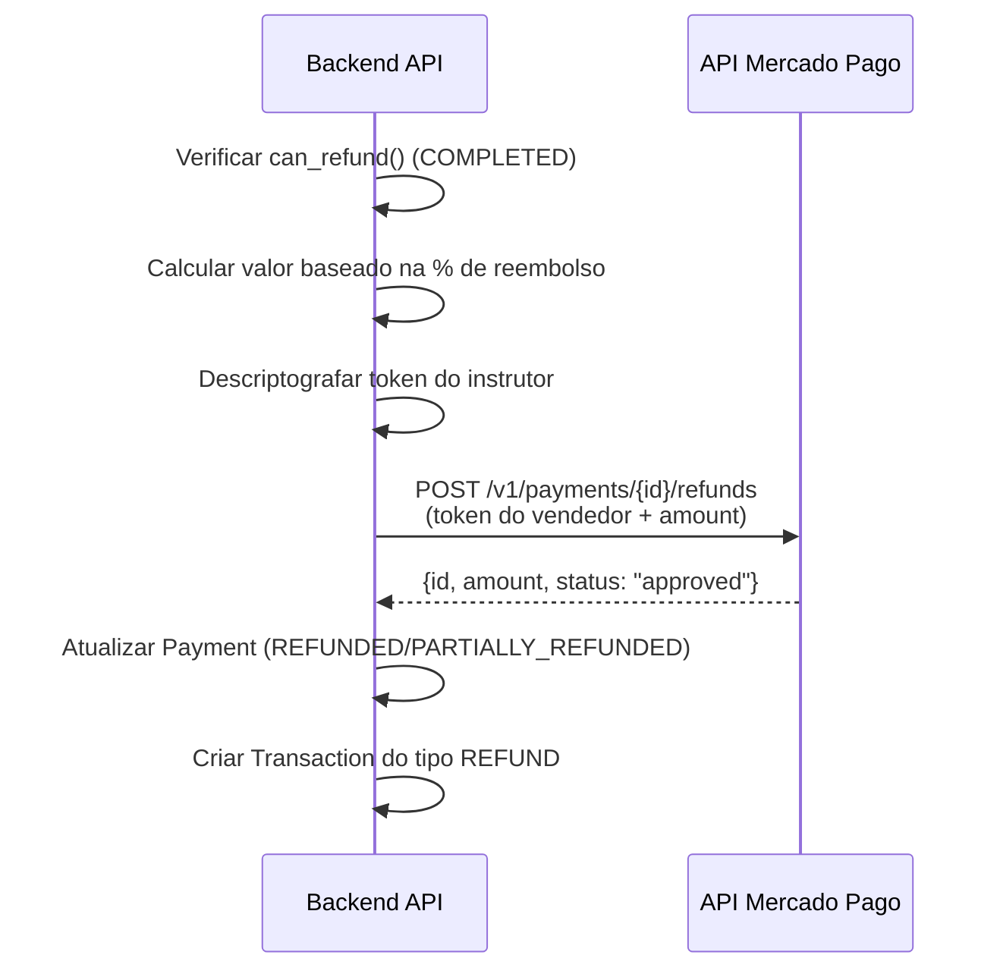

# Integração Mercado Pago — GoDrive

Estudo completo de como a integração com o gateway de pagamento Mercado Pago funciona e está organizada no sistema GoDrive.

---

## Índice

1. [Visão Geral](#1-visão-geral)
2. [Arquitetura e Clean Architecture](#2-arquitetura-e-clean-architecture)
3. [Configuração e Variáveis de Ambiente](#3-configuração-e-variáveis-de-ambiente)
4. [Camada de Domínio](#4-camada-de-domínio)
5. [Camada de Aplicação (Use Cases)](#5-camada-de-aplicação-use-cases)
6. [Camada de Infraestrutura](#6-camada-de-infraestrutura)
7. [Camada de Interface (API Routers)](#7-camada-de-interface-api-routers)
8. [Frontend Mobile (React Native)](#8-frontend-mobile-react-native)
9. [Fluxos Completos (End-to-End)](#9-fluxos-completos-end-to-end)
10. [Segurança](#10-segurança)
11. [Mapa de Arquivos](#11-mapa-de-arquivos)
12. [Endpoints da API](#12-endpoints-da-api)
13. [Pendências e TODOs](#13-pendências-e-todos)

---

## 1. Visão Geral

O GoDrive é um marketplace SaaS que conecta alunos a instrutores de direção. A integração com o Mercado Pago é o coração do sistema financeiro, responsável por:

- **Checkout Pro**: Criação de preferências de pagamento (Cartão, PIX, Saldo MP)
- **Marketplace Split**: Divisão automática de valores entre instrutor e plataforma via `marketplace_fee`
- **OAuth**: Vinculação de contas Mercado Pago dos instrutores para recebimento
- **Webhooks**: Notificações assíncronas de status de pagamento (IPN e Webhooks v2)
- **Reembolsos**: Processamento de devoluções parciais e totais via API do MP
- **Precificação fee-on-top**: Cálculo de preço final para o aluno garantindo repasse líquido ao instrutor

### Modelo de Negócio

```
┌─────────────────────────────────────────────────────┐
│                    ALUNO PAGA                       │
│              Valor Final (ex: R$ 89,90)             │
├─────────────────────────────────────────────────────┤
│                                                     │
│  ┌──────────────┐  ┌──────────────┐  ┌───────────┐  │
│  │ Taxa MP      │  │ Marketplace  │  │ Instrutor │  │
│  │ (~4,98%)     │  │ Fee (GoDrive)│  │ (Líquido) │  │
│  │ MP retém     │  │ GoDrive      │  │ Valor base│  │
│  │ automaticam. │  │ recebe       │  │ definido  │  │
│  └──────────────┘  └──────────────┘  └───────────┘  │
│                                                     │
│  O pagamento é criado COM O TOKEN DO VENDEDOR       │
│  (access_token do instrutor) e o MP faz o split     │
│  automaticamente. O instrutor recebe o valor total   │
│  menos a marketplace_fee; o MP retém sua taxa do     │
│  valor total.                                        │
└─────────────────────────────────────────────────────┘
```

---

## 2. Arquitetura e Clean Architecture

A integração segue estritamente os princípios de **Clean Architecture**, com separação em 4 camadas:



### Princípio da Inversão de Dependência

- O domínio define **interfaces abstratas** (`IPaymentGateway`, `IPaymentRepository`)
- A infraestrutura **implementa** essas interfaces (`MercadoPagoGateway`, `PaymentRepositoryImpl`)
- Os use cases dependem **apenas das interfaces**, nunca da implementação concreta
- A injeção de dependência é feita nos routers da camada de Interface

---

## 3. Configuração e Variáveis de Ambiente

Definidas em `backend/src/infrastructure/config.py` via **Pydantic Settings**:

| Variável                      | Descrição                                               | Exemplo                                    |
|-------------------------------|----------------------------------------------------------|--------------------------------------------|
| `MP_ACCESS_TOKEN`             | Token de acesso da plataforma (marketplace)              | `APP_USR-...`                              |
| `MP_PUBLIC_KEY`               | Chave pública do MP                                      | `APP_USR-...`                              |
| `MP_CLIENT_ID`                | Client ID da aplicação OAuth                             | `123456789`                                |
| `MP_CLIENT_SECRET`            | Client Secret da aplicação OAuth                         | `abc123...`                                |
| `MP_WEBHOOK_SECRET`           | Segredo para validação de assinatura de webhooks         | `hmac-secret...`                           |
| `MP_WEBHOOK_URL`              | URL pública para receber webhooks                        | `https://api.godrive.com.br/api/v1/shared/webhooks/mercadopago` |
| `MP_REDIRECT_URI`             | URL de callback OAuth                                    | `https://api.godrive.com.br/api/v1/instructors/oauth/mercadopago/callback` |
| `ENCRYPTION_KEY`              | Chave para criptografia Fernet de tokens OAuth           | `minha-chave-secreta`                      |
| `PLATFORM_FEE_PERCENTAGE`     | Percentual de comissão da plataforma (ex: 20)            | `20.0`                                     |
| `MERCADOPAGO_FEE_PERCENTAGE`  | Percentual da taxa do Mercado Pago (ex: 4.98)            | `4.98`                                     |

---

## 4. Camada de Domínio

### 4.1 Entidade `Payment`

**Arquivo:** `backend/src/domain/entities/payment.py`

Representa um pagamento individual de aula com split entre instrutor e plataforma.

| Campo                    | Tipo            | Descrição                                                |
|--------------------------|-----------------|----------------------------------------------------------|
| `id`                     | `UUID`          | Identificador único do pagamento                         |
| `scheduling_id`          | `UUID`          | FK → Scheduling                                          |
| `student_id`             | `UUID`          | FK → User (aluno)                                        |
| `instructor_id`          | `UUID`          | FK → User (instrutor)                                    |
| `amount`                 | `Decimal`       | Valor total pago pelo aluno (BRL)                        |
| `platform_fee_percentage`| `Decimal`       | % da taxa da plataforma                                  |
| `platform_fee_amount`    | `Decimal`       | Valor absoluto da taxa da plataforma                     |
| `instructor_amount`      | `Decimal`       | Valor líquido do instrutor                               |
| `status`                 | `PaymentStatus` | Status do pagamento (enum)                               |
| `preference_group_id`    | `UUID?`         | Agrupa payments de um mesmo checkout multi-item           |
| `gateway_payment_id`     | `str?`          | ID do pagamento no MP (ex: `1234567890`)                 |
| `gateway_preference_id`  | `str?`          | ID da preferência no MP (ex: `123456789-abc123...`)      |
| `gateway_provider`       | `str`           | Provedor fixo: `"mercadopago"`                           |
| `payer_email`            | `str?`          | Email do pagador (retornado pelo MP)                     |
| `refund_amount`          | `Decimal?`      | Valor reembolsado                                        |
| `refunded_at`            | `datetime?`     | Data/hora do reembolso                                   |

**Métodos principais:**

| Método               | Descrição                                                   |
|----------------------|-------------------------------------------------------------|
| `calculate_split()`  | Calcula a divisão `platform_fee_amount` e `instructor_amount` |
| `mark_processing()`  | PENDING → PROCESSING (quando checkout é criado)              |
| `mark_completed()`   | PROCESSING → COMPLETED (quando webhook confirma aprovação)   |
| `mark_failed()`      | → FAILED (quando pagamento é rejeitado)                      |
| `process_refund()`   | COMPLETED → REFUNDED ou PARTIALLY_REFUNDED                  |
| `can_refund()`       | Retorna True se status == COMPLETED                         |

### 4.2 Enum `PaymentStatus`

**Arquivo:** `backend/src/domain/entities/payment_status.py`

```
PENDING → PROCESSING → COMPLETED → REFUNDED
                    ↘ FAILED      → PARTIALLY_REFUNDED
```

| Valor                | Significado                                       |
|----------------------|---------------------------------------------------|
| `pending`            | Aguardando criação de preferência no gateway       |
| `processing`         | Preferência criada, aguardando pagamento do aluno  |
| `completed`          | Pagamento aprovado pelo MP                         |
| `failed`             | Pagamento rejeitado/cancelado                      |
| `refunded`           | Reembolso total (100%)                             |
| `partially_refunded` | Reembolso parcial (ex: 50%)                        |

### 4.3 Interface `IPaymentGateway`

**Arquivo:** `backend/src/domain/interfaces/payment_gateway.py`

Interface abstrata que define as operações disponíveis em qualquer gateway de pagamento:

| Método                 | Descrição                                      | Retorno              |
|------------------------|------------------------------------------------|----------------------|
| `create_checkout()`    | Cria preferência de checkout                   | `CheckoutResult`     |
| `get_payment_status()` | Consulta status real de um pagamento           | `PaymentStatusResult` |
| `get_merchant_order()` | Consulta detalhes de uma Merchant Order        | `dict`               |
| `process_refund()`     | Processa reembolso total ou parcial            | `RefundResult`       |
| `authorize_seller()`   | Troca code OAuth por tokens (autorização)      | `OAuthResult`        |
| `refresh_seller_token()`| Renova tokens expirados                       | `OAuthResult`        |

**Dataclasses de retorno:**

- `CheckoutResult`: `preference_id`, `checkout_url`, `sandbox_url`
- `PaymentStatusResult`: `payment_id`, `status`, `status_detail`, `payer_email`
- `RefundResult`: `refund_id`, `amount`, `status`
- `OAuthResult`: `access_token`, `refresh_token`, `expires_in`, `user_id`, `scope`

### 4.4 Interface `IPaymentRepository`

**Arquivo:** `backend/src/domain/interfaces/payment_repository.py`

| Método                         | Descrição                                |
|--------------------------------|------------------------------------------|
| `create(payment)`              | Persiste novo pagamento                  |
| `update(payment)`              | Atualiza pagamento existente             |
| `get_by_id(payment_id)`        | Busca por UUID                           |
| `get_by_scheduling_id(id)`     | Busca por scheduling                     |
| `get_by_gateway_payment_id(id)`| Busca pelo ID do MP                      |
| `get_by_preference_group_id()` | Busca todos de um checkout multi-item    |
| `list_by_student()`            | Lista pagamentos de um aluno (paginado)  |
| `list_by_instructor()`         | Lista pagamentos de um instrutor         |
| `count_by_student()`           | Contagem por aluno                       |
| `count_by_instructor()`        | Contagem por instrutor                   |

---

## 5. Camada de Aplicação (Use Cases)

### 5.1 `CreateCheckoutUseCase`

**Arquivo:** `backend/src/application/use_cases/payment/create_checkout.py`

Cria checkout multi-item no Mercado Pago Checkout Pro. Este é o use case mais complexo do fluxo de pagamento.

**Fluxo de execução:**

```
1. Buscar e validar todos os scheduling_ids recebidos
2. Verificar que todos pertencem ao MESMO instrutor
3. Verificar se já existe pagamento para algum agendamento
4. Verificar se instrutor tem conta MP vinculada (has_mp_account)
5. Calcular split para cada item via CalculateSplitUseCase
6. Gerar preference_group_id → criar N Payments com status PENDING
7. Chamar gateway.create_checkout() com lista de items
8. Atualizar Payments com preference_id → status PROCESSING
9. Retornar CheckoutResponseDTO com checkout_url (init_point)
```

**Detalhes importantes:**

- Usa `seller_access_token` (token do vendedor/instrutor) para criar a preferência — isso ativa o split automático do marketplace
- `marketplace_fee` é a soma das taxas da plataforma de todos os itens
- `back_urls` usam deep links `godrive://payment/{success|error|pending}` para retorno ao app
- `notification_url` aponta para `/api/v1/shared/webhooks/mercadopago`
- `external_reference` é o `preference_group_id` (UUID) usado para rastreabilidade
- `metadata` contém `scheduling_ids`, `payment_ids`, `student_id`, `instructor_id`
- `binary_mode: true` — apenas aprovado ou rejeitado, sem estado "pendente"

### 5.2 `HandlePaymentWebhookUseCase`

**Arquivo:** `backend/src/application/use_cases/payment/handle_payment_webhook.py`

Processa notificações assíncronas do Mercado Pago (Webhooks v2 e IPN).

**Mapeamento de status MP → Domínio:**

| Status MP        | PaymentStatus Domínio |
|------------------|-----------------------|
| `approved`       | `COMPLETED`           |
| `authorized`     | `PROCESSING`          |
| `in_process`     | `PROCESSING`          |
| `in_mediation`   | `PROCESSING`          |
| `pending`        | `PROCESSING`          |
| `rejected`       | `FAILED`              |
| `cancelled`      | `FAILED`              |
| `refunded`       | `REFUNDED`            |
| `charged_back`   | `REFUNDED`            |

**Fluxo:**

```
1. Filtrar — só processa 'payment' e 'merchant_order'
2. Para merchant_order: buscar ordem completa e iterar pagamentos
3. Para payment:
   a. Buscar Payment pelo gateway_payment_id no DB
   b. Fallback: buscar por preference_group_id se veio via IPN
   c. Buscar token do instrutor (vendedor)
   d. GET /v1/payments/{id} na API do MP usando token do vendedor
   e. Mapear status MP → PaymentStatus
   f. Buscar todos payments do grupo (multi-item)
   g. Idempotência: se todos já estão no status, ignorar
   h. Executar handler conforme status:
      - approved → mark_completed + confirmar Scheduling + criar Transaction
      - rejected → mark_failed
      - refunded → process_refund(100)
```

### 5.3 `OAuthAuthorizeInstructorUseCase`

**Arquivo:** `backend/src/application/use_cases/payment/oauth_authorize_instructor.py`

Gera a URL de autorização OAuth para o instrutor vincular sua conta Mercado Pago.

```
URL: https://auth.mercadopago.com/authorization?
     client_id={MP_CLIENT_ID}
     &response_type=code
     &platform_id=mp
     &redirect_uri={MP_REDIRECT_URI}
     &state={instructor_user_id}
```

### 5.4 `OAuthCallbackUseCase`

**Arquivo:** `backend/src/application/use_cases/payment/oauth_callback.py`

Processa o callback OAuth após o instrutor autorizar no site do MP.

**Fluxo:**

```
1. Extrair instructor_user_id do parâmetro 'state'
2. Buscar instrutor no DB
3. Verificar se já está conectado (has_mp_account)
4. Chamar gateway.authorize_seller(code, redirect_uri) → POST /oauth/token
5. Criptografar access_token e refresh_token com Fernet (AES)
6. Calcular data de expiração
7. Salvar mp_access_token, mp_refresh_token, mp_token_expiry, mp_user_id no perfil
```

### 5.5 `ProcessRefundUseCase`

**Arquivo:** `backend/src/application/use_cases/payment/process_refund.py`

Processa reembolsos baseados nas regras de cancelamento.

**Fluxo:**

```
1. Buscar Payment por payment_id
2. Validar can_refund() (status == COMPLETED)
3. Obter access_token do instrutor (descriptografar)
4. Calcular valor de reembolso pela porcentagem
5. POST /v1/payments/{id}/refunds na API do MP com token do vendedor
6. Atualizar Payment com refund_amount e status
7. Criar Transaction do tipo REFUND
```

### 5.6 `CalculateSplitUseCase`

**Arquivo:** `backend/src/application/use_cases/payment/calculate_split.py`

Calcula a divisão de valores usando o modelo **fee-on-top**:

- Se `instructor_base_amount` é fornecido: usa `PricingService.calculate_marketplace_fee()` para garantir que o instrutor receba exatamente seu valor limpo
- Se não: usa cálculo proporcional legado com `platform_fee_percentage`

### 5.7 `ConnectGatewayAccountUseCase`

**Arquivo:** `backend/src/application/use_cases/payment/connect_gateway_account.py`

Use case legado/stub para conectar conta. Retorna URL placeholder para OAuth.
Na prática, o fluxo real usa `OAuthAuthorize` + `OAuthCallback`.

---

## 6. Camada de Infraestrutura

### 6.1 `MercadoPagoGateway`

**Arquivo:** `backend/src/infrastructure/external/mercadopago_gateway.py`

Implementação concreta de `IPaymentGateway` usando **httpx** (async HTTP client).

| Método                   | Endpoint API do MP                           | Token usado          |
|--------------------------|----------------------------------------------|----------------------|
| `create_checkout()`      | `POST /checkout/preferences`                 | Vendedor (instrutor) |
| `get_payment_status()`   | `GET /v1/payments/{id}`                      | Vendedor (instrutor) |
| `get_merchant_order()`   | `GET /merchant_orders/{id}`                  | Plataforma           |
| `process_refund()`       | `POST /v1/payments/{id}/refunds`             | Vendedor (instrutor) |
| `authorize_seller()`     | `POST /oauth/token` (grant=authorization_code)| Plataforma (client_id/client_secret) |
| `refresh_seller_token()` | `POST /oauth/token` (grant=refresh_token)    | Plataforma           |

**Base URL:** `https://api.mercadopago.com`

**Observação importante sobre tokens:**
- As operações de checkout, consulta de pagamento e reembolso usam o **token do vendedor (instrutor)** pois os pagamentos são criados "em nome" do vendedor no modelo marketplace
- As operações OAuth usam o **client_id e client_secret** da plataforma
- A consulta de Merchant Order pode usar o token da plataforma para identificar o grupo

### 6.2 `PaymentRepositoryImpl`

**Arquivo:** `backend/src/infrastructure/repositories/payment_repository_impl.py`

Implementação SQLAlchemy assíncrona do `IPaymentRepository`.
Usa `PaymentModel` para conversão ORM ↔ Entidade via `to_entity()` / `from_entity()`.

### 6.3 `PaymentModel` (ORM)

**Arquivo:** `backend/src/infrastructure/db/models/payment_model.py`

Tabela `payments` no PostgreSQL com:
- Colunas `DECIMAL(10,2)` para valores monetários
- Enum `paymentstatus` para o status
- FKs para `users.id` (student, instructor) e `schedulings.id`
- Índices em `id`, `status`, `preference_group_id`
- Relacionamentos: `student`, `instructor`, `scheduling`, `transactions`

### 6.4 `PricingService`

**Arquivo:** `backend/src/infrastructure/services/pricing_service.py`

Serviço de precificação **fee-on-top** com duas funções:

**`calculate_final_price(base_price)`** — Calcula preço final para o aluno:
```
1. target_net = base_price × (1 + platform_fee%)    # ex: 70 × 1.20 = 84
2. subtotal = target_net / (1 - mp_fee%)             # ex: 84 / 0.9502 = 88.40
3. rounded = ceil(subtotal / 5) × 5                  # ex: 90.00
4. if rounded % 10 == 0: final -= 0.10               # ex: 89.90
```

**`calculate_marketplace_fee(final_price, instructor_base)`** — Calcula a `marketplace_fee`:
```
after_mp_tax = final_price × (1 - mp_fee%)
marketplace_fee = after_mp_tax - instructor_base_price
```

### 6.5 `TokenEncryptionService`

**Arquivo:** `backend/src/infrastructure/services/token_encryption.py`

Criptografia **Fernet (AES-128-CBC + HMAC)** para proteger tokens OAuth dos instrutores:

- `encrypt_token(plaintext)` → token criptografado em base64
- `decrypt_token(ciphertext)` → token original
- Chave derivada via SHA-256 da variável `ENCRYPTION_KEY`

---

## 7. Camada de Interface (API Routers)

### 7.1 Router: Student Payments

**Arquivo:** `backend/src/interface/api/routers/student/payments.py`

| Endpoint                       | Método | Autenticação | Descrição                      |
|-------------------------------|--------|--------------|--------------------------------|
| `/api/v1/students/payments/checkout` | POST   | JWT (Aluno)  | Criar checkout Mercado Pago    |

**Request body (`CreateCheckoutDTO`):**
```json
{
    "scheduling_ids": ["uuid1", "uuid2"],
    "student_id": "student-uuid",
    "student_email": "aluno@email.com"
}
```

**Response (`CheckoutResponseDTO`):**
```json
{
    "payment_id": "uuid",
    "preference_id": "123456789-abc...",
    "checkout_url": "https://www.mercadopago.com.br/checkout/v1/redirect?...",
    "sandbox_url": "https://sandbox.mercadopago.com.br/checkout/v1/redirect?...",
    "status": "processing"
}
```

### 7.2 Router: Webhooks

**Arquivo:** `backend/src/interface/api/routers/shared/webhooks.py`

| Endpoint                                 | Método | Autenticação | Descrição                    |
|-----------------------------------------|--------|--------------|------------------------------|
| `/api/v1/shared/webhooks/mercadopago`    | POST   | **Nenhuma**  | Receber notificações do MP   |

**Comportamento:**
- Endpoint **público** (sem JWT) — o MP não suporta autenticação JWT
- **Sempre retorna HTTP 200** imediatamente para evitar retries do MP
- Processa o webhook em **background** (`BackgroundTasks`) para evitar timeout
- Suporta tanto Webhooks v2 (`body.type`) quanto IPN (`query.topic`)
- Abre **sessão de DB independente** no background para evitar problemas de sessão

### 7.3 Router: Instructor OAuth

**Arquivo:** `backend/src/interface/api/routers/instructor/oauth.py`

| Endpoint                                          | Método | Autenticação  | Descrição                   |
|--------------------------------------------------|--------|---------------|-----------------------------|
| `/api/v1/instructors/oauth/mercadopago/authorize` | GET    | JWT (Instrutor)| Gerar URL OAuth             |
| `/api/v1/instructors/oauth/mercadopago/callback`  | GET    | **Nenhuma**    | Processar callback OAuth    |

- O endpoint `/authorize` gera a URL para o instrutor vincular sua conta
- O endpoint `/callback` é **público** pois o MP redireciona o browser do instrutor diretamente. Retorna uma página HTML confirmando o sucesso

### 7.4 Router: Instructor Earnings

**Arquivo:** `backend/src/interface/api/routers/instructor/earnings.py`

| Endpoint                                    | Método | Autenticação     | Descrição                   |
|--------------------------------------------|--------|------------------|-----------------------------|
| `/api/v1/instructors/gateway/connect`       | POST   | JWT (Instrutor)  | Conectar conta de pagamento |
| `/api/v1/instructors/earnings`              | GET    | JWT (Instrutor)  | Obter resumo de ganhos      |

### 7.5 Router: Shared Payments

**Arquivo:** `backend/src/interface/api/routers/shared/payments.py`

| Endpoint                            | Método | Autenticação   | Descrição                   |
|------------------------------------|--------|----------------|-----------------------------|
| `/api/v1/shared/payments/history`   | GET    | JWT (Qualquer) | Histórico de pagamentos     |
| `/api/v1/shared/payments/cancel`    | POST   | JWT (Qualquer) | Cancelar agendamento + reembolso |

---

## 8. Frontend Mobile (React Native)

### 8.1 API Layer — Aluno

**Arquivo:** `mobile/src/features/shared-features/scheduling/api/paymentApi.ts`

```typescript
// POST /students/payments/checkout
createCheckout({ scheduling_ids, student_id, student_email })
  → { payment_id, preference_id, checkout_url, sandbox_url, status }
```

### 8.2 API Layer — Instrutor

**Arquivo:** `mobile/src/features/instructor-app/api/paymentApi.ts`

```typescript
// GET /instructors/oauth/mercadopago/authorize
getOAuthAuthorizeUrl()
  → { authorization_url, state }
```

### 8.3 Hook `usePayment`

**Arquivo:** `mobile/src/features/shared-features/scheduling/hooks/usePayment.ts`

- `useCreateCheckout()` — Mutation para criar checkout, invalida cache do carrinho após sucesso
- `useRemoveCartItem()` — Remove item do carrinho cancelando o agendamento
- `useClearStudentCart()` — Limpa todo o carrinho
- `useCartItems()` — Query para listar itens do carrinho (agendamentos pendentes)

### 8.4 Tela `LinkMercadoPagoScreen`

**Arquivo:** `mobile/src/features/instructor-app/screens/LinkMercadoPagoScreen.tsx`

Tela de vinculação de conta Mercado Pago do instrutor:
1. Exibe cards informativos (segurança, valor, rapidez)
2. Botão "Vincular conta Mercado Pago"
3. Ao clicar: chama `getOAuthAuthorizeUrl()` → abre browser via `expo-web-browser` → instrutor autoriza no MP → retorna ao app
4. Se já vinculado, exibe badge "Conta Mercado Pago vinculada ✅"

### 8.5 Tela `PaymentResultScreen`

**Arquivo:** `mobile/src/screens/PaymentResultScreen.tsx`

Tela exibida após retorno do Checkout Pro via **deep link** (`godrive://payment/{status}`):
- `success` → ícone verde, "Pagamento Confirmado!"
- `error` → ícone vermelho, "Pagamento não realizado"
- `pending` → ícone amarelo, "Pagamento em Processamento"

Invalida caches do carrinho e agendamentos ao montar.

---

## 9. Fluxos Completos (End-to-End)

### 9.1 Fluxo de Checkout (Aluno)



### 9.2 Fluxo de OAuth (Instrutor)



### 9.3 Fluxo de Reembolso



---

## 10. Segurança

### 10.1 Tokens OAuth dos Instrutores

- **Criptografia em repouso**: Tokens `access_token` e `refresh_token` são criptografados com **Fernet (AES-128-CBC + HMAC)** antes de serem salvos no banco
- **Chave derivada**: A chave Fernet é derivada via `SHA-256` da variável de ambiente `ENCRYPTION_KEY`
- **Descriptografia just-in-time**: Tokens são descriptografados apenas no momento do uso (`decrypt_token()`)

### 10.2 Webhooks

- O endpoint de webhook é **público** (sem JWT)
- A validação de assinatura `x-signature` (HMAC SHA-256) foi **removida** temporariamente
- A veracidade é garantida pelo `HandlePaymentWebhookUseCase` que faz um **GET** na API do MP para confirmar os dados reais do pagamento
- O endpoint **sempre retorna 200 OK** para evitar retries do MP
- O processamento é feito em **background task** (sessão de DB separada)

### 10.3 Autorização

- Endpoints de checkout exigem **JWT de Aluno** e validam que `student_id == current_user.id`
- Endpoints OAuth de instrutor: `/authorize` exige JWT, `/callback` é público (protegido pelo `state` parameter)
- Endpoints de earnings/connect exigem **JWT de Instrutor**

---

## 11. Mapa de Arquivos

```
backend/
├── src/
│   ├── domain/
│   │   ├── entities/
│   │   │   ├── payment.py              # Entidade Payment
│   │   │   └── payment_status.py       # Enum PaymentStatus
│   │   └── interfaces/
│   │       ├── payment_gateway.py      # IPaymentGateway + DTOs de retorno
│   │       └── payment_repository.py   # IPaymentRepository
│   │
│   ├── application/
│   │   ├── dtos/
│   │   │   └── payment_dtos.py         # Todos os DTOs de pagamento
│   │   └── use_cases/payment/
│   │       ├── calculate_split.py      # CalculateSplitUseCase
│   │       ├── create_checkout.py      # CreateCheckoutUseCase
│   │       ├── handle_payment_webhook.py # HandlePaymentWebhookUseCase
│   │       ├── oauth_authorize_instructor.py # OAuthAuthorizeInstructorUseCase
│   │       ├── oauth_callback.py       # OAuthCallbackUseCase
│   │       ├── process_refund.py       # ProcessRefundUseCase
│   │       └── connect_gateway_account.py # ConnectGatewayAccountUseCase
│   │
│   ├── infrastructure/
│   │   ├── config.py                   # Settings (variáveis MP_*)
│   │   ├── external/
│   │   │   └── mercadopago_gateway.py  # MercadoPagoGateway (httpx)
│   │   ├── db/models/
│   │   │   └── payment_model.py        # PaymentModel (SQLAlchemy ORM)
│   │   ├── repositories/
│   │   │   └── payment_repository_impl.py # PaymentRepositoryImpl
│   │   └── services/
│   │       ├── pricing_service.py      # PricingService (fee-on-top)
│   │       └── token_encryption.py     # Fernet encrypt/decrypt
│   │
│   └── interface/api/routers/
│       ├── student/
│       │   └── payments.py             # POST /checkout
│       ├── instructor/
│       │   ├── oauth.py                # GET /authorize, GET /callback
│       │   └── earnings.py             # POST /gateway/connect, GET /earnings
│       └── shared/
│           ├── webhooks.py             # POST /webhooks/mercadopago
│           └── payments.py             # GET /history, POST /cancel
│
├── scripts/
│   └── generate_test_checkout.py       # Script standalone para testes
│
└── tests/
    └── application/use_cases/
        ├── test_oauth_use_cases.py
        ├── test_payment_phase3_use_cases.py
        └── test_merchant_order_webhook.py

mobile/
├── src/
│   ├── features/
│   │   ├── instructor-app/
│   │   │   ├── api/paymentApi.ts         # getOAuthAuthorizeUrl()
│   │   │   ├── screens/
│   │   │   │   ├── LinkMercadoPagoScreen.tsx # Tela de vinculação
│   │   │   │   └── InstructorProfileScreen.tsx # Menu com link para MP
│   │   │   └── navigation/
│   │   │       └── InstructorProfileStack.tsx  # Stack com tela MP
│   │   │
│   │   └── shared-features/scheduling/
│   │       ├── api/paymentApi.ts          # createCheckout()
│   │       └── hooks/usePayment.ts        # useCreateCheckout, etc.
│   │
│   └── screens/
│       └── PaymentResultScreen.tsx        # Resultado do checkout (deep link)
│
docs/payments/
├── PAYMENT_FLOW.md                        # Fluxo de negócio e regras
├── MP_TESTING.md                          # Guia de testes
├── MP_REFUNDS.md                          # Documentação de reembolsos
└── MP_INTEGRATION.md                      # Este documento
```

---

## 12. Endpoints da API

### Resumo completo:

| Rota                                              | Método | Auth          | Responsabilidade                   |
|---------------------------------------------------|--------|---------------|------------------------------------|
| `/api/v1/students/payments/checkout`              | POST   | JWT Aluno     | Criar checkout Mercado Pago        |
| `/api/v1/shared/webhooks/mercadopago`             | POST   | Público       | Receber notificações do MP         |
| `/api/v1/instructors/oauth/mercadopago/authorize` | GET    | JWT Instrutor | Gerar URL de vinculação OAuth      |
| `/api/v1/instructors/oauth/mercadopago/callback`  | GET    | Público       | Processar retorno OAuth            |
| `/api/v1/instructors/gateway/connect`             | POST   | JWT Instrutor | Conectar conta (stub)              |
| `/api/v1/instructors/earnings`                    | GET    | JWT Instrutor | Resumo financeiro                  |
| `/api/v1/shared/payments/history`                 | GET    | JWT Qualquer  | Histórico de pagamentos            |
| `/api/v1/shared/payments/cancel`                  | POST   | JWT Qualquer  | Cancelar agendamento + reembolso   |

---

## 13. Pendências e TODOs

| Item | Status | Descrição |
|------|--------|-----------|
| Validação HMAC de webhooks | ❌ Removida | A validação `x-signature` foi desativada. Atualmente a autenticidade é garantida pelo GET na API do MP |
| Refresh automático de tokens OAuth | ❌ Não implementado | `refresh_seller_token()` existe no gateway mas não é chamado automaticamente antes de tokens expirarem |
| `ConnectGatewayAccountUseCase` | ⚠️ Stub | Retorna placeholder URL. O fluxo real usa OAuth diretamente |
| Tratamento de webhook sem Payment no DB | ⚠️ Parcial | Se o Payment não é encontrado pelo `gateway_payment_id`, tenta fallback mas pode falhar silenciosamente |
| Notificações push ao aluno/instrutor | ❌ Não implementado | Após confirmação de pagamento e cancelamento |
| Suporte a boleto | ❌ Não implementado | O Checkout Pro suporta mas não há tratamento específico para boletos |
