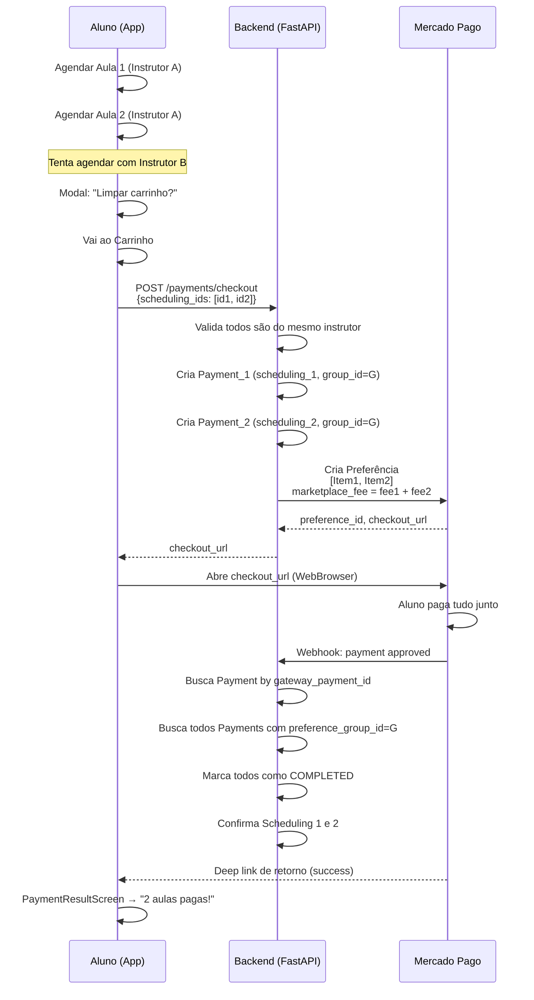

# Carrinho Multi-Item — Plano de Implementação

Implementar um carrinho de compras multi-item no GoDrive, permitindo que o aluno agende múltiplas aulas e pague todas de uma vez via **Mercado Pago Checkout Pro**. O carrinho é restrito a um único instrutor por vez (modelo estilo iFood).

## Contexto Atual

### O que já temos

| Componente | Estado | Detalhe |
|---|---|---|
| `MercadoPagoGateway.create_checkout` | ✅ Pronto | Já aceita `items: list[dict]` e `marketplace_fee` |
| Backend: `payment_status_filter` no endpoint `/lessons` | ✅ Pronto | Filtra por `pending`, `completed`, `none` |
| `SchedulingResponse.payment_status` | ✅ Pronto | Já exposto ao frontend |
| `PricingService` + split fee-on-top | ✅ Pronto | Cálculo de markup, arredondamento e charm pricing |
| `CreateCheckoutUseCase` | ⚠️ Parcial | Aceita apenas **1 scheduling_id** |
| `CreateCheckoutDTO` | ⚠️ Parcial | Campo `scheduling_id: UUID` (singular) |
| `Payment` entity | ⚠️ Parcial | Vinculada a um único `scheduling_id` |
| `HandlePaymentWebhookUseCase` | ⚠️ Parcial | Busca `Payment` único por `gateway_payment_id` |
| Frontend: `createCheckout` API | ⚠️ Parcial | Envia 1 `scheduling_id` |
| Frontend: `CartScreen` | ❌ Não existe | Tela de carrinho não implementada |
| Frontend: Restrição de instrutor único | ❌ Não existe | Validação client-side não implementada |

### Premissas do Mercado Pago

De acordo com a documentação oficial do MP:

1. **Checkout Pro aceita múltiplos items** em uma única preferência — basta enviar uma lista no campo `items`
2. **Marketplace fee funciona normalmente** com múltiplos items — o `marketplace_fee` é aplicado sobre o valor total da preferência
3. **Todos os items de uma preferência devem pertencer ao mesmo vendedor** (mesmo `seller_access_token`) — isso alinha perfeitamente com a regra de instrutor único no carrinho
4. **Um único `gateway_payment_id` é gerado** para toda a preferência, independente do número de items

---

## Decisões de Design

### 1. Um `Payment` por scheduling (manter)

O modelo atual cria um registro `Payment` por `scheduling_id`. Vamos **manter** esse padrão para preservar a granularidade de rastreamento e a compatibilidade com a lógica de reembolso individual.

Adicionaremos um campo `preference_group_id` (UUID) que liga todos os `Payment`s criados no mesmo checkout. Isso permite:
- Rastrear quais payments foram pagos juntos
- Atualizar todos de uma vez quando o webhook chegar

### 2. Um único Checkout = Uma única preferência MP

O `CreateCheckoutUseCase` passará a aceitar `scheduling_ids: list[UUID]` e criará:
- N registros `Payment` (um por scheduling), todos com o mesmo `preference_group_id`
- 1 preferência MP com N items e a soma total de `marketplace_fee`

### 3. Restrição de instrutor único (client + server)

- **Frontend**: ao adicionar item ao carrinho, verificar se o `instructor_id` é o mesmo dos items existentes. Se diferente, exibir modal de confirmação ("Limpar carrinho ou finalizar compra atual?")
- **Backend**: o `CreateCheckoutUseCase` validará que todos os `scheduling_ids` pertencem ao mesmo instrutor antes de criar a preferência

---

## Alterações Propostas

### Backend

---

#### [MODIFY] [payment_dtos.py](file:///home/carloshf/udrive/backend/src/application/dtos/payment_dtos.py)

Substituir `scheduling_id: UUID` por `scheduling_ids: list[UUID]` no `CreateCheckoutDTO`:

```diff
 @dataclass(frozen=True)
 class CreateCheckoutDTO:
-    scheduling_id: UUID
+    scheduling_ids: list[UUID]
     student_id: UUID
     student_email: str | None = None
```

---

#### [MODIFY] [payment.py](file:///home/carloshf/udrive/backend/src/domain/entities/payment.py)

Adicionar campo `preference_group_id: UUID | None` à entidade `Payment`:

```diff
 class Payment:
     scheduling_id: UUID
+    preference_group_id: UUID | None = None
     student_id: UUID
     ...
```

> [!NOTE]
> Será necessário criar migration Alembic para adicionar a coluna `preference_group_id` na tabela `payments`.

---

#### [MODIFY] [payment_repository.py](file:///home/carloshf/udrive/backend/src/domain/interfaces/payment_repository.py)

Adicionar método `get_by_preference_group_id(group_id: UUID) -> list[Payment]` para buscar todos os payments de um mesmo checkout.

---

#### [MODIFY] [payment_repository_impl.py](file:///home/carloshf/udrive/backend/src/infrastructure/repositories/payment_repository_impl.py)

Implementar `get_by_preference_group_id`.

---

#### [MODIFY] [create_checkout.py](file:///home/carloshf/udrive/backend/src/application/use_cases/payment/create_checkout.py)

Refatorar `CreateCheckoutUseCase.execute` para:

1. Receber `scheduling_ids: list[UUID]`
2. Buscar todos os schedulings e validar:
   - Todos existem
   - Todos pertencem ao mesmo `student_id`
   - Todos pertencem ao mesmo `instructor_id`
   - Nenhum tem pagamento já processado
3. Gerar um `preference_group_id` (UUID)
4. Criar N registros `Payment`, todos com o mesmo `preference_group_id`
5. Montar a lista de `items` para o MP:
   ```python
   items = [
       {
           "id": f"AULA-{s.id}",
           "title": "Aula de Direção - GoDrive",
           "description": f"Aula em {s.scheduled_datetime.strftime('%d/%m/%Y às %H:%M')}",
           "category_id": "services",
           "quantity": 1,
           "unit_price": s.price,
       }
       for s in schedulings
   ]
   ```
6. Somar todos os `platform_fee_amount` para o `marketplace_fee` total
7. Criar a preferência MP com `external_reference` contendo o `preference_group_id`
8. Atualizar todos os `Payment`s com o `gateway_preference_id`

---

#### [MODIFY] [handle_payment_webhook.py](file:///home/carloshf/udrive/backend/src/application/use_cases/payment/handle_payment_webhook.py)

Ajustar para tratar cenário multi-item:

1. Quando o webhook chegar com um `gateway_payment_id`, buscar o `Payment` correspondente
2. A partir do `preference_group_id` desse payment, buscar **todos** os payments do grupo  
3. Atualizar **todos** os payments do grupo com o mesmo status
4. Confirmar **todos** os schedulings vinculados quando status = approved

> [!IMPORTANT]
> O Mercado Pago gera **um único pagamento** para toda a preferência, independente do número de items. O webhook virá com um `gateway_payment_id` singular. Precisamos garantir que a lógica busque e atualize todos os `Payment`s do mesmo `preference_group_id`.

---

#### [MODIFY] [payments.py (router)](file:///home/carloshf/udrive/backend/src/interface/api/routers/student/payments.py)

Atualizar o endpoint para aceitar `scheduling_ids: list[UUID]` no body.

---

#### Migration Alembic

Criar migration para:
- Adicionar coluna `preference_group_id` (UUID, nullable) na tabela `payments`
- Adicionar índice em `preference_group_id`

---

### Frontend (Mobile)

---

#### [MODIFY] [paymentApi.ts](file:///home/carloshf/udrive/mobile/src/features/shared-features/scheduling/api/paymentApi.ts)

Alterar `createCheckout` para enviar `scheduling_ids: string[]` ao invés de `scheduling_id: string`:

```diff
-export async function createCheckout(schedulingId: string) {
-    const response = await api.post('/student/payments/checkout', {
-        scheduling_id: schedulingId,
-        student_id: ...,
-    });
+export async function createCheckout(schedulingIds: string[]) {
+    const response = await api.post('/student/payments/checkout', {
+        scheduling_ids: schedulingIds,
+        student_id: ...,
+    });
```

---

#### [MODIFY] [usePayment.ts](file:///home/carloshf/udrive/mobile/src/features/shared-features/scheduling/hooks/usePayment.ts)

Atualizar `useCreateCheckout` para aceitar `schedulingIds: string[]`.

---

#### [NEW] CartScreen.tsx

`/mobile/src/features/shared-features/scheduling/screens/CartScreen.tsx`

Nova tela de carrinho exibindo:
- Lista de aulas pendentes de pagamento (filtradas por `payment_status: 'pending'` ou sem pagamento ainda)
- Nome do instrutor, data/hora, preço individual
- Total do carrinho
- Botão "Finalizar Pagamento" → chama `createCheckout` com todos os `scheduling_ids`
- Botão "Limpar Carrinho" → cancela os schedulings pendentes

**Restrição de instrutor único**: ao navegar para a tela ou ao verificar items, validar que todos pertencem ao mesmo instrutor.

---

#### [MODIFY] [MyLessonsScreen.tsx](file:///home/carloshf/udrive/mobile/src/features/shared-features/scheduling/screens/MyLessonsScreen.tsx)

- Adicionar badge/botão de carrinho com contador de items pendentes
- Separar visualmente "Aulas Agendadas" (payment completed ou sem necessidade de pagamento) de "Carrinho" (payment pending)
- Navegação para `CartScreen`

---

#### [MODIFY] [BookingSuccessScreen.tsx](file:///home/carloshf/udrive/mobile/src/features/shared-features/scheduling/screens/BookingSuccessScreen.tsx)

Ajustar fluxo pós-agendamento:
- Botão "Ver Meus Agendamentos" → "Ver Carrinho" (se pagamento pendente)
- Botão "Agendar mais uma aula" → mantém (se mesmo instrutor)
- Se instrutor não tem MP vinculado, mostrar apenas "Ver Agendamentos"

---

#### [MODIFY] [PaymentResultScreen.tsx](file:///home/carloshf/udrive/mobile/src/screens/PaymentResultScreen.tsx)

Ajustar para:
- Invalidar cache de agendamentos/carrinho
- Exibir resumo de quantas aulas foram pagas
- Navegar para `MyLessonsScreen` após sucesso

---

#### Lógica de restrição de instrutor (Frontend)

Implementar nos hooks/screens:
1. Ao agendar nova aula, verificar se já há items no carrinho de outro instrutor
2. Se sim, exibir modal:
   - "Você já tem aulas no carrinho com o Instrutor X"
   - Opções: "Limpar Carrinho" | "Ir ao Carrinho" | "Cancelar"
3. Se não, adicionar normalmente

---

## Diagrama de Fluxo



---

## Plano de Verificação

### Testes Automatizados

Atualizar `test_payment_phase3_use_cases.py` dentro do Docker:

1. **`test_create_checkout_multi_item_success`**: Verificar que N `Payment`s são criados com o mesmo `preference_group_id` e a preferência MP recebe N items
2. **`test_create_checkout_different_instructors_rejected`**: Verificar que `scheduling_ids` de instrutores diferentes geram erro de validação
3. **`test_handle_webhook_updates_all_payments_in_group`**: Verificar que ao receber webhook, todos os payments do grupo são atualizados
4. **`test_create_checkout_single_item_backward_compatible`**: Verificar que enviar `scheduling_ids: [uuid]` (lista com 1) funciona normalmente

> [!TIP]
> Comando para rodar os testes (dentro do Docker):
> ```bash
> docker compose exec backend pytest tests/application/use_cases/test_payment_phase3_use_cases.py -v
> ```

### Teste Manual (pelo usuário)

1. Agendar 2 aulas com o mesmo instrutor
2. Ir ao carrinho → verificar que ambas aparecem
3. Tentar agendar aula com outro instrutor → verificar que modal de restrição aparece
4. Finalizar pagamento → verificar que o Checkout Pro abre com 2 items listados
5. Completar pagamento → verificar que ambas as aulas aparecem como confirmadas na `MyLessonsScreen`
