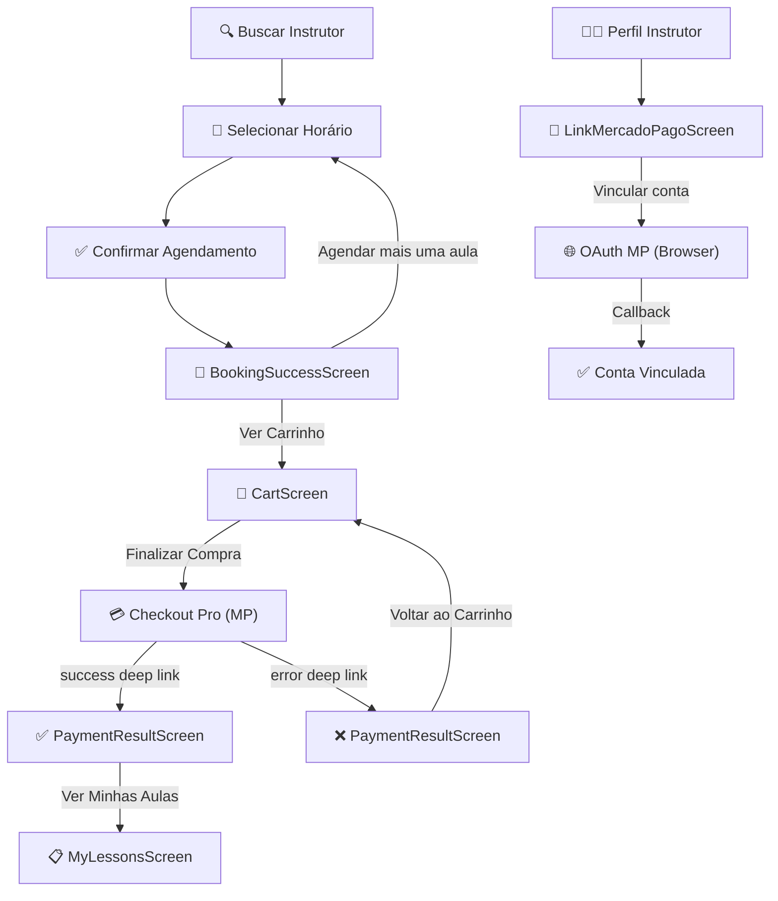

# Plano de Implementação — Telas de Pagamento (GoDrive)

Este documento detalha o plano por etapas para construir as telas relacionadas a pagamentos nos apps de **Instrutor** e **Aluno**, com base na análise do backend existente, da documentação do Mercado Pago, e dos fluxos definidos em [PAYMENT_FLOW.md](./PAYMENT_FLOW.md) e [MP_INTEGRATION.md](./MP_INTEGRATION.md).

---

## Análise de Lacunas (Backend vs. Frontend)

### ✅ O que já está pronto no Backend

| Componente | Status | Detalhes |
| :--- | :--- | :--- |
| OAuth (authorize + callback) | ✅ Completo | Endpoints `GET /oauth/mercadopago/authorize` e `GET /oauth/mercadopago/callback` |
| Use Case `create_checkout` | ✅ Completo | Cria preferência MP e retorna `checkout_url` (init_point) |
| Endpoint `POST /payments/checkout` | ✅ Completo | Protegido por JWT de aluno |
| Webhook `POST /webhooks/mercadopago` | ✅ Completo | Valida assinatura, atualiza Payment e Scheduling |
| Use Case `handle_payment_webhook` | ✅ Completo | Marca pagamento como COMPLETED e confirma o Scheduling |
| Reembolso + Cancelamento | ✅ Completo | `POST /payments/cancel` com regras de antecedência |
| Entidade `Payment` | ✅ Completo | Campos genéricos (`gateway_payment_id`, `gateway_preference_id`) |
| Cálculo de Split (fee-on-top) | ✅ Completo | `CalculateSplitUseCase` refatorado com modelo fee-on-top — usa `PricingService.calculate_marketplace_fee()` para garantir que o instrutor receba o valor base líquido |
| PricingService | ✅ Completo | Calcula preço final para o aluno: `base × 1.2498` → arredondamento (múltiplo de 5) → charm pricing (−R$ 0,10 se terminar em 0). Já integrado em `get_nearby_instructors` e `create_scheduling` |
| Criptografia de tokens OAuth | ✅ Completo | `encrypt_token` / `decrypt_token` |

### ⚠️ O que precisa de ajuste no Backend

| Lacuna | Impacto | Detalhes |
| :--- | :--- | :--- |
| `SchedulingResponse` não tem `payment_status` | 🔴 Alto | O frontend precisa saber se o agendamento tem pagamento pendente, pago ou nenhum para decidir se exibe na lista de aulas ou no carrinho |
| Sem endpoint para listar "itens do carrinho" | 🔴 Alto | Não existe endpoint que retorne agendamentos **sem pagamento confirmado** (status `CONFIRMED` porém sem Payment `COMPLETED`). É necessário criar ou adaptar query |
| Sem campo `has_mp_account` exposto na API do instrutor | 🟡 Médio | O mobile do instrutor precisa saber se a conta MP já está vinculada para mostrar/esconder botão |
| `app.json` sem `scheme` | 🔴 Alto | Deep links `godrive://payment/success` não funcionam sem `"scheme": "godrive"` no `app.json` |

### ❌ O que é totalmente novo (Frontend)

| Componente | App | Descrição |
| :--- | :--- | :--- |
| Tela de vincular Mercado Pago | 📱 Instrutor | Tela com avisos + botão para iniciar OAuth |
| API client de pagamento | 📱 Aluno | Funções para chamar `POST /payments/checkout` e consultar status |
| Tela de carrinho | 📱 Aluno | Resumo de agendamentos pendentes de pagamento |
| Lógica de carrinho em `MyLessonsScreen` | 📱 Aluno | Substituir botão de histórico por carrinho + filtrar aulas por payment_status |
| Ajuste na `BookingSuccessScreen` | 📱 Aluno | Trocar textos e botão "Ver Agendamentos" → "Ver Carrinho" |
| Deep link handling | 📱 Aluno | Configurar scheme + listener para retorno do Checkout Pro |
| Abertura do Checkout Pro | 📱 Aluno | Usar `expo-web-browser` (já instalado) para abrir `init_point` |

---

## Plano de Implementação por Etapas

### Etapa 1 — Ajustes no Backend (Pré-requisito)

> Objetivo: Expor ao frontend as informações necessárias para o funcionamento do carrinho e da tela de vincular MP.

#### 1.1. Adicionar `payment_status` ao `SchedulingResponse`

- **Arquivo**: `backend/src/interface/api/schemas/scheduling_schemas.py`
- **Mudança**: Adicionar campo `payment_status: str | None = None` ao `SchedulingResponse`
- **Lógica**: No endpoint que lista agendamentos do aluno, buscar o `Payment` associado ao scheduling e retornar seu status (`"pending"`, `"processing"`, `"completed"`, `"failed"`, `None`)
- **Arquivo afetado**: `backend/src/interface/api/routers/student/lessons.py` (ou equivalente que monta a lista)

#### 1.2. Criar endpoint ou filtro para "itens do carrinho"

- **Opção A (recomendada)**: Adicionar query param `payment_status_filter` ao endpoint `GET /student/lessons` para filtrar por status de pagamento
  - `payment_status_filter=pending` → retorna agendamentos com Payment PENDING/PROCESSING (carrinho)
  - `payment_status_filter=completed` → retorna agendamentos com Payment COMPLETED (aulas confirmadas)
  - sem filtro → retorna todos (comportamento atual)
- **Opção B**: Criar endpoint dedicado `GET /student/cart` que retorna agendamentos sem pagamento confirmado

#### 1.3. Expor `has_mp_account` na API do instrutor

- **Arquivo**: `backend/src/interface/api/schemas/instructor_schemas.py` (ou equivalente)
- **Mudança**: Garantir que o campo `has_mp_account: bool` esteja presente na resposta do perfil do instrutor
- **Uso**: O app do instrutor consultará esse campo para decidir se mostra a tela de vincular MP ou um badge de "conta vinculada"

---

### Etapa 2 — Configuração de Deep Links no Mobile

> Objetivo: Permitir que o Mercado Pago redirecione o aluno de volta ao app após o pagamento.

#### 2.1. Configurar scheme no `app.json`

```json
{
  "expo": {
    "scheme": "godrive",
    ...
  }
}
```

#### 2.2. Configurar Deep Link handling

- **Arquivo**: `mobile/App.tsx` (ou entry point)
- **Lógica**: Usar `Linking.addEventListener('url', ...)` para escutar retornos do Checkout Pro
- Deep links esperados:
  - `godrive://payment/success` → Navegar para tela de sucesso de pagamento
  - `godrive://payment/error` → Navegar para tela de falha
  - `godrive://payment/pending` → Navegar para tela de pendente (improvável com `binary_mode: true`)
- **Dependência**: `expo-web-browser` (já instalado v15.0.10, já nos plugins)
- **Referência**: [Documentação oficial MP — React Native Expo Go](https://www.mercadopago.com/developers/pt/docs/checkout-pro/mobile-integration/react-native-expo-go)

---

### Etapa 3 — App Instrutor: Tela de Vincular Mercado Pago

> Objetivo: Criar tela amigável para instrutor vincular sua conta MP.

#### 3.1. Criar tela `LinkMercadoPagoScreen`

- **Caminho**: `mobile/src/features/instructor-app/screens/LinkMercadoPagoScreen.tsx`
- **Conteúdo visual**:
  - Ícone/logo do Mercado Pago
  - Títuto: "Vincule sua conta Mercado Pago"
  - Avisos amigáveis em cards informativos:
    - 🔒 "Seus ganhos são depositados diretamente na sua conta Mercado Pago de forma segura"
    - ⚡ "O aluno paga pelo app e você recebe automaticamente após cada aula"
    - 💰 "Você recebe o valor integral que definiu, sem descontos"
    - 📱 "A vinculação é feita uma única vez e leva menos de 1 minuto"
  - Botão principal: "Vincular conta Mercado Pago" → chama `GET /oauth/mercadopago/authorize` e abre a URL no browser via `expo-web-browser`
  - Se já vinculado: Badge de sucesso "✅ Conta vinculada" com opção de desvincular (futuro)

#### 3.2. Criar API client para OAuth

- **Caminho**: `mobile/src/features/instructor-app/api/paymentApi.ts`
- **Funções**:
  - `getOAuthAuthorizeUrl(): Promise<{ authorization_url: string }>` → chama `GET /instructor/oauth/mercadopago/authorize`

#### 3.3. Integrar ao menu de perfil do instrutor

- **Arquivo**: `mobile/src/features/instructor-app/screens/InstructorProfileScreen.tsx`
- **Mudança**: Substituir o item de menu "Dados Bancários" (atualmente com `route: null`) pela rota para `LinkMercadoPago`
- **Badge**: Mostrar indicador visual se a conta MP ainda não está vinculada (ponto vermelho) ou se já está (✅)

#### 3.4. Registrar na navegação

- **Arquivo**: `mobile/src/features/instructor-app/navigation/InstructorProfileStack.tsx`
- **Mudança**: Adicionar `LinkMercadoPago` ao stack

---

### Etapa 4 — App Aluno: API e Hooks de Pagamento

> Objetivo: Criar a camada de dados para pagamento no mobile.

#### 4.1. Criar API client de pagamento

- **Caminho**: `mobile/src/features/shared-features/scheduling/api/paymentApi.ts`
- **Funções**:
  - `createCheckout(schedulingId: string, studentEmail?: string): Promise<CheckoutResponse>` → chama `POST /student/payments/checkout`
  - `getPaymentStatus(paymentId: string): Promise<PaymentStatusResponse>` → chama `GET /payments/status/{id}` (se existir) ou derivar do scheduling

#### 4.2. Criar tipos TypeScript

```typescript
export interface CheckoutResponse {
    payment_id: string;
    preference_id: string;
    checkout_url: string;
    sandbox_url: string | null;
    status: string;
}
```

#### 4.3. Criar hooks

- `useCreateCheckout()` — mutation hook para criar checkout
- `useCartItems()` — query hook para listar agendamentos com pagamento pendente (carrinho)

#### 4.4. Atualizar `BookingResponse` (tipo existente)

- **Arquivo**: `mobile/src/features/shared-features/scheduling/api/schedulingApi.ts`
- **Mudança**: Adicionar campo `payment_status?: string` ao `BookingResponse`

---

### Etapa 5 — App Aluno: Tela de Carrinho

> Objetivo: Criar tela de carrinho substituindo o botão de histórico da `MyLessonsScreen`.

#### 5.1. Criar tela `CartScreen`

- **Caminho**: `mobile/src/features/shared-features/scheduling/screens/CartScreen.tsx`
- **Conteúdo visual**:
  - **Header**: "Meu Carrinho" com contador de itens
  - **Lista de cards**: Cada card mostra:
    - Nome do instrutor + avatar
    - Data e horário da aula
    - Valor da aula — **este é o preço final** já calculado pelo `PricingService` (inclui comissão GoDrive 20% + margem MP 4,98% + arredondamento + charm pricing). O campo `price` do `Scheduling` já contém esse valor.
    - Badge de status: "Aguardando pagamento"
    - Botão de remover/cancelar item (opcional primeira versão)
  - **Mensagem amigável** (componente de incentivo):
    - 💳 "Finalize a compra para que o instrutor entre em contato via chat e combine os detalhes da aula!"
  - **Resumo financeiro** (footer):
    - Total de aulas: X
    - Valor total: R$ XXX,XX (soma dos `price` de cada scheduling)
  - **Botão principal**: "Finalizar Compra (R$ XXX,XX)"
    - Ao clicar: Chama `POST /student/payments/checkout` para **cada** agendamento (ou lote se suportado) e abre o `checkout_url` com `expo-web-browser`
    - **Nota sobre precificação**: O `CreateCheckoutUseCase` recalcula o `instructor_base_amount` no momento do checkout (`hourly_rate × horas`) e usa o `PricingService.calculate_marketplace_fee()` para definir o `marketplace_fee` enviado ao MP. Isso garante que o instrutor receba exatamente seu valor base, mesmo que as taxas tenham mudado desde o agendamento.
  - **Estado vazio**: 
    - Ícone de carrinho vazio
    - "Nenhuma aula no carrinho"
    - Botão "Buscar Instrutor"

> [!IMPORTANT]
> **Decisão de design: Checkout por item vs. lote**
> O backend atual cria checkout por **scheduling_id individual**. Para múltiplos itens no carrinho, temos duas opções:
> 1. **Por item** (mais simples): Cada aula gera um checkout separado no MP. O aluno paga uma por uma.
> 2. **Lote** (melhor UX): Adaptar o backend para aceitar array de scheduling_ids e gerar preferência MP com múltiplos items. Requer ajuste no `CreateCheckoutUseCase`.
> Recomendação: Começar com checkout por item e evoluir para lote em iteração futura.

#### 5.2. Modificar `MyLessonsScreen`

- **Arquivo**: `mobile/src/features/shared-features/scheduling/screens/MyLessonsScreen.tsx`
- **Mudanças**:
  1. **Substituir botão de histórico** (ícone `History`) por botão de carrinho (ícone `ShoppingCart`)
     - Mostrar badge com contador de itens no carrinho
  2. **Filtrar aulas**: Mostrar **apenas** agendamentos com `payment_status === "completed"` na lista de "Minhas Aulas"
  3. **Estado vazio com carrinho**: Quando não houver aulas pagas mas houver itens no carrinho, mostrar:
     - Mensagem: "Você ainda não tem aulas confirmadas"
     - Botão: "Ver Carrinho (X itens)" que navega para `CartScreen`
     - Botão secundário: "Buscar Instrutor"
  4. **Estado completamente vazio**: Quando não houver nada (nem carrinho, nem aulas pagas), manter o comportamento atual

---

### Etapa 6 — App Aluno: Ajuste na `BookingSuccessScreen`

> Objetivo: Adaptar mensagens e navegação da tela de sucesso de agendamento.

#### 6.1. Modificar textos

- **Arquivo**: `mobile/src/features/shared-features/scheduling/screens/BookingSuccessScreen.tsx`
- **Mudanças nos textos**:

| Elemento | Antes | Depois |
| :--- | :--- | :--- |
| Título | "Aula Agendada!" | "Aula Adicionada ao Carrinho! 🛒" |
| Subtítulo | "Seu agendamento foi enviado para o instrutor e aguarda confirmação." | "O agendamento aguarda o pagamento para ser enviado ao instrutor. Após o pagamento, ele entrará em contato via chat para tirar dúvidas e combinar o ponto de encontro." |
| Aviso | "Você receberá uma notificação quando o instrutor confirmar a aula." | "Você pode agendar mais aulas antes de finalizar a compra no carrinho. 💡" |
| Botão primário | "Ver Meus Agendamentos" | "Ver Carrinho 🛒" |

#### 6.2. Modificar navegação do botão primário

- **Antes**: `navigation.dispatch(CommonActions.reset(...))` → `MyLessons`
- **Depois**: Navegar para `CartScreen`

#### 6.3. Manter botão "Agendar mais uma aula"

- Esse botão continua funcionando igual, redirecionando para `SelectDateTime` com os dados do instrutor atual

---

### Etapa 7 — Fluxo de Retorno do Pagamento (Deep Links)

> Objetivo: Tratar o retorno do Mercado Pago após pagamento.

#### 7.1. Criar tela `PaymentResultScreen`

- **Caminho**: `mobile/src/features/shared-features/scheduling/screens/PaymentResultScreen.tsx`
- **Comportamento baseado no deep link**:
  - `godrive://payment/success` → Tela de sucesso com confete/animação
    - "Pagamento confirmado! 🎉"
    - "O instrutor será notificado e entrará em contato pelo chat."
    - Botão "Ver Minhas Aulas"
  - `godrive://payment/error` → Tela de erro
    - "Ops! O pagamento não foi concluído. 😕"
    - "Tente novamente ou escolha outra forma de pagamento."
    - Botão "Voltar ao Carrinho"

#### 7.2. Registrar rotas de deep link no React Navigation

- Configurar `linking` no NavigationContainer para mapear:
  - `godrive://payment/success` → tela PaymentResult com param `{ status: 'success' }`
  - `godrive://payment/error` → tela PaymentResult com param `{ status: 'error' }`
  - `godrive://payment/pending` → tela PaymentResult com param `{ status: 'pending' }`

---

### Etapa 8 — Testes e Validação

#### 8.1. Testes Backend

- Testar que `SchedulingResponse` inclui `payment_status`
- Testar filtro `payment_status_filter` no endpoint de listagem
- Testar que `has_mp_account` é retornado no perfil do instrutor

#### 8.2. Testes Mobile (Manual)

- **Fluxo Instrutor**:
  1. Acessar Perfil → clicar em "Vincular Mercado Pago"
  2. Verificar que abre o navegador com a URL OAuth do MP
  3. (Em sandbox: autorizar com conta de teste seller)
  4. Verificar que volta ao app com mensagem de sucesso

- **Fluxo Aluno**:
  1. Buscar instrutor → selecionar horário → confirmar agendamento
  2. Verificar que `BookingSuccessScreen` mostra textos atualizados e botão "Ver Carrinho"
  3. Navegar para carrinho → verificar que a aula aparece com resumo
  4. Clicar "Finalizar Compra" → verificar que abre Mercado Pago no browser
  5. (Em sandbox: pagar com cartão de teste)
  6. Verificar que deep link redireciona de volta ao app na tela de resultado
  7. Navegar para "Minhas Aulas" → verificar que a aula agora aparece (após pagamento)
  8. Verificar que sem pagamento confirmado, "Minhas Aulas" mostra estado vazio com botão de carrinho

---

## Diagrama do Fluxo Completo (Visão Mobile)



---

## Ordem de Execução Recomendada

| # | Etapa | Prioridade | Dependências |
| :--- | :--- | :--- | :--- |
| 1 | Ajustes Backend (payment_status, filtro, has_mp_account) | 🔴 Alta | Nenhuma |
| 2 | Deep Links (scheme + handling) | 🔴 Alta | Nenhuma |
| 3 | Tela Instrutor (LinkMercadoPago) | 🟡 Média | Backend OAuth ✅ |
| 4 | API + Hooks de Pagamento (mobile) | 🔴 Alta | Etapa 1 |
| 5 | Tela de Carrinho + MyLessonsScreen | 🔴 Alta | Etapas 1, 2, 4 |
| 6 | Ajuste BookingSuccessScreen | 🟡 Média | Etapa 5 |
| 7 | PaymentResultScreen (retorno MP) | 🟡 Média | Etapas 2, 5 |
| 8 | Testes e Validação | 🔴 Alta | Todas anteriores |

---

## Referências

- [PAYMENT_FLOW.md](./PAYMENT_FLOW.md) — Regras de negócio de pagamento
- [MP_INTEGRATION.md](./MP_INTEGRATION.md) — Plano técnico de integração Mercado Pago
- [PricingService](../../backend/src/infrastructure/services/pricing_service.py) — Lógica de precificação fee-on-top (arredondamento, charm pricing, marketplace_fee)
- [Checkout Pro — React Native Expo Go](https://www.mercadopago.com/developers/pt/docs/checkout-pro/mobile-integration/react-native-expo-go) — Integração mobile oficial
- [Deep Links — URLs de Retorno](https://www.mercadopago.com/developers/pt/docs/checkout-pro/checkout-customization/user-interface/redirection) — Configuração de back_urls
- [expo-web-browser](https://docs.expo.dev/versions/latest/sdk/webbrowser/) — Abertura do checkout no browser nativo
 
 ...