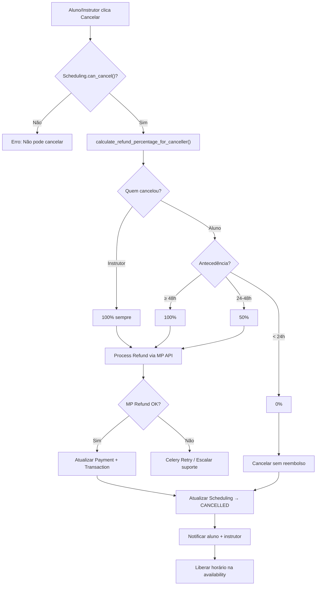

# Plano de Implementação: Lógica de Reembolso — GoDrive

> **Data:** 2026-03-03  
> **Contexto:** Primeira versão do reembolso. Apenas cartão de crédito habilitado (D+14), facilitando estornos antes da liberação dos fundos.

---

## 1. Visão Geral

### O que já existe no backend

O GoDrive já possui uma **fundação sólida** para reembolsos, porém incompleta e com lacunas importantes. Segue o inventário:

| Camada | Arquivo | Status |
|---|---|---|
| **Domain** | `payment.py` — `can_refund()`, `process_refund()` | ✅ Pronto |
| **Domain** | `payment_status.py` — `REFUNDED`, `PARTIALLY_REFUNDED` | ✅ Pronto |
| **Domain** | `scheduling.py` — `calculate_refund_percentage()`, `can_cancel()`, `cancel()` | ✅ Pronto |
| **Domain** | `exceptions.py` — `RefundException`, `CancellationException` | ✅ Pronto |
| **Application** | `process_refund.py` — `ProcessRefundUseCase` | ✅ Pronto (recebe `refund_percentage` pronto) |
| **Application** | `cancel_scheduling.py` — `CancelSchedulingUseCase` | ✅ Pronto (orquestra cancel + refund) |
| **Application** | `payment_dtos.py` — `ProcessRefundDTO`, `RefundResultDTO`, `CancelSchedulingDTO`, `CancelSchedulingResultDTO` | ✅ Pronto |
| **Infrastructure** | `mercadopago_gateway.py` — `process_refund()` (API `/v1/payments/{id}/refunds`) | ✅ Pronto |
| **Interface** | `payment_gateway.py` — `IPaymentGateway.process_refund()`, `RefundResult` | ✅ Pronto |
| **Interface** | `shared/payments.py` — `POST /cancel` endpoint | ⚠️ Existe mas com bugs |
| **Testes** | `test_scheduling_cancellation.py` — testes de `calculate_refund_percentage` e `cancel` | ✅ Pronto (domínio) |
| **Testes** | Testes de `ProcessRefundUseCase` | ❌ Não existe |
| **Testes** | Testes de `CancelSchedulingUseCase` | ❌ Não existe |
| **Celery** | Task para reembolso assíncrono | ❌ Não existe |
| **Mobile** | Tela/Fluxo de cancelamento | ❌ Não existe |

### O que precisa ser feito

O plano está dividido em **6 etapas incrementais**, da base ao topo, seguindo Clean Architecture (Domain → Application → Infrastructure → Interface).

---

## 2. Regras de Negócio Consolidadas

### 2.1 Tabela de Reembolso por Antecedência

| Antecedência (em relação ao `scheduled_datetime`) | % Reembolso | Observação |
|---|---|---|
| **≥ 48 horas** | 100% | Reembolso integral ao aluno |
| **Entre 24h e 48h** | 50% | 50% retido como taxa de reserva do instrutor |
| **< 24 horas** | 0% | Sem reembolso (pagamento integral ao instrutor) |
| **Emergência** | 100% | Via suporte, com justificativa e aprovação manual |

> [!IMPORTANT]
> **Trava de Reagendamento:** Aula reagendada dentro da janela de multa (< 48h do horário original) **mantém a janela de multa original** para cálculo de reembolso em caso de cancelamento posterior. Isso impede o "ciclo de restituição" onde o aluno reagenda para o futuro e cancela com 100%.

### 2.2 Quem pode cancelar?

- **Aluno:** pode cancelar aulas em status `PENDING`, `CONFIRMED` ou `RESCHEDULE_REQUESTED`
- **Instrutor:** pode cancelar aulas nesses mesmos status, com **100% de reembolso sempre** (culpa do instrutor)
- **Sistema / Suporte:** cancelamento emergencial com 100% (requer flag especial)

### 2.3 Mecânica do Reembolso no Mercado Pago (Marketplace Split)

- **Endpoint:** `POST /v1/payments/{payment_id}/refunds` com `access_token` do vendedor (instrutor)
- **Proporcionalidade:** O MP retira fundos proporcionalmente do vendedor E do marketplace
- **Taxas:** O MP estorna suas próprias taxas no reembolso (plataforma não "perde" a taxa do gateway)
- **Reembolso total:** Não enviar `amount` (ou enviar o total) — MP devolve tudo
- **Reembolso parcial:** Enviar `amount` com o valor — MP devolve proporcionalmente
- **Idempotência:** Usar header `X-Idempotency-Key` para evitar reembolsos duplicados

### 2.4 Vantagem do D+14 (Cartão de Crédito)

Com apenas cartão de crédito habilitado e o prazo de D+14:
- Nos primeiros 14 dias, o dinheiro está na conta do instrutor como "A liberar" (bloqueado)
- Reembolsos nesse período são "cancelamentos" da entrada futura — mais seguros
- Após D+14, o reembolso depende de saldo disponível na conta do instrutor

> [!WARNING]
> **Risco pós-D+14:** Se o instrutor sacou os fundos, o reembolso via API pode falhar por "saldo insuficiente". A plataforma precisa tratar esse cenário com retry ou escalação para suporte.

---

## 3. Plano de Implementação por Etapas

### Etapa 1: Correções e Fortalecimento do Domínio

**Objetivo:** Garantir que as regras de negócio estejam 100% corretas e cobertas por testes.

#### 1.1 — Corrigir `calculate_refund_percentage` para Trava de Reagendamento

**Arquivo:** [scheduling.py](file:///home/carloshf/udrive/backend/src/domain/entities/scheduling.py)

**Problema atual:** O método usa `self.scheduled_datetime` diretamente. Se a aula foi reagendada dentro da janela de multa, deveria usar a **data original** para cálculo.

**Solução:**
- Adicionar campo `original_scheduled_datetime: datetime | None` à entidade `Scheduling` (valor setado quando um reagendamento é aceito dentro da janela de < 48h)
- Alterar `calculate_refund_percentage()`:
  ```python
  # Se a aula foi reagendada dentro da janela de multa, usa a data original
  reference_datetime = self.original_scheduled_datetime or self.scheduled_datetime
  ```

#### 1.2 — Adicionar lógica diferenciada para cancelamento pelo instrutor

**Arquivo:** [scheduling.py](file:///home/carloshf/udrive/backend/src/domain/entities/scheduling.py)

Criar método:
```python
def calculate_refund_percentage_for_canceller(self, cancelled_by: UUID) -> int:
    """Instrutor cancela → sempre 100%. Aluno → regras padrão."""
    if cancelled_by == self.instructor_id:
        return 100
    return self.calculate_refund_percentage()
```

#### 1.3 — Testes unitários de domínio

**Arquivo:** `tests/domain/test_scheduling_cancellation.py` (expandir) e `tests/domain/test_payment_refund.py` (novo)

Novos cenários:
- Instrutor cancela → 100% independente da antecedência
- Reagendamento dentro da janela de multa → usa data original
- `Payment.process_refund(50)` → muda status para `PARTIALLY_REFUNDED`
- `Payment.process_refund(100)` → muda status para `REFUNDED`
- `Payment.can_refund()` com status não-COMPLETED → `False`

---

### Etapa 2: Melhorias na Camada Application

**Objetivo:** Tornar os Use Cases robustos e preparados para produção.

#### 2.1 — Atualizar `CancelSchedulingUseCase`

**Arquivo:** [cancel_scheduling.py](file:///home/carloshf/udrive/backend/src/application/use_cases/payment/cancel_scheduling.py)

Alterações:
- Usar `calculate_refund_percentage_for_canceller(dto.cancelled_by)` ao invés de `calculate_refund_percentage()`
- Adicionar validação: verificar se `cancelled_by` é o `student_id` ou `instructor_id` do scheduling
- Liberar horários do instrutor na availability após cancelamento

#### 2.2 — Adicionar validação de permissão

No `CancelSchedulingDTO`, garantir que o `cancelled_by` é aluno ou instrutor daquela aula (não qualquer usuário autenticado).

#### 2.3 — Testes do Use Case

**Arquivo novo:** `tests/application/test_cancel_scheduling_use_case.py`

Cenários:
- Cancelamento com 100% refund (chama `process_refund`)
- Cancelamento com 50% refund (reembolso parcial no MP)
- Cancelamento com 0% refund (não chama gateway)
- Cancelamento por instrutor → sempre 100%
- Scheduling não encontrado → `SchedulingNotFoundException`
- Scheduling já cancelado → `CancellationException`

---

### Etapa 3: Melhorias na Camada Infrastructure

**Objetivo:** Tornar o gateway mais robusto e adicionar Celery task.

#### 3.1 — Adicionar Idempotência no Gateway

**Arquivo:** [mercadopago_gateway.py](file:///home/carloshf/udrive/backend/src/infrastructure/external/mercadopago_gateway.py)

- Adicionar header `X-Idempotency-Key` no `process_refund()` usando um UUID gerado a partir do `payment_id` + timestamp para evitar duplo-estorno
- Adicionar tratamento de erros HTTP com logging detalhado (como já existe no `authorize_seller`)
- Adicionar header `X-Render-In-Process-Refunds: true` para obter status `in_process` no retorno (especialmente útil para Pix no futuro)

#### 3.2 — Criar Celery Task de Reembolso

**Arquivo novo:** `backend/src/infrastructure/tasks/refund_tasks.py`

```python
@celery_app.task(bind=True, max_retries=3, default_retry_delay=60)
def process_refund_task(self, payment_id: str, refund_percentage: int, reason: str | None = None):
    """Task Celery para processar reembolso de forma assíncrona."""
    ...
```

**Justificativa:** Chamadas ao MP podem falhar por timeout/saldo. Com Celery, podemos fazer retry automático com backoff.

#### 3.3 — Migrations

Se o campo `original_scheduled_datetime` for adicionado à entidade:
- **Criar migration Alembic** para adicionar coluna `original_scheduled_datetime` na tabela `schedulings`
- Comando: `docker compose exec backend alembic revision -m "add_original_scheduled_datetime"`

---

### Etapa 4: Melhorias na Camada Interface (API)

**Objetivo:** Corrigir e aprimorar o endpoint de cancelamento.

#### 4.1 — Corrigir bugs no endpoint `POST /cancel`

**Arquivo:** [shared/payments.py](file:///home/carloshf/udrive/backend/src/interface/api/routers/shared/payments.py)

Problemas atuais:
1. `MercadoPagoGateway()` instanciado sem `Settings` (linha 101) — vai falhar em runtime
2. `scheduling_id` e `reason` como query params — deveriam ser request body (Pydantic schema)
3. Falta validação de que `current_user` é participante do scheduling

**Correções:**
- Instanciar `MercadoPagoGateway(Settings())` corretamente
- Criar schema Pydantic para request body do cancelamento
- Adicionar validação de participante

#### 4.2 — Criar schema de request/response

**Arquivo novo ou expandir:** `interface/api/schemas/payment_schemas.py`

```python
class CancelSchedulingRequest(BaseModel):
    scheduling_id: UUID
    reason: str | None = None

class CancelSchedulingResponse(BaseModel):
    scheduling_id: UUID
    status: str
    refund_percentage: int
    refund_amount: Decimal | None
    refund_status: str | None
```

---

### Etapa 5: Fluxo de Emergência (Suporte Administrativo)

**Objetivo:** Permitir reembolsos emergenciais via suporte.

#### 5.1 — Endpoint administrativo

Criar endpoint `POST /api/v1/admin/refund/emergency` (futuro, quando houver painel admin):
- Requer autenticação de admin/suporte
- Aceita `scheduling_id`, `justificativa`, força `100%` de reembolso
- Independe da antecedência

> [!NOTE]
> Este endpoint pode ser implementado em fase posterior. Para o MVP, o suporte pode processar reembolsos emergenciais diretamente pelo painel do Mercado Pago.

---

### Etapa 6: Integração Mobile

**Objetivo:** Permitir que alunos e instrutores cancelem aulas pelo app.

#### 6.1 — Tela de cancelamento

**Diretório:** `mobile/src/features/shared-features/payments/`

Componentes:
- `CancelLessonModal` — modal de confirmação com:
  - Exibição do percentual de reembolso calculado
  - Campo de motivo (opcional)
  - Botão confirmar / cancelar
- Hook `useCancelLesson` — chamada à API `POST /payments/cancel`

#### 6.2 — Integração na tela de detalhes

- Adicionar botão "Cancelar Aula" na tela de detalhes do agendamento (student-app e instructor-app)
- Mostrar aviso com regra de reembolso aplicável antes da confirmação
- Após cancelamento, atualizar cache via `queryClient.invalidateQueries`

---

## 4. Diagrama de Fluxo



---

## 5. Ordem de Execução Recomendada

| Prioridade | Etapa | Esforço | Impacto |
|---|---|---|---|
| 🔴 P0 | **Etapa 4.1** — Corrigir bugs no endpoint `/cancel` | Baixo | Crítico (está quebrado) |
| 🔴 P0 | **Etapa 1** — Fortalecimento do domínio + testes | Médio | Fundacional |
| 🟡 P1 | **Etapa 2** — Melhorias no Use Case + testes | Médio | Corretude |
| 🟡 P1 | **Etapa 3.1** — Idempotência no gateway | Baixo | Segurança |
| 🟢 P2 | **Etapa 3.2** — Celery task de reembolso | Médio | Resiliência |
| 🟢 P2 | **Etapa 3.3** — Migration (se necessário) | Baixo | Infraestrutura |
| 🟢 P2 | **Etapa 6** — Integração mobile | Alto | Experiência |
| ⚪ P3 | **Etapa 5** — Admin/Emergência | Baixo | Operacional |

---

## 6. Riscos e Mitigações

| Risco | Probabilidade | Impacto | Mitigação |
|---|---|---|---|
| Instrutor sem saldo para reembolso pós-D+14 | Média | Alto | Monitorar via webhook + escalar para suporte |
| Duplo estorno por retry | Baixa | Alto | Idempotência via `X-Idempotency-Key` |
| Aluno usa reagendamento para burlar janela de multa | Média | Médio | Trava `original_scheduled_datetime` |
| Timeout na API do MP | Baixa | Médio | Celery task com retry + exponential backoff |
| Reembolso PIX em contingência | N/A (só cartão) | N/A | Header `X-Render-In-Process-Refunds` preparado para futuro |

---

## 7. Observações Finais

- **Cartão de crédito apenas:** A decisão de aceitar apenas cartão no início é estratégica — o prazo D+14 cria uma janela de proteção natural contra estornos
- **Sem Autorização e Captura:** O Checkout Pro não suporta two-step payment, então confiamos no D+14 como mecanismo de "hold"
- **Testes dentro do Docker:** Conforme `PROJECT_GUIDELINES.md`, todos os testes devem rodar via `docker compose exec backend pytest`
- **Clean Architecture:** Toda alteração segue Domain → Application → Infrastructure → Interface
